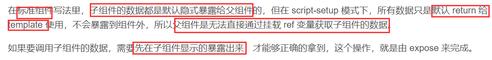

# 模板语法

## 内容指令

### 文本显示

`{{ }}`双大括号：支持**简单表达式**(三元运行，基本运算)，不支持语句

$event \$emit \$route \$router 在\<template>中引用

`v-once `:	仅显示一次初始内容。数据改变时，插值处的内容不更新

`v-html`：	输出真正的 HTML

```html
<div id="counter">
  Counter: {{ counter }}  
</div>

<span v-once>这个将不会改变: {{ msg }}</span>

<span v-html="rawHtml"></span></p>

{{ number + 1 }} 
{{ ok ? 'YES' : 'NO' }}    三元运算
{{ message.split('').reverse().join('')}}
```

### 标签属性 v-bind  ( : )

`v-bind : attrName = varName `：设置*H5标签* 属性，支持**转换boolean**

`v-bind : [ 动态attr变量名 ]= varName ` ：绑定的是变量，此**变量值=属性名称字符串**。**不支持运算**

```html
<div v-bind:id="'list-' + id"></div>
<button v-bind:disabled="isButtonDisabled">支持boolean</button>

<a v-bind:[attributeName变量  值为真正的元素属性名]="url"> ... </a>
```

## 事件处理指令`v-on`   ( @ )

1. `v-on : / @ 事件名 = 函数名 / 函数( 参数) / 简单表达式 `：支持click   keyup 和 快捷键
2. `v-on:[动态事件名变量] = "函数名"` ： 绑定的是变量，此**变量值=事件名字符串**。**不支持运算**

- `$event`：特殊实参，代表**事件本身**
- **仅绑定函数名**默认传入`$event`参数，回调函数可用一个参数接受
- 自定义事件$event=value
- 支持**逗号分隔**的多处理方法

```html
<div id="basic-event">
  <button @click="counter += 1">Add 1</button>
  <p>The button above has been clicked {{ counter }} times.</p>
</div>
<a v-on:click="doSomething"> ... </a> 
<a @click="doSomething('hello ')"> ... </a>
<a v-on:[eventName]="doSomething"> ... </a>
```

### 事件修饰符

#### 通用

- `.stop`：     event.stopPropagation()   ***阻止事件冒泡***
- `.prevent`   ：    event.preventDefault()    **不执行默认动作**，如submit表单 href超链接
- `.capture`：       使用事件捕获模式
- `.self`：      当前元素自身时触发处理函数
- `.once`： ：    只会触发一次
- `.passive`：永远不会调用 `preventDefault()` 改善的滚屏性能，有利于移动端

```html
<!-- 阻止单击事件继续传播 -->
<a @click.stop="doThis"></a>

<!-- 提交事件不再重载页面 -->
<form @submit.prevent="onSubmit"></form>

<!-- 修饰符可以串联 -->
<a @click.stop.prevent="doThat"></a>

<!-- 只有修饰符 -->
<form @submit.prevent></form>

<!-- 添加事件监听器时使用事件捕获模式 -->
<div @click.capture="doThis">...</div>

<!-- 只当在 event.target 是当前元素自身时触发处理函数 -->
<div @click.self="doThat">...</div>
```

## 渲染指令

1.  `v-if = " boolVar" ` ，`v-else`  ，`v-else-if`：根据绑定的**布尔变量决定是否渲染DOM**
2.  `v-show = " boolVar"` ：**元素总是会被渲染**，单地切换元素的 CSS `display:none`
3. `v-for = "value  in arr/obj "`**==`:key`==** : 循环遍历**当前标签**，支持**组件props传递**

- `v-if`用于`<template>` 元素：条件渲染。**切换后原数据全部销毁不保存**
- `v-show` 不支持 `<template>` 元素，也不支持 `v-else`。**切换后原数据仍然保存**
- `v-if` 有更高的切换开销， `v-show` 有更高的初始渲染开销
- `v-if` 具有比 `v-for` 更高的优先级
- 在 `v-for` 必须设置唯一 `key` attribute

### 实时监测变更

- 数组操作方法实时监测：`push()` `pop()` `shift()` `unshift()` `splice()` `sort()` `reverse()`
- 新数组替换旧数组：`filter()`、`concat()`  `slice()`
- **排序**建议计算属性**computed**

```html
<ul id="array-rendering">
  <li v-for="item in itemsArray">    
  <li v-for="(item, index) in items">
    {{ item.message }}
  </li>
</ul>

<ul id="v-for-object" class="demo">
  <li v-for="value in myObject">    
  <li v-for="(value, name) in myObject">
  <li v-for="(value, name, index) in myObject">
    {{ value }}
  </li>
</ul>
<template v-if="ok">
  <h1>Title</h1>
  <p>Paragraph 1</p>
  <p>Paragraph 2</p>
</template>

<!--组件有独立的作用域，使用 props传递值-->
<my-component
  v-for="(item, index) in items"
  :item="item"
  :index="index"
  :key="item.id"
></my-component>
```

## 表单指令 v-model

在 `<input>`、`<textarea>` 及 `<select>` ==双向数据绑定==。根据控件类型自动更新元素。本质是语法糖，监听用户的输入事件以更新数据。默认oninput

- radio select 默认绑定value   
- Checkbox单选默认boolean绑定，value绑定需设置true-value和false-value。支持多选数组
- 支持绑定内联对象`:value="{ number: 123 }"`

```html
<select v-model="selected">
  <!-- 内联对象字面量 -->
  <option :value="{ number: 123 }">123</option>
</select>

// 当被选中时
typeof vm.selected // => 'object'
vm.selected.number // => 123
```

### 修饰符

 `.lazy`：改为onchage离开焦点更新

 `.number`：数值类型

 `.trim`：去除首尾空白字符

## 组件动态切换 `:is`

`<components :is="varName">`    varValue时自定义组件名

`<keep-alive>`**缓存**生成的组件，否则每次切换都生成新的组件实例

## 样式指令

### `:class = obj/array`动态地切换 class

①内联对象 `{attrName:bool,...}`  ② 直接绑定对象obj  ③ 数组`[attrStr1,attrStr2]`

绑定对象：peoperty=attrName value只能是boolean            绑定数组可以是str，切换class只能用数组

```html
<div
  class="static"
  :class="{ active: isActive, 'text-danger': hasError }"
/>
<!-- 支持直接绑定obg或计算属性-->
<div :class="classObject"></div>
data() {	^
  return {  |
    classObject: {
      active: true,
      'text-danger': false
}}}

<!-- 支持直接绑定变量数组[ ]:str-->
<div :class="[activeClass, errorClass]"></div>
data() {
  return {
    activeClass: 'active',
    errorClass: 'text-danger'
}}
<!-- 切换class-->
<div :class="[isActive ? activeClass : '', errorClass]"></div>
```

### :style = obj/array

`:style = obj`：绑定样式对象，支持内联写法

`:style = [ obj1 , obj2 ...]`：样式对象 组成的 数组

```html
<div :style="{ color: activeColor, fontSize: fontSize + 'px' }"></div>

<div :style="styleObject"></div>
data() {
  return {
    styleObject: {
      color: 'red',
      fontSize: '13px'
    }
  }
}
<div :style="[baseStylesObj, overridingStylesObj]"></div>

<!-- 多选一，不支持自动跳过-->
<div :style="{ display: ['-webkit-box', '-ms-flexbox', 'flex'] }"></div>
```

# 组件

各个组件被组织成一个嵌套的、可重用的组件树，与DOM树类似

## 组件创建

##### 挂载根组件

```js
Vue.createApp({ })//根组件属性
    .component('SearchInput', SearchInputComponent)   //声明全局组件
	.directive('focus', FocusDirective)  
    .use(LocalePlugin)   //使用插件  
    .mount('#app')js
```

### 组件注册

- 在挂载`mount`**之前**注册
- **全局注册**：在挂载DOM执行.component(组件名，组件内容)
  1. 支持*子组件内相互嵌套使用*
  2. 有性能损耗，不建议
- **局部注册**：`components`定义对象
  1. `components` 对象中每个 property 名作为组件名。
  2. ==**只能在父组件使用**==
- 组件名规范：
  - \<script>声明**大驼峰**
  - \<template>使用**全小写连字符分隔**，或大驼峰

```js
app.component('my-component-name', {
  /* ... */
})

import ComponentA from './ComponentA.vue'
export default {
  components: {           //快捷赋值
    ComponentA 
  }
}
```

## 组件交互

### 父-->子 props

1. 子组件：声明 `props`，子组件内可作为peoperty在\<script>、\<template>中任意访问
   - **`props`不可修改**，只能引用。配合watch/computed使用
   - `contexi.attrs`获取style等属性
2. 父组件：将子组件的props.XXX作为属性绑定、固定
   - 支持Number、Array、Object，boolean、解构传递所有属性

```html
<blog-post v-bind="post">传递所有属性</blog-post>
等价于
<blog-post v-bind:id="post.id" v-bind:title="post.title"></blog-post>
```

------

#### props声明

- 数组形式：**props变量名称(str)**作为数组元素
- 对象形式：设置类型、校验函数、默认值。
- 规范：\<script>声明**大驼峰**，\<template>使用**全小写连字符分隔**

```js
props: ['title', 'likes', 'isPublished', 'commentIds', 'author']
props: {
  title: String,
  likes: Number,
  isPublished: Boolean,
  commentIds: Array,
  author: Object,
  callback: Function,
  contactsPromise: Promise // 或任何其他构造函数
}
props: {
    // 基础的类型检查 (`null` 和 `undefined` 会通过任何类型验证)
    propA: Number,
    // 多个可能的类型
    propB: [String, Number],
    // 必填的字符串
    propC: {
      type: String,
      required: true,      //必须
       default: ‘100’,      //默认值
       validator: function(value) {    //校验函数
        return boolean
      }
    }}
```

### 子-->父 emit事件机制

1. 子组件：触发自定义事件 template中$emit
   - `<template>`中 `$emit(事件名，value)`，`<script>`中`context.emit(事件名，value)`
   - `emits对象/数组`声明自定义事件，支持校验
2. 父组件：监听子组件出发的自定义事件
3. 规范：完全匹配，不存在转换。建议**全小写**

```js
app.component('custom-form', {
  emits: ['in-focus', 'submit']
})
emits: {
    // 没有验证
    click: null,
    // 验证submit 事件
    submit: ({ email, password }) => {
      if (email && password) {
        return true
      } else {
        console.warn('Invalid submit event payload!')
        return false
      }
    }
  }
```

### 隔代传递

针对**嵌套的父子组件**，而非兄弟组件

- `provide(varName,value)`：向所有子组件传值
- `inject(varName)`：从所有长辈获取对应值
- 传递普通对象不会实时更新视图，建议**<u>传递`ref/reeactive`值保证实时更新</u>**

```js
 const geolocation = reactive({
      longitude: 90,
      latitude: 135
    })
    //祖先
    provide('location', location)
    provide('geolocation', geolocation)
    
    //后辈
    const location = inject('location')
    const geolocation = inject('geolocation')
```

## 插槽slot

### 单个插槽

- **子组件提供\<slot>**占位符(可设默认值)，父组件向此占位**填充**内容(*html、组件*等)，便于扩展。
- <u>父组件</u>中 自定义的子组件标签 有内容，默认忽略。若此<u>子组件有\<slot></u>标签会接受内容并渲染在子组件<u>插槽处DOM</u>
- 填充内容的作用域**生命周期和子组件**一致

```html
<!--子-->
<button class="btn-primary">
  <slot>设置默认值</slot>
</button>

<!--父-->
<todo-button>
  Add todo
</todo-button>
```

### 具名多插槽

1. 子组件插槽多个\<slot>标签设置`name`属性，无name默认default
2. 父组件在 子组件标签内分别**`<template v-slot:name>`**包裹填充内容(**`#name`**简写)

```html
<！--父-->
<nav-bar>
  <template #left>
     <button>左边的按钮</button>
  </template>
</nav-bar>
<！--子-->
<template>
    <div class="left">
      <slot name="left"></slot>
    </div>
</template>
```

### 插槽slot传值

默认父组件填充的内容 ：==**不能**在 父组件中 **访问 子组件变量**==

父组件代码原样替换 slot标签后  子组件才编译，代码替换，而非渲染结果替换

- 子组件将内部值绑定至`\<slot :varName ="propertyName">`标签某变量

- 插槽名默认`default`，即**`v-slot = v-slot:default`**

- 父组件使用**`<template v-slot:name=插槽所有变量的对象>`**引用此变量，支持解构赋值

- 常用于设置**列表单个item**组件用于循环显示

  

# Composition API

### `setup(props,{ attrs, slots, emit } )` 组件选项

setup在==Created之前==执行(**beforeCreate-setup-Created**),不能访问  this data  computed  methods

- **`props`只读**，是响应式对象(**toRefs解构**)不可修改；使用`watch`构造变化的逻辑
- `context` 是普通 JavaScript 对象(es6解构)，暴露：attrs   slots   emit
- `attrs` 和 `slots` 始终最新值，以 `attrs.x` 或 `slots.x` 的方式引用 property
- 内部设置生命周期回调函数
- 原则：==**尽量不操作原始对象**==
- `<script setup>`:语法糖，简化setup()写法，无需返回值。自动暴露导入的components，data，methods
  - `defineProps`用来接收props，`defineEmits`声明触发的事件表，`useContext`用来获取组件context。
  - `<script setup>`变量只针对本组件内部，子组件需要`defineExpose`**手动暴露给父组件**内部的变量供父组件标签引用子组件实例(非props机制)
  - `setup( )`默认暴露子组件所有property给组件外，父组件可任意引用。
  - 直接使用`await`即可，无需async setup()



```js
//子组件
<script setup>
import {  ref ,defineExpose} from 'vue'
const msg = ref('HelloWorld') // 响应式数据：msg
defineExpose({msg})
</script>

//父组件
<HelloWorld ref="sonRef" />
<script setup>
    const sonRef = ref(null) // 通过 ref 绑定子组件
    function getSonComponent () { // 通过 ref 获取子组件
      console.log(sonRef.value)
      console.log(sonRef.value.msg)
      sonRef.value.msg+='gnfdk'
    }
    let x=reactive({e:0})  //父组件mounted才能使用子组件实例，因为在此之前子组件未渲染，没有实例
    onMounted(()=>x.e=computed(()=>sonRef.value.msg))
</script>
```

### 响应式变量

Proxy劫持修改操作，在==页面实时显示==。分为**响应式对象reactive()**和**响应式变量ref()**

#### reactive(obj)

1. 声明响应式对象，**劫持**对象**内部变量**的**赋值**操作用于**更新视图**
2. reactive：原数据的**引用**，而非拷贝。对reactive的property赋值才能被劫持从而更新视图。*修改原数据会影响reactive对象的值，但**视图不会更新***
3. 针对**整个对象被包装**而非每个property包装

#### ref(baseVar)

1. 声明响应式变量，ref(X)内部包装为reactive( ( value : X } )的响应式对象。
2. `ref` ：原数据的**拷贝**，ref包装后完全和原值无关
3. \<script>中.value==修改，\<template>中直接引用
4. **引用DOM节点**：节点的ref属性   为绑定的 ref(null) 空变量名。可**获得该组件实例**，父**`mounted`**后才能**获取子实例**引用，在此之前子组件未渲染，没有实例。通常事件回调操作ref.value.XXX
5. setup( )默认暴露子组件所有property，父组件可任意引用。`<script setup>`需要`defineExpose`**手动暴露给父组件**。封装子组件给别人要特别注意

```js
    <div ref="el变量名">div元素</div>
setup() {
    // 创建一个DOM引用，名称必须与元素的ref属性名相同
    const el = ref(null)     

    // 在挂载后才能通过 el 获取到目标元素
    onMounted(() => {
      el.value.innerHTML = '内容被修改'
    })

    // 把创建的引用 return 出去
    return {el}//变量名
  }
}

  <div v-for="(item, i) in list" :ref="el => { divs[i] = el }">
 export default {
    setup() {
      const list = reactive([1, 2, 3])
      const divs = ref([])

      // 确保在每次变更之前重置引用
      onBeforeUpdate(() => {
        divs.value = []
      })

      return {
        list,
        divs,}}}
```

#### 响应式数组

- ref( [ ] ): 用 push等支持劫持的方法操作
- reactive( { propertyName : [ ] } ): 对propertyName **直接赋值**

#### `toRefs`响应式对象-变量转换

将**reactive/普通obj** **每个属性** 转成 **ref变量**，构造对应普通对象 { propertyName : Ref\<> }

- ==reactive对象使用`toRefs(reactiveObj)`***解构***==，不能ES6解构(会消除 prop 的响应性)
- 转换reactive：实时更新**数据和试图**；转换普通obj**仅更新数据**，不更新视图
- 原数据的**引用**，新值改变不会更新视图？？？？？？？？？？？？
- 常用于return { ...toRefs( reactiveObj ) }

```js
{//toRefs(reactiveObj)后生成
  foo: Ref<number>,
  bar: Ref<number>
}
return {
      ...toRefs(state),
      info,
      changeMsg,
    };
```

#### 非递归响应式变量

- reactive ref：递归监听 
- shallowRef 、shallowReactive、shallowReadonly ：仅仅劫持第一层

#### `readonly(reactive/ref/普通obj)`

返回原始对象的**递归只读**代理，对内部*<u>所有层</u>*都是*<u>只读</u>*

#### `toRaw (reactive/ref)`转成原始数据

获取到的是**原始数据**，失去响应性，视图不会变化。转换`toRaw(ref)`变量仍需`.value`

### 监听

1. `watchEffect( ( onInvalidate ? ) => )`:立即执行传入的函数，并响应式监听其依赖
   - **积极加载**：onMounted会加载watchEffect
   - 只能**监听reactive.property**，和`ref.value`
   - 不能访问新旧值
   - 不需要传递参数，会自动管制代码中的变量
2. `停止监听`：执行watchEffect/watch`返回的函数`
3. `watch(ref / reactive , ( newValue,oldValue onInvalidate ? ) => { },{options} )`
   - 默认`immediate = false`：**懒加载**，监听的值发生变化的时候才会执行，即首次加载页面不立即执行
   - `deep`深度监听：默认false，
   - 仅针对 `ref` ，==**getter函数监听reactive的property**==
   - 访问**真正的新旧值**newValue/oldValue，而非ref。支持数组同时**侦听多个源**
4. `onInvalidate( ( ) => )` ：清除副作用，通常是未完成的异步操作，避免回调频繁而异步操作延时跟不上
   -  ①**每次重新执行watchEffect/watch**时，都会调用上次的onInvalidate回调
   - ②停止监听(**unMounted**或手动**停止监听**)时

```js
const counter = ref(0)
watch(counter, (newValue, oldValue) => {})
//只能监听ref、reactiveObject， function， array，监听reactive.property需getter函数转换
watch([fooRef, barRef], ([foo, bar], [prevFoo, prevBar]) => {})
watch(() => countObj.count, (newVal, oldVal) => {}, {})

//只能监听reactive.property，不能监听reactive整体对象
const stop=watchEffect(() => {
  // 依赖追踪
  console.log(copy.count)
})
// 停止监听
stop()
```

### 计算

`computed( ( ) => )`：传入getter返回**只读响应式引用**

`computed( {( ) => , ( val ) => } )`：getter+setter可手动修改**响应式引用**

```js
const count = ref(1)

const plusOne = computed(() => count.value + 1)

const plusOne = computed({
  get: () => count.value + 1,
  set: (val) => {
    count.value = val - 1
  },
})
```

### 生命周期

| 生命周期      | hook回调函数    | 作用                                                         |
| ------------- | --------------- | ------------------------------------------------------------ |
| beforeCreate  | setup()         | 实例生成前，vue实例并未完全创建出来                          |
| created       | setup()         | 实例创建完成                                                 |
| beforeMount   | onBeforeMount   | 组件渲染到对应DOM之前                                        |
| mounted       | onMounted       | 组件渲染到对应DOM之后，显示组件中变量。常用于**请求网络数据**、定时器(因为DOM已渲染可被操作) |
| beforeUpdate  | onBeforeUpdate  | **数据变化后**，**重新渲染之前**                             |
| updated       | onUpdated       | 数据变化后， **重新渲染之后**。不常用                        |
| beforeDestroy | onBeforeUnmount | vue实例(DOM)销毁前                                           |
| destroyed     | onUnmounted     | vue实例失效，且dom完全销毁。子实例(组件)、watch等全部销毁    |
| errorCaptured | onErrorCaptured | 子组件报错处理，(err,组件实例，msg )=>return false阻止传播   |

#### 父子组件声明周期(类似栈)

- 创建

  ```
  Parent beforeCreate -> Parent Created -> Parent BeforeMount -> 
  	Child BeforeCreate -> Child Created -> Child BeforeMount -> Child Mounted ->
  Parent Mounted
  ```

- 更新

  ```
  Parent BeforeUpdate -> Child BeforeUpdate -> Child Updated -> Parent Updated
  ```

- 销毁

  ```
  Parent BeforeDestroy -> Child BeforeDestroy -> Child Destroyed -> Parent Destroyed
  ```

# Router

## Router创建

- **`<router-link :to replace? active-class?>`**：渲染出超链接\<a> `to`为链接地址href，可响应式变化。点击才能跳转
- **`<router-view name？:key?>`**：对应路由渲染的DOM位置。嵌套路由要在对应大目标组件内设`<router-view>`
- `router`控制路由跳转，设置守卫，编程式控制
- 使用hsitory模式，后端需配置url匹配失败返回至 index.html

```js
//1 创建src/router/index.js文件配置详细routes
//2 导入相关创建函数
import {createRouter,createWebHistory } from 'vue-router'
//3 配置mode和routes映射，并导出
export default createRouter({
    history :createWebHistory(),  //createwebHashHistory
    routes: [{       //多个route对象组成数组
        path :'/',
        alias:['/index','/home'],
        component: Home
    }]
})
//4 main.js配置use( router )
import router from '/src/router/index'
createApp(App).use(router).mount('#app')
```

- 默认样式类名：`router-link-active`
- 支持缓存`<keep-alive include/exclude/max>`，缓存的组件不会`unmounted`
  - `include`：指定缓存组件(str/array)
  - `exclude`：不会缓存的组件(str/array)
  - `max`：最大缓存数

```js
<router-view v-slot="{Component }">
<keep-alive>
<component :is="Component"/>
</keep-alive>
</ router-view>

```

## Route配置

router配置选项routes由多个route对象组成数组，每个route选项如下：

路由懒加载：使用**`()=>import('...')`**导入组件

| 选项                | 意义                                                         | 选项     | 意义                      |
| ------------------- | ------------------------------------------------------------ | -------- | ------------------------- |
| **path**            | 匹配路径，支持正则表达式                                     | name     | 命名路由避免程序和url耦合 |
| **component**单组件 | 跳转的目的组件                                               | alias    | 路径path别名，支持数组    |
| **components**对象  | 对象peoperty名与\<router-view **name**对应                   | redirect | 重定向某指定route         |
| **children**        | 子路由嵌套，**子path/alias不能根路径开头**                   | meta     | 自定义的info              |
| props               | 是否将route.params作为**子组件props**，多个命名视图需要一一指定 |          |                           |

```js
const routes = [
{
    path: '/users/:id',
    component: UsersByIdLayout,
    children: [
        //注意不能出现根路径/**
      { path: 'profile', component: UserDetails, alias: ['/:id', ''] },
    ],
  },
  {
    path: '/user/:id',
    components: { default: User, sidebar: Sidebar },
    props: { default: true, sidebar: false }
  }
]
```

### path配置

1. 常用于组合**目的地址**，支持相对路径
2. **`/`**：始终是根路径，**`children`**子路由、**`alias`**别名的路径不能存在`/`
3. 支持空路径 `‘  ’` ，常用于children路由不匹配任何子路由
4. 类似java**最精确最长匹配**

#### params路径变量(**`/: pathVarName (正则)`**)

各个路径变量作为route.params的对象属性，支持正则匹配。即`route.params:{p1 : v1 ,p2 : v2 }`

```js
/users/:username/posts/:postId  ------------>{ username: 'eduardo', postId: '123' }
'/user-:afterUser(.*)'---------->/user-XXX ------->route.params.afterUser
```

#### query自定义?参数

传递路由目的对象时与path配合使用，可写在url上自动识别

### 命名视图

同一route跳转渲染多个\<router-view >，components配置的组件和\<router-view >对应

- route配置的**`components对象`**属性名 == \<router-view  **name**>视图名
- 单个和多个共存渲染至default视图，匹配不到name忽略
- **未指定**时名称为`default`

```js
 routes: [
    {
      path: '/',
      components: {
        default: Home,        //<router-view>未配置name
        LeftSidebar,		//<router-view name="LeftSidebar">
        RightSidebar,		//<router-view name="RightSidebar">
      },
    },
     {
  path: '/settings',
  // You could also have named views at the top
  component: UserSettings,
  children: [{
    path: 'emails',
    component: UserEmailsSubscriptions  //单个和多个共存渲染至default视图，匹配不到name忽略
  }, {
    path: 'profile',
    components: {
      default: UserProfile,
      helper: UserProfilePreview
    }
  }]
}
  ]
```

## 编程式路由

### 获取相关对象

1. useRouter：获取当前router   用于跳转
2. useRoute ：获取当前route，是 **<u>响应式对象</u>**，可获取name path params query
3. \<template>中支持 `$router \$route`


### 路由跳转控制

`router`控制，使用编程方式，避免用户点击触发。

- **`push`**:支持url简单跳转、==**name+params**==、==**path+query**==复杂跳转
  1. path和params不能同时配置
  2. 相当于\<router-link>的**`to`**
- **`replace`**：不会新增history记录
- **`go(n)`**：前进/后退步数，forward/back

```js
router.push(`/user/${username}`) 
router.push({ path: `/user/${username}`,query:{q1:v1} }) 
router.push({ name: 'user', params: { username } }) 

router.go(1) = router.forward()

router.go(-1) = router.back()
```

### 路由守卫

#### 全局守卫

1. | 全局守卫                         | 意义                                    |
   | -------------------------------- | --------------------------------------- |
   | `beforeEach（to，from）`         | 每个route前触发，常用于登录验证         |
   | beforeResolve（to，from， next） |                                         |
   | afterEach（to，from）            | 每个route离开组件后触发，常用于记录信息 |

- `beforeEach` ：返回false取消导航        无返回值或true继续导航  
- 支持回调函数**async**、await
- **to和from**都是路由对象Route
- 重复点击同一route，不会触发beforeEach，但会afterEach

#### 局部route守卫  在route配置

| 单个route守卫                  | 意义                  |
| ------------------------------ | --------------------- |
| beforeEnter: (to, from) => { } | 在**每个route**中配置 |

#### 组件route守卫

| 组件内守卫                           | 意义                             |
| ------------------------------------ | -------------------------------- |
| `beforeRouteUpdate` (to, from, next) | 组件**复用**时触发，可获取实例   |
| `beforeRouteLeave(to, from, next)`   | 组件离开时被调用，常用于退出提示 |

beforeRouteLeave (离开组件的) beforeEach(全局路由)  beforeEnter   beforeRouteEnter(跳转到的路由组件内的) afterEach(全局路由) 

## 生命周期

- **组件复用**：to和from指向**同一route**，该组件会复用，不会unmounted。
  - params不是响应式对象，需要主动更新涉及params的逻辑
    - **beforeRouteUpdate** 回调函数**手动**变更params的逻辑
    - \<route-view>设置 **`：key`**改变决定复用的key，可设变化随机数禁用复用
  - 复用同一组件**不会调用beforeRouteLeave**
  
- 重复点击同一route，不会触发beforeEach，但会afterEach
- `<keep-alive>`缓存的修改使用onActivated、onDeactivated

