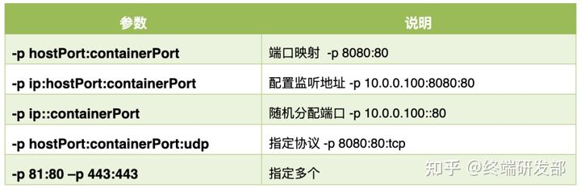
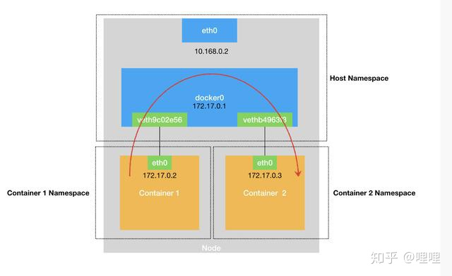

# Docker构成

## 容器和虚拟机

1. 隔离级别
   - 虚拟化使得许多OS可同时在单个物理机运行，**OS级隔离**
   - 容器则可共享同一OS内核，应用**进程级隔离**。可将容器当做重量轻、模块化的虚拟机使用。
2. 安全性
   - CPU虚拟化支持硬件隔离；容器不能硬件隔离
   - 虚拟机租户 `root` 权限和物理机的 `root` 权限分离；`Docker` 的租户 `root` 和物理机 `root` 等同


## 特点

1. Docker 以Linux 内核和内核功能为基础（如 Cgroups 和 namespaces）来分隔进程，以便**各进程相互独立运行**。相当于是在**正常进程的外面套了一保护层**。对于容器里的进程来说，各种**资源都是虚拟的**，从而实现与底层系统的隔离。
2. `Docker` 提供基于**镜像**的部署模式，将应用程序与该程序的**依赖**，**打包在一个文件里**。运行这个文件，就会生成一个**虚拟容器**。程序在这个虚拟容器里运行，就好像在真实的物理机上运行一样。Docker 还可在这一容器环境中自动部署应用程序（或者合并多种流程，以构建单个应用程序）。
3. ==各个容器都有独立的精简OS(rootfs)==

## Docker组成结构

`Docker` 使用 **`C/S`** 架构， `Docker client`与 `Docker daemon` 交互，`Docker daemon` 负责`build`、`run`和分发 `Docker image` 。`Docker client`有多种方式：本机、`RESTful`、`stock` 或网络接口，可远程通信。

镜像是 `Docker` 运行容器的前提，仓库是存放镜像的场所

### `docker client`

`Docker Client` 使用 `docker API` ，**用于发送命令**。`Docker client`有多种方式：本机命令行、`RESTful`、`stock` 或网络接口，可远程通信。可以与**多个服务端**进行通信。


### `Docker daemon`

`Docker daemon`：Docker服务器组件，以 Linux后台服务的方式运行，是 `Docker` 最核心的后台进程。**负责真正执行来自 `Docker Client`的请求**。

`Docker Daemon` 通过 `Docker Server` 模块接受 `Docker Client` 的请求，并在 `Engine` 中处理请求，然后根据请求类型，创建出指定的 `Job` 并运行。 `Docker Daemon` 运行在 `Docker host` 上，负责创建、运行、监控容器，构建、存储镜像。


### `Image`(镜像)

`Docker Image` 看作**特殊的文件系统**，包含**容器运行时依赖、配置参数**(<u>所需的程序、库、资源、配置、匿名卷、环境变量、用户等</u>)，由**name：tag**组成

==**镜像由多个只读层构成(只读模板)，不含动态数据**==，其内容构建之后不会改变。层层重叠在一起，除了最下面一层，其它层都会有一个指针指向下一层。统一文件系统 `(unionFS)` 技术能够将不同的层整合成一个文件系统，用户的角度看来，只存在一个文件系统。**最底层bootfs**与Linux一致，包含boot加载器、内核和linux文件目录结构，不同发行版可公用bootfs


#### `Dockerfile`

`Dockerfile`事自动构建 `docker` 镜像的配置文件， 用于创建自定义的镜像。分为四个部分：

```
FROM		#基础镜镜像，一切从这里开始构建
MAINTAINER		#镜像是谁写的，姓名+邮箱
RUN		#镜像构建的时候需要运行的命令
ADD		#步嘟:tomcat镜像,这个tomcat压缩包!添加内容
WORKDIR		#镜像的工作目录
VOLUME		#挂载的目录
EXPOSE		#保留端口配置
CMD		#指定这个容器启动的时候要运行的命令,只有最后一个会生效，可被替代
ENTRYPOINT		#指定这个容器启动的时候要运行的命令,可以追加命令
ONBUILD		#当构建一个被继承 DockerFi1e这个时候就会运行ONBUILD 的指令。触发指令。
COPY		#类似ADD,将我们文件拷贝到镜像中
ENV		#构建的时候设置环境变量!
```


### `Container`(容器)

`Container`容器的**最上面是可读写层**，之下是`Image`层。==**容器 = 镜像 + 读写层**==。所有对容器的改动 - 无论添加、删除、还是修改文件都只会发生在容器层中。只有**容器层是可写的，容器层下面的所有镜像层都是只读的。**

`Docker Container` 是 基于`Docker Image` 的运行实例，是真正运行项目程序、消耗系统资源、提供服务的地方。容器启动时，一个新的可写层被加载到镜像的顶部。这一层通常被称作“容器层”，“容器层”之下的都叫“镜像层”。


### `Repository`(仓库)

`Docker` 仓库是集中存放、分发`Image`文件的场所。分为`public`(公有仓库)、`private`(私有仓库)。仓库地一般是**域名**


# Docker操作

## 镜像管理

| 命令基本                                       | 参数                        | 备注                                     |
| ---------------------------------------------- | --------------------------- | ---------------------------------------- |
| docker search imageName                        |                             |                                          |
| docker pull  仓库地址 / imageName : tag        |                             | 默认latest最新版，保存到 /var/lib/docker |
| docker images                                  | -a所有镜像                  |                                          |
| docker image inspect imageName                 |                             | 查看镜像的详细信息                       |
| docker image load -i tar.gz文件                |                             | 从tar.gz导入镜像                         |
| docker image rm centos:latest                  |                             | 删除本机镜像                             |
| docker rmi name                                | -f强制删除                  |                                          |
| docker version/info                            |                             | 查看docker系统信息                       |
| docker build -t 仓库地址 / imageName : version | -t 是为新镜像设置仓库和名称 | tag默认latest                            |


## 容器运行

| 命令基本                          | 参数                                                         | 备注                          |
| --------------------------------- | ------------------------------------------------------------ | ----------------------------- |
| docker run imageName              | -d 后台 ****  --name指定名称  -P外部随机端口映射   -v挂载数据卷 | 返回id                        |
| docker container inspect          |                                                              | 查看容器详细信息              |
| docker ps                         | -a：显示全部container                                        | 无-a显示正在运行              |
| docker cp ID:/xx   /xx            |                                                              | 拷贝文件到物理机              |
| docker rm ID                      |                                                              |                               |
| docker start/restart/stop ID      |                                                              |                               |
| docker rm -f $(docker ps -aq)     |                                                              | 删除所有容器                  |
| docker top  ID                    |                                                              | 容器内进程信息                |
| docker exec -it  ID  /bin/bash    |                                                              | **新建**指定shell进入容器操作 |
| docker a't'tach ID                |                                                              | 进入容器**原本**shell         |
| docker **commit** ID 新镜像名:tag | -a 作者 -m 信息                                              | 从容器生成新镜像              |
| docker save -o filename imagename |                                                              |                               |



## 配置管理

### 查看配置命令

```text
docker -H 服务器IP地址 info           实现与远程服务器通信
```


### 配置文件

/etc/docker/**`daemon.json`**

```json
{//镜像加速
  "registry-mirrors": [ "http://hub-mirror.c.163.com",
    "https://docker.mirrors.ustc.edu.cn"]
}   
```

开启远程管理

 `/etc/systemd/system/multi-user.target.wants/docker.service` ， `ExecStart` 后面添加 `-H tcp://0.0.0.0`，允许来自任意 IP 的客户端连接。


## **Docker 数据卷的管理**

数据外部持久化，将**容器内数据<u>同步</u>至本地**，便于共享、重用、备份、转移。完全独立于容器的生存周期，==**`container`不记录volume的变化，容器删除后挂载的volume不受影响**==

| 命令                                                     | 选项           | 意义              |
| -------------------------------------------------------- | -------------- | ----------------- |
| docker run -d  -v / 物理机目录 : 容器目录 [: ro]  镜像名 | ro：容器内只读 | 挂载volume        |
| docker volume create  vName                              |                | 创建卷，卷名vName |
| docker volume ls                                         |                | 查看卷            |
| docker volume inspect   volumeName                       |                | 某卷详情          |

- 挂载方式
  - 匿名挂载：-v 容器目录
  - 具名挂载：-v  **卷名**：容器目录（没有根路径） 
  - 指定路径：-v **/** 物理机目录 : 容器目录（根路径开头）
- 数据卷类型
  - 命名卷不会自动删除，默认在物理机 `/var/lib/docker/volumes /卷名/data`
  - 匿名卷则是随着容器的建立而建立，随着容器的关闭而消亡。匿名卷一般用来存储无关痛痒的数据。
- inspect中Mounted Source：物理机目录   Destination：容器内目录

```text
docker run -d -p 80:80 -v /data : /usr/share/nginx/html nginx:latest 

docker volume create myData
docker run -d -p 80:80 -v myData : /usr/share/nginx/html nginx:latest 
```

## 数据卷容器

**已挂载数据卷的父容器** 被 **其他容器** **共享**父容器已挂载的**数据**，称为数据卷容器。常用于文件共享

```
docker run -it --name childDoc --volumes-from 父Id centos
```

==子容器的数据卷 不会 因数据卷容器删除 而丢失，即传导volume配置而非数据本身==

# 网络配置

## 相关概念名词

1. network namespace：内核版本之后支持的特性，主要用于资源的隔离。每个namespace有属于自己的网络设备，Linux 系统就可以抽象出多个网络子系统，各子系统间都有自己的网络设备，协议栈等。**各namespace间相互独立不可见，namespace内部的设备可间可感知**
2.  `docker0`：Docker安装后创建的虚拟交换机，与物理机网卡联通，作为物理机的某内网  172.XXX 255.255.0.0
3. `veth pair`技术：一对联通的虚拟网口，用于联通不同namespace。每创建/删除一个`container`，成对创建/删除
   - `eth0` 接口（**仅属于container namespace内**，IP为docker0分配）
   -  `vethxxx` 物理机的namespace中，==**无IP**==。**默认**桥接到 **docker0** 
   - 保证无论哪一个 veth 接收到网络报文，都会将报文传输给另一方

## `container`网络绑定

1. 创建一对虚拟接口/网卡`veth pair`，分别放到本地主机和新容器中
2. **本地主机端veth桥接到默认的 docker0 或指定网桥上，**==无IP==
3. **容器端eth0放到新`container`**，==只在容器的namespace可见==
4. 为eth0分配网桥(默认docker0)的子网IP，配置默认路由到 veth

- 创建容器默认使用的网络模式bridge
- 每个docker `container`分配新的 network namespace，**与主namespace隔离**。
- `container`默认都会挂到 docker0 上，使用本地主机上 docker0 接口的 IP 作为所有容器的默认网关。同一网桥下的各容器可互通

## 网络模式

默认创建三种网络，可以通过 `docker network ls` 查看。


### bridge模式

1. 创建方式：默认使用的网络模式bridge

- 每个`container`分配独有的network namespace，为此namespace配置虚拟网卡etho，路由，DNS，IP地址与iptables规则

- 网桥 `docker0` 的私有地址空间中分配 IP 地址和子网给该容器，并设 docker0 容器的默认网关


- `veth` 绑定到 docker0 网桥上。保证物理机的网络报文发往 veth；
-  `eth0`绑定到 `Container` 所属的 namespace 下，物理机的网络报文若发往 veth0，立即被 Container 的 eth0 接收，实现<u>物理机到 Container</u> 的联通性



### host 网络模式

1. 创建：`--net host` 或者 `--network host` 创建容器
2. **`Container`直接使用物理机 IP 与外界进行通信**，而非内网或docker0。无需额外进行 NAT 转换；

- 端口、IP与物理机一致，相当于运行运行普通进程
- ==**`Container`使用使用物理机的namespace**==，没有独立的namespace。==**一切与物理机共享**==


### none 网络模式

1. 创建：`--net none` 或者 `--network none` 创建容器
2. `Container` **不创建任何的网络资源但有namespace**，只有 lo 接口127.0.0.1，==**没有`veth pair`**==。一切需自定义配置

- `Container` 独有network namespace ，但不会为这个命名空间准备虚拟网卡，IP地址，路由等，需要用户自己配置。

### container 网络模式joined-container

1. 创建：`--net container:网络cointainer|ID` 或 `--network container:网络cointainer|ID` 
2. 新`Container`和指定的容器**共享namespace**、 IP(local)、端口；不会创建网络资源，==**没有`veth pair`**==

- `Container`没有独有namespace，==**一切与指定容器共享**==


