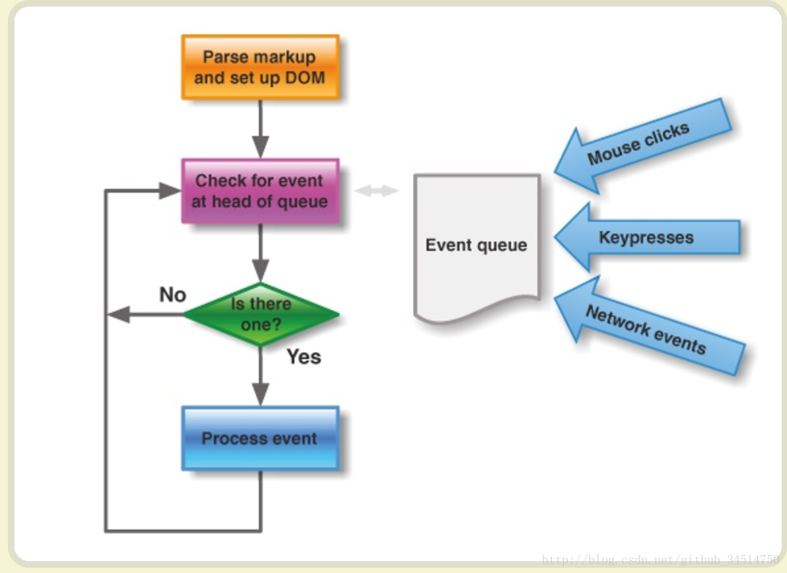
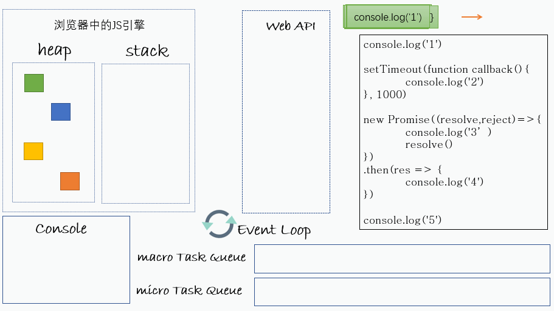

# 浏览器模型

## 组成

- GUI 渲染线程

  **解析代码**：HTML代码解析为DOM，CSS代码解析为CSSOM（CSS Object Model）
  **对象合成**：将DOM和CSSOM合成一棵渲染树（render tree）
  **布局**：计算出渲染树的布局（layout）
  **绘制**：将渲染树绘制到屏幕

- 事件触发线程

  控制交互，响应用户。事件添加到待处理队列的队尾，等待JS引擎的处理

- 事件轮询处理线程

  轮询消息队列，event loop

- JavaScript引擎线程

  **javascript是单线程运行**。

  ==GUI渲染线程与JS引擎线程互斥JavaScript引擎线程==，JS执行的时间过长，会造成页面的渲染不连贯

  页面的下载和渲染都必须停下来等待js脚本执行完成，==操作的DOM节点必须存在才能js操作==。一般依赖库最先声明，执行脚本最后书写。

- 定时触发器线程

  单独线程来计时并触发定时更准确。setTimeout和setInteval

- 异步http请求线程

  XMLHttpRequest新开一个线程请求，将检测到状态变更时，如果设置有回调函数，异步线程就产生状态变更事件放到JS引擎的处理队列中等待处理。

  Chrome中打开一个网页相当于起了一个**进程**，每个**tab**网页都有由其独立的渲染引擎实例

  

## 解析页面

1. 开始解析HTML

   解析器将HTML转换为文档对象模型(**DOM**)

2. 获取外部资源

   遇到外部资源（如CSS或JavaScript文件）时，提取这些文件。 解析器在加载CSS文件时继续运行，此时会阻止页面渲染但仍解析，直到资源加载解析完

   解析器==先加载执行 JS 文件，阻塞渲染线程和HTML解析过程==。 defer` 和`async`允许同时执行

3. 解析 CSS 并构建CSSOM

   CSSOM 与 DOM一起构建渲染树

4. 执行 JavaScript

   JS和DOM被完全解析并准备就绪后就会 发生`document.DOMContentLoaded`事件。 所有资源(异步JavaScript，图像)出发`Window.load`事件

5. 合并 DOM 和 CSSOM 以构造渲染树

   **渲染树**是**DOM**和**CSSOM**的组合，表示将要渲染到页面上的所有内容

6. 计算布局和绘制

   渲染引擎从顶部开始一直向下遍历渲染树，计算应显示每个节点的坐标

## event loop机制

异步任务进入消息队列，指定回调函数。只有消息队列通知主线程，并且同步执行栈为空时，该消息对应的==回调函数==才能执行。

1. 所有同步任务都在主线程上执行，形成一个执行栈。主线程之外，还存在一个”任务队列”。
2. 只要异步任务有了运行结果，就在”任务队列”之中放置一个事件。
3. 一旦”执行栈”中的所有同步任务执行完毕，系统就会读取”任务队列”，看看里面有哪些事件。那些对应的异步任务，于是结束等待状态，进入执行栈，开始执行。
4. 主线程不断重复上面的第三步。
   




主线程从”任务队列”中读取事件，这个过程是循环不断的，所以整个的这种运行机制又称为Event Loop（事件循环）



都处于 Task Queue 中时，微任务 > 宏任务
宏任务	setTimeout 、setInterval 、UI rendering
微任务	promise 、requestAnimationFrame

Map本质上时二维数组  const arr = [...map]输出二维数组，可以更具二维数组生曾map。只能get访问，不能[ ]


for-of  = froEach支持array map set，不支持对象object，需要Object.keys

对象的[]访问针对属性名，而非索引

解构赋值，支持作为函数参数

```
let {name=默认值, 原属性名:新变量} = person;
```

高阶函数仅支持数组array


var user = {name:'张三',age:10,sex:'男'}

for(let index of Object.keys(user)){
 console.log(index+':'+user[index])
 //"name:张三""age:10""sex:男"
}

箭头函数完全修复了`this`的指向，`this`总是指向词法作用域，也就是外层调用者`obj`：


```
getAge.apply(xiaoming, []); // 25, this指向xiaoming, 参数为空
```

Object.keys 遍历对象属性包括父类+本类， 仅可枚举属性，无原型

**Object.getOwnPropertyNames**  获取属性包括父类+本类，包括可枚举和不可枚举的属性

hasOwnProperty()   是否自身拥有（包括父+子）的，而不是原型得到的


var obj = {"name":"tom","sex":"male"}；

Object.defineProperty(obj, "age", {value:"18", enumerable:false});//增加不可枚举的属性age

Object.prototype.protoPer1 = function(){console.log("name is tom");};//通过原型链增加属性，为一个函数

Object.prototype.protoPer2 = 2;通过原型链增加属性，为一个整型值2

console.log("Object.keys:")

console.log(Object.keys(obj));


```
var xiaoming = {
    name: '小明',
    birth: 1990,
    school: 'No.1 Middle School',
    height: 1.70,
    weight: 65,
    score: null
};          检测xiaoming是否拥有某一属性，可以用in操作符
是否是xiaoming自身拥有的，而不是继承得到的，可以用hasOwnProperty()方法
'name' in xiaoming; // true
'grade' in xiaoming; // false

xiaoming.hasOwnProperty('name'); // true
xiaoming.hasOwnProperty('toString'); // false
```


```
JSON.stringify(xiaoming, ['name', 'skills'  属性名list], '  '缩进);
```

精确控制如何序列化小明，可以给`xiaoming`定义一个`toJSON()`的方法，直接返回JSON应该序列化的数据：

```
var xiaoming = {
    name: '小明',
    age: 14,
    gender: true,
    height: 1.65,
    grade: null,
    'middle-school': '\"W3C\" Middle School',
    skills: ['JavaScript', 'Java', 'Python', 'Lisp'],
    toJSON: function () {
        return { // 只输出name和age，并且改变了key：
            'Name': this.name,
            'Age': this.age
        };
    }
};

JSON.stringify(xiaoming); // '{"Name":"小明","Age":14}'
```

var obj = JSON.parse('{"name":"小明","age":14}', function (key, value) {
    if (key === 'name') {
        return value + '同学';
    }
    return value;
});
console.log(JSON.stringify(obj)); // {name: '小明同学', age: 14}


```
<!-- HTML -->
<form id="test-form" onsubmit="return checkForm()">   返回true提交，flase不提交
    <input type="text" name="test">
    <button type="submit">Submit</button>
</form>

<script>
function checkForm() {
    var form = document.getElementById('test-form');
    // 可以在此修改form的input...
    // 继续下一步:
    return true;   
}
</script>
```

async 是“异步”的简写，而 await 可以认为是 async wait 的简写。
 async 用于申明一个 function 是异步的，而 await 用于等待一个异步方法执行完成。
  async 是一个修饰符，async 定义的函数会默认的返回一个Promise对象resolve的值，因此对async函数可以直接进行then操作,返回的值即为then方法的传入函数


await 关键字 只能放在 async 函数内部， await关键字的作用 就是获取 Promise中返回的内容， 获取的是Promise函数中resolve或者reject的值
// 如果await 后面并不是一个Promise的返回值，则会按照同步程序返回值处理


async 作为一个关键字放到函数的前面，用于表示函数是一个异步函数，该函数的执行不会阻塞后面代码的执行


await是等待，只能放到async函数里面，在后面放一个返回promise对象的表达式

**当 async 函数中只要一个 await 出现 reject 状态，则后面的 await 都不会被执行,可以添加 try/catch**


如果它等到的不是一个 `Promise` 对象，那 await 表达式的运算结果就是它等到的东西。
 如果它等到的是一个 `Promise` 对象，`await` 就会阻塞后面的代码，等着 `Promise` 对象 `resolve`，然后得到 `resolve` 的值，作为 `await` 表达式的运算结果。


then正确执行   catch错误发生时专门捕获异常，整条调用链都可以被.catch捕获

```
job1.then(job2).then(job3).catch(handleError); 同步执行

// 同时执行p1和p2，并在它们都完成后执行then:
Promise.all([p1, p2]).then(function (results) {
    console.log(results); // 获得一个Array: ['P1', 'P2']
});

Promise.race([p1, p2]).then(function (result) {
    console.log(result); // 'P1'
});  先返回结束
```

Promise中返回普通对象，默认Promise.resolve状态


当Promise的回调函数返回非Promise对象的值时，then和catch都生成一个状态为fulfilled的Promise对象（reslove），并把该返回值传入Promise链的下一环节then。
当Promise的回调函数返回值为Promise对象时，生成的Promise对象的状态由被返回的Promise对象决定，传入Promise链下一环节的值也由这个被返回的Promise决定。
当Promise的回调函数中抛出错误时，then和catch都生成一个状态为rejected的Promise对象，并把抛出的错误对象传入Promise链的下一环节。


- pending: 初始状态，不是成功或失败状态。
- fulfilled: 意味着操作成功完成。
- rejected: 意味着操作失败。

只要这两种情况发生，状态就凝固了，不会再变了，会一直保持这个结果。就算改变已经发生了，你再对 Promise 对象添加回调函数，也会立即得到这个结果。但可以产生新的Promise


`then`和`catch`都会返回一个新的`Promise`。

`3、``catch`不管被连接到哪里，都能捕获上层未捕捉过的错误。


Promise代表承诺将来会执行即内部有异步操作，==本身不是异步而是同步，而是在内部触发执行异步操作==，调用reslove/reject会改变状态，then/catch时状态改变的回调