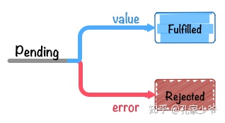

# 浏览器模型

## 组成

- GUI 渲染线程

  **解析代码**：HTML代码解析为DOM，CSS代码解析为CSSOM（CSS Object Model）
  **对象合成**：将DOM和CSSOM合成一棵渲染树（render tree）
  **布局**：计算出渲染树的布局（layout）
  **绘制**：将渲染树绘制到屏幕

- 事件触发线程

  控制交互，响应用户。事件添加到待处理队列的队尾，等待JS引擎的处理

- 事件轮询处理线程

  轮询消息队列，event loop

- JavaScript引擎线程

  **javascript是单线程运行**。

  ==GUI渲染线程与JS引擎线程互斥JavaScript引擎线程==，JS执行的时间过长，会造成页面的渲染不连贯

  页面的下载和渲染都必须停下来等待js脚本执行完成，==操作的DOM节点必须存在才能js操作==。一般依赖库最先声明，执行脚本最后书写。

- 定时触发器线程

  单独线程来计时并触发定时更准确。setTimeout和setInteval

- 异步http请求线程

  XMLHttpRequest新开一个线程请求，将检测到状态变更时，如果设置有回调函数，异步线程就产生状态变更事件放到JS引擎的处理队列中等待处理。

  Chrome中打开一个网页相当于起了一个**进程**，每个**tab**网页都有由其独立的渲染引擎实例

  

## 解析页面

1. 开始解析HTML

   解析器将HTML转换为文档对象模型(**DOM**)

2. 获取外部资源

   遇到外部资源（如CSS或JavaScript文件）时，提取这些文件。 解析器在加载CSS文件时继续运行，此时会阻止页面渲染但仍解析，直到资源加载解析完

   解析器==先加载执行 JS 文件，阻塞渲染线程和HTML解析过程==。 defer` 和`async`允许同时执行

3. 解析 CSS 并构建CSSOM

   CSSOM 与 DOM一起构建渲染树

4. 执行 JavaScript

   JS和DOM被完全解析并准备就绪后就会 发生`document.DOMContentLoaded`事件。 所有资源(异步JavaScript，图像)出发`Window.load`事件

5. 合并 DOM 和 CSSOM 以构造渲染树

   **渲染树**是**DOM**和**CSSOM**的组合，表示将要渲染到页面上的所有内容

6. 计算布局和绘制

   渲染引擎从顶部开始一直向下遍历渲染树，计算应显示每个节点的坐标

## event loop机制

异步任务进入消息队列，指定回调函数。只有消息队列通知主线程，并且同步执行栈为空时，该消息对应的==回调函数==才能执行。

1. 所有同步任务都在主线程上执行，形成一个执行栈。主线程之外，还存在一个”任务队列”。
2. 只要异步任务有了运行结果，就在”任务队列”之中放置一个事件。
3. 一旦”执行栈”中的所有同步任务执行完毕，系统就会读取”任务队列”，看看里面有哪些事件。那些对应的异步任务，于是结束等待状态，进入执行栈，开始执行。
4. 主线程不断重复上面的第三步。
   


主线程从”任务队列”中读取事件，这个过程是==循环不断==的，所以整个的这种运行机制又称为Event Loop（事件循环）


Task Queue 的异步任务分为   `微任务` 、`宏任务`；**微任务优先**
宏任务	setTimeout 、setInterval 、UI rendering
微任务	promise 、requestAnimationFrame          (Promise>setTimeout )


# JS

## 基本语法

### 基本类型

1. 反引号\`\`:用于模板字符串：**\`pre  ${varName}   suf\` **和   **多行字符串**
2. str：作为字符的数组

### 运算符

1. 比较运算符：始终坚持使用`===`比较，唯一能判断`NaN`的方法是通过`isNaN()`函数
2. boolean：null '' undefine转换为false  非空白转为true
3. 大多数情况用`null`。`undefined`仅仅在判断函数参数是否传递的情况下有用
4. 异步错误必须==回调函数中处理try-catch==

## 循环

`for-of`针对`iterable`:Map、Set、Array的**forEach**方法快捷遍历。==不支持**对象objec**t==，需要Object.keys才能

```js
map.forEach(function (value, key, map) {
    console.log(value);
}//Map支持k-v，但是Array、Set不支持
```

遍历**obj**：①for-in+hasOwnProperty()     ②for-of遍历properName

```js
for (var key in o) {
    if (o.hasOwnProperty(key)) {
        console.log(key); // 'name', 'age', 'city'
    }
}
for (let key of Object.keys(o)) {
    console.log(o[key]);
}
```


## Array

length赋一个新的值会导致变化


## object

1. ==所有属性key都是字符串(自动转换)==，value任意类型

2. 访问方式：①obj.proName    ②obj[  'proName '  **属性名str**  ]，不是str自动转换

3. `in`操作符判断obj是否有某一property，是否xiaoming自身拥有的，而不是来自原型可以用`hasOwnProperty()`

   ```javascript
   'toString' in xiaoming; // true
   xiaoming.hasOwnProperty('name'); // true
   xiaoming.hasOwnProperty('toString'); // false
   ```

4. Object.keys 遍历对象属性包括父类+本类， 仅可枚举属性，无原型

   **Object.getOwnPropertyNames**  获取属性包括父类+本类，包括可枚举和不可枚举的属性

   hasOwnProperty()   是否自身拥有（包括父+子）的，而不是原型得到的


## Map和Set

1. **KEY可为任意类型，而Object的property只能是str**
2. Map本质上时**二维数组**  const arr = [...map]输出二维数组的元素  `[keyn,  value1]`  ；Set可用Array初始化
3. **只能用get访问，不能[ ]**,    Object可以**[  ]**访问
4. get/has/delete/set方法操作


## 解构赋值

==支持作为函数参数==，可用于array(  )  对象{  }

```
let {name=默认值, 原属性名:新变量} = person;
```

支持...array/map 打散


## 函数

### this问题

箭头函数完全修复了`this`的指向，`this`总是指向词法作用域，也就是外层调用者`obj`：

```js
getAge.apply(xiaoming, [参数数组]); //  this指向xiaoming, 参数为数组
getAge.call(null, 3, 5, 4); // this指向xiaoming, 参数为...
```


### 箭头函数

```js
// 两个参数:
(x, y) => x * x + y * y
// 无参数:
() => 3.14
// 可变参数:
(x, y, ...rest) => {
    return a;
}
```

箭头函数完全修复`this`的指向，无需apply和call。`this`总是指向**外层调用者`obj`**：

```js
var obj = {
    birth: 1990,
    getAge: function () {
        var b = this.birth; // 1990
        var fn = () => new Date().getFullYear() - this.birth; // this指向obj对象
        return fn();
    }
};
obj.getAge(); // 25
```


### 高阶函数

高阶函数仅支持数组array


## Class(简化原型链代码)

```js
class Student {
    constructor(name) {
        this.name = name;
    }
}

class PrimaryStudent extends Student {
    constructor(name, grade) {
        super(name); // 记得用super调用父类的构造方法!
        this.grade = grade;
    }
}
```

## Promise  承诺内部有函数将来会执行，即内部有异步操作

==本身是同步，但是内部会触发异步方法==，Promise链根据不同状态进行不同调用。

> **Promise正常结束调用resolve( )方法，异常则调用reject( )方法**

### 状态转换



- pending: 初始状态，不是成功或失败状态。

- fulfilled: 意味着操作成功完成。

  **then()**：注册Promise正常结束的回调，多次then会根据顺序串行执行，参数为resolve(value )保存的value 

- rejected: 意味着操作失败。

  **catch()**：注册Promise失败的回调函数，异常可传递直至catch( )捕获，参数为reject(value )保存的value 

- fulfilled 和 rejected 状态只能由 pending 转化而来，两者之间不能互相转换。==只能转换一次==

### 构造方法

```js
new Promise(function (resolve, reject) { 
    setTimeout(function () {
        if (timeOut < 1) {
            resolve('200 OK');          //转换成fulfilled ，设置值，传递给then回调
        }
        else {
            reject('timeout in ');       //转换rejected ，设置值，传递给catch回调
        }
    }, timeOut * 1000);
})
Promise.resolve()    //生成fulfilled 状态的Promise
Promise.reject()	//生成rejected 状态的Promise
```

1. resolve(value )执行：转换成fulfilled状态，设置值value，传递给then回调，回调参数为保存的value值。
2. reject(value )执行：转换成rejected 状态，设置值value，传递给catch回调，回调参数为保存的value值。
3.  catch错误发生时专门捕获异常，==整条调用链==都可以被.catch捕获，用于==统一异常处理==

### 调用链

有多次then()可==串行处理==，then() catch()设置的回调函数有不同的返回值，==但都会处理成全新的Promise==

```js
job1.then(job2).then(job3).catch(handleError); //同步执行

Promise.reject().catch(function() {
  return 'Hello World';
})
.then(function(value) {
  console.log(`fulfilled: ${value}`); // 'fulfilled: Hello World'
})
.catch(function(value) {
  console.log(`rejected: ${value}`);
})
```

1. **then()和catch()返回普通对象，==全部==包装成resolve(fulfilled)状态的Promise对象，与原状态无关**
2. then()和catch()可以返回`指定状态`的Promise
3. then()和catch()抛出错误`时，==全部==包装成rejected(rejected)状态的Promise对象

### 并行多个Promise

1. `Promise.all([Promise数组])`：**所有**Promise都执行完毕才继续，==生成数组往后传递==
2. `Promise.race([Promise数组])`：**任意一个**Promise执行完就返回

```js
// 同时执行p1和p2，并在它们都完成后执行then:
Promise.all([p1, p2]).then(function (results) {
    console.log(results); // 获得一个Array: ['P1', 'P2']
});

Promise.race([p1, p2]).then(function (result) {
    console.log(result); // 'P1'
});  
```


### async await


async 是“异步”的简写，而 await 可以认为是 async wait 的简写。
 async 用于申明一个 function 是异步的，而 await 用于等待一个异步方法执行完成。
  async 是一个修饰符，async 定义的函数会默认的返回一个Promise对象resolve的值，因此对async函数可以直接进行then操作,返回的值即为then方法的传入函数


await 关键字 只能放在 async 函数内部， await关键字的作用 就是获取 Promise中返回的内容， 获取的是Promise函数中resolve或者reject的值
// 如果await 后面并不是一个Promise的返回值，则会按照同步程序返回值处理


async 作为一个关键字放到函数的前面，用于表示函数是一个异步函数，该函数的执行不会阻塞后面代码的执行


await是等待，只能放到async函数里面，在后面放一个返回promise对象的表达式

**当 async 函数中只要一个 await 出现 reject 状态，则后面的 await 都不会被执行,可以添加 try/catch**


如果它等到的不是一个 `Promise` 对象，那 await 表达式的运算结果就是它等到的东西。
 如果它等到的是一个 `Promise` 对象，`await` 就会阻塞后面的代码，等着 `Promise` 对象 `resolve`，然后得到 `resolve` 的值，作为 `await` 表达式的运算结果。


## 内置对象

### Json

1. JSON.stringify(xiaoming, ['name', 'skills'  属性名Array], '  '缩进);
2. 或重写`toJSON()`的方法，直接返回JSON应该序列化的数据：
3. JSON.parse(str)：反序列化

```js
var xiaoming = {
    name: '小明',
    age: 14,
    gender: true,
    height: 1.65,
    grade: null,
    'middle-school': '\"W3C\" Middle School',
    skills: ['JavaScript', 'Java', 'Python', 'Lisp'],
    toJSON: function () {
        return { // 只输出name和age，并且改变了key：
            'Name': this.name,
            'Age': this.age
        };
    }
};
JSON.stringify(xiaoming, ['name', 'skills'属性名Array], '缩进');
JSON.stringify(xiaoming); // '{"Name":"小明","Age":14}'

var obj = JSON.parse('{"name":"小明","age":14}', function (key, value) {
    if (key === 'name') {
        return value + '同学';
    }
    return value;
});
console.log(JSON.stringify(obj)); // {name: '小明同学', age: 14}
```

### Date

JavaScript的Date对象月份值从0开始，牢记0=1月，1=2月，2=3月，……，11=12月。

```js
var d = Date.parse('2015-06-24T19:49:22.875+08:00');//ISO标准格式创建
var d = new Date(1435146562875);					//时间戳创建
getTime()//获取时间戳
```


