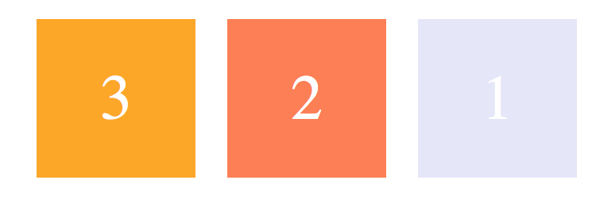

# HTML5

## 表单

readonly：不可修改，可选中，提交后台

disabled：不可修改，不可选中，不提交后台

# css

## 选择器

-  \*通用选择器：匹配所有元素
- tag标签选择器：匹配某标签
- ,逗号  并列选择：任意匹配其中之一
- .className类选择
- \#ID ID选择器
- 属性选择  [attr]` `[attr=value]  [attr^=value] [attr$=value] [attr*=value]
- 空格 子代(一代)：只有一代
- \>所有后代
- +相邻兄弟：选中一个，跟在前一个==之后==，==同一个父节点==
- ~兄弟：选择多个，前一个节点后面的任意位置，并且共享同一个父节点
- ：伪类选择器
- 优先级：\*  <  tag   <  类   <ID            某属性 !important：此属性最优先

## 通用样式

boder：style width size             margin/padding: 上右下左   /  上下    左右 ==支持auto==

background： url(img)                background-color

## 文本常见样式

text-decoration:none 下划线样式


# 列表常见样式

list-style-type:none    list前缀


## 超链接样式


# display

| 属性         | 是否可指定width、height | 是否独占一行 |                          |
| ------------ | ----------------------- | ------------ | ------------------------ |
| block        | √                       | √            |                          |
| inline       | ×                       | ×            |                          |
| inline-block | √                       | ×            | ==可以设置大小的inline== |
| none         |                         |              | 隐藏并脱离文档流         |

**div+float可以横向显示导航**


# 定位position

# 绝对定位 absolute

1. 相对于  ==已设position属性的父级元素==  去定位；所有祖先元素没有开启定位，则相对于根html
2. 完全脱离文档流，不占有原来位置，**被后面顶替**；不设置偏移量，则元素的位置不会发生变化
3. 内联元素变成块元素，块元素的宽度和高度默认都被内容撑开
4. 元素提升一个层级
5. left/top设置偏移


将对象从文档流中拖出，使用left ,right , top , bottom 等属性相对于==其最接近的一个最有定位设置的父对象进行绝对定位==。如果不存在这样的父对象，则依据body对象。而其层叠通过z-index属性定义

## 相对定位 relative

1. 相对于  ==自身原本位置==   定位
2. 不脱离文档流，占有原来的位置；不设置偏移量时，元素不会发生任何变化
3. 元素提升一个层级
4. 不会改变元素的性质，块还是块，内联还是内联
5. ==主要作用是  给absolute当父级元素==
6. left/top设置偏移

## 固定定位 fixed

1. 大部分特点都和绝对定位一样
2. 相对于   浏览器窗口  进行定位
3. 固定在浏览器窗口某个位置，不会随滚动条滚动

## 默认静态定位 static


# 浮动float

1. ==脱离标文档准流==，后面会顶替
2. 浮动的元素会一行内显示并且元素顶部对齐
3. 浮动的元素会具有==inline-block==元素的特性
4. 浮动的元素是互相贴靠（不会有缝隙）；父级宽度装不下这些浮动的盒子， 多出的盒子会另起一行对齐
5. clear清除浮动针对本元素，而非旁边元素
6. z-index越大越优先

# flex布局

不需依赖float就能在行或列进行上布局，并且能以弹性尺寸来适应空间


水平主轴(main axis) 和垂直的交叉轴(cross axis)是==相对==的，通过主轴和交叉轴设置子元素大致布局，后微调各个子元素。剩余空间根据子元素flex放大/缩小，默认空间不够则等比例缩小。


## Flex 容器：

首先，实现 flex 布局需要先指定一个容器，任何一个容器都可以被指定为 flex 布局，这样容器内部的元素就可以使用 flex 来进行布局。**当时设置 flex 布局之后，子元素的 float、clear、vertical-align 的属性将会失效。**

```css
.container {
    display: flex | inline-flex;       //可以有两种取值
}
```

### 容器属性

#### flex-direction **决定内部子元素主轴的方向(即项目的排列方向)**

```css
.container {
    flex-direction: row  | row-reverse | column | column-reverse;
}
```

默认值：row，主轴为水平方向，起点在左端。


row-reverse：主轴为水平方向，起点在右端



column：主轴为垂直方向，起点在上沿


column-reverse：主轴为垂直方向，起点在下沿


#### flex-wrap **决定容器内部子元素是否可换行**

```css
.container {
    flex-wrap: nowrap | wrap | wrap-reverse;
}
```

默认值：nowrap 不换行，即当主轴尺寸固定时，当空间不足时，项目尺寸会随之调整而并不会挤到下一行。

wrap：项目主轴总尺寸超出容器时换行，第一行在上方


wrap-reverse：换行，第一行在下方


#### justify-content **定义了内部子元素元素在主轴的对齐方式（nowrap时会根据子元素放大缩小系数调整子元素大小，默认情况子元素flex= 0 1 auto等比例缩小）**

```css
.container {
    justify-content: flex-start | flex-end | center | space-between | space-around;
}
```

默认值: flex-start 左/上   flex-end  右/下 

space-between：两端对齐，项目之间的间隔相等，即剩余空间等分成间隙。

space-around：每个项目两侧的间隔相等，所以项目之间的间隔比项目与边缘的间隔大一倍。

#### align-items   定义了内部子元素在交叉轴上的对齐方式

```css
.container {
    align-items: flex-start | flex-end | center | baseline | stretch;
}
```

默认值为 stretch 即如果项目==未设置高度或者设为 auto，将占满整个容器的高度==。


flex-start：交叉轴的起点对齐(左/上)


flex-end：交叉轴的终点对齐


center：交叉轴的中点对齐


baseline: 项目的第一行文字的基线对齐（每个子元素首行文字底部对齐）


#### align-content   flex-wrap=wrap产生多个轴线时，轴线本身对齐

```css
.container {
    align-content: flex-start | flex-end | center | space-between | space-around | stretch;
}
```


默认值为 stretch，轴线平分容器交叉轴方向空间。==未指定子元素width、height默认撑开==


flex-start：轴线全部在交叉轴上的起点对齐（上/左），flex-end：轴线全部在交叉轴上的终点对齐(下/右)


center：轴线全部在交叉轴上的中间对齐

space-between：轴线两端对齐，之间的间隔相等，即剩余空间等分成间隙。

space-around：每个轴线两侧的间隔相等，所以轴线之间的间隔比轴线与边缘的间隔大一倍。


## Flex子元素属性

 **order: 排列顺序，数值越小，排列越靠前，默认值为 0**

```css
.item {
    order: <integer>;
}
```


**flex-basis: 主轴方向上的初始大小。横主轴时width失效；纵主轴时height失效**

```css
.item {
    flex-basis: <length> | auto;
}
```

- 当 flex-basis 值为 0 % 时，该子元素视为零尺寸的，不显示
- 当 flex-basis 值为 auto 时，原来width/height值
- 当 flex-basis 值为指定时，原来width/height失效，支持相对于其父容器主轴的百分数

**flex-grow  主轴方向放大比例。flex-basis设置后有剩余空间时，如何分配该子元素**

当所有子元素都以 flex-basis 的值进行排列剩余空间，才会发挥作用

-  flex-grow 全部=为= 1，则它们将等分剩余空间。(如果有的话)
-  flex-grow=  =2，其他项目都为 1，则前者占据的剩余空间将比其他项多一倍。(如果有的话)

**flex-shrink  主轴方向缩小比例。flex-basis设置后没有剩余空间且nowrap时，如何分配缩小子元素**

```css
.item {    flex-shrink: <number>;}
```

flex-shrink 全部= 1，当空间不足时，都将==等比例==缩小。

 flex-shrink = 0，其他项目都为 1，则空间不足时，前者不缩小。

**flex: flex-grow, flex-shrink 和 flex-basis的简写**

```css
.item{    flex: none | [ <'flex-grow'> <'flex-shrink'>? || <'flex-basis'> ]} 
```

flex 的默认值是以上三个属性值的组合。假设以上三个属性同样取默认值，则 flex 的默认值是 0 1 auto。

**align-self: 覆盖 align-items 父容器定义align-items(交叉轴)属性**

```css
.item {     align-self: auto | flex-start | flex-end | center | baseline | stretch;}
```


- ==在同一时间，flex-shrink 和 flex-grow 只有一个能起作用==。
- 空间足够时，flex-grow 生效；空间不足时，flex-shrink 生效。
- flex-wrap 的值为 wrap | wrap-reverse 时，表明可以换行，空间就总是足够的，flex-shrink 当然就不会起作用

