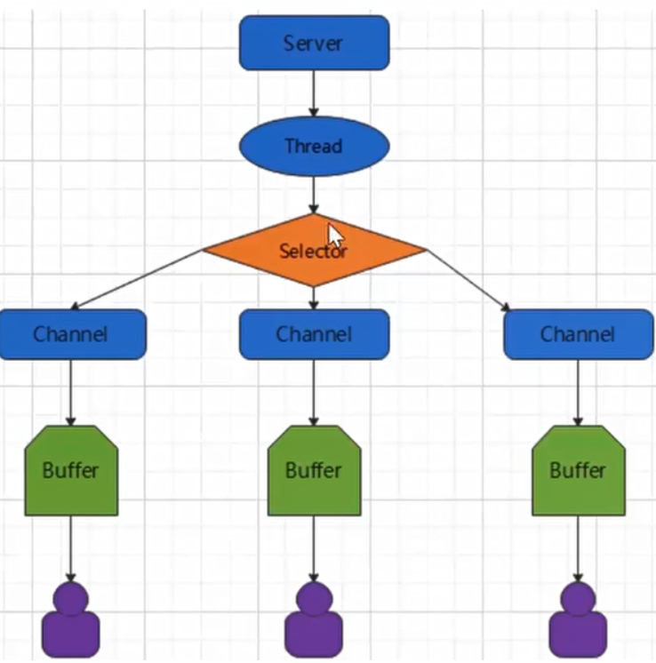

# IO模型

Java NIO:**同步非阻塞**，面向**缓冲区**(块)、基于**通道**的IO操作

BIO：流阻塞线程，即使没有数据传输也阻塞等待

一个线程从某通道发送请求或者读取数据，仅能得到目前可用的数据，如果**没有数据传输，不会空等而是返回null去做其他事情，不阻塞线程**。非阻塞写也是如此，一个线程请求写入一些数据到某通道，但不需要等待它完全写入，这个线程同时可以去做别的事情。真正传输数据时，会因为从OS得到数据而阻塞

Channel**双向**，可读写，可移动，可异步

selector一个线程处理多个Channel

APP必须通过Buffer处理Channel，Channel是连接数据源和Buffer的桥梁，Channel的读写是在Buffer角度而言的


服务器实现模式为一个线程处理多个请求(连接)，即客户端发送的连接请求都会注册到多路复用器上，多路复用器轮询到连接有IO请求就进行处理




# Buffer

可读写、可前后移动。联系Channel和APP的桥梁，**线程不安全**

## 类型

基本数据类型(无BooleanBuffer，无StringBuffer)，通常时`ByteBuffer`。本质上时数组

wrap([])：将普通数组包装为缓冲区


ByteBuffer大小分配
·每个channel都需要记录可能被切分的消息，因为ByteBuffer 不能被多个channel共同使用，因此需要为每个channel维护一个独立的 ByteBuffer
ByteBuffer 不能太大，比如一个ByteBuffer 1Mb的话，要支持百万连接就要1Tb内存，因此需要设计大小可变的 ByteBuffer
。一种思路是首先分配一个较小的buffer，例如4k，如果发现数据不够，再分配8k的buffer，将4kbuffer内容拷贝至8k buffer，优点是消息连续容易处理，缺点是数据拷贝耗费性能

另一种思路是用多个数组组成buffer，一个数组不够，把多出来的内容写入新的数组，与前面的区别是消息存储不连续解析复杂，优点是避免了拷贝引起的性能损耗

### 直接字节缓冲区

`ByteBuffer.allocateDirect(）`：直接内存（OS处理)。直接作用于本地系统的IO操作，绕过JVM减少数据拷贝次数，性能更强。适用于长期存储的大数据，但**申请**内存代价大

非直接内存（JVM堆内存)：普通`allocate`方法

## 结构

capacity：缓冲区大小，不可修改

limit：可以操作数据的大小。填充put模式，限制等于buffer的容量。访问get模式下，limit等于写入的数据量。

position：下一个要读取或写入的数据的索引。从0记

mark：指定position记号，默认-1

0<=mark <=position<= limit <= capacity

### 常用API

allocate( )：初始化创建固定大小缓冲区。默认填充put模式


put( )：向缓冲区写入数据


flip( )：切换为访问get模式，position置0，limit置为原position


get()读取一个单位 get(byte[])读取多个到指定数组 get(index)：读取指定index，不会修改position

put(X)写一个单位 put(byte[])将数组写入缓冲区 put(index，X)：指定index处写入，不会修改position

批量传输到数组时，若数组大小和传输大小不匹配，需要指定数组位置


capacity/limit/position()：返回当前缓冲区状态     

 remaining：position到limit可用数量   hasRemaining是否还有可用元素

mark()：标记，mark为position     rewind()：清除mark，position置0  reset()：position置为mark标记

clear( )：position置0，limit置为capacity

compact( )：方法将所有未读的数据拷贝到Buffer起始处。然后将position设到最后一个未读元素正后面。limit置为capacity

# Channel

Channel**双向**，可读写，可移动，可异步。直接作用于源，连接ByteBuffer。APP通过缓冲区和Channel简介交互

## 类型

- FileChannel：读写文件。
  - 只能工作在阻塞模式，**不支持注册selector**
  - RandomAccessFile可读写/FileInputStream只读/FileOutStream/只写   `.getChannel()`
  - 仅FileChannel支持`transformTo`：Channel之间传输
  - 内存映射文件：将文件映射入虚拟内存
- ServerSocketChannel/SocketChannel：TCP的server/client
  - 非阻塞模式时，accept( )返回null
- DatagramChannel：通过UDP读写网络中的数据通道。
- PipSource/SinkChannel：用于线程间通信

buffer写入Channel，要flip切换为get访问模式

可设置阻塞/非阻塞模式：accept是否阻塞等待数，非阻塞返回null。非阻塞模式支持注册Selector

## 读写

### 网络Channel操作


### Pip管道


### Scatter gather

Scatter ：Channel读取数据**按顺序依次**填充多个Buffer


gather：多个Buffer**按顺序依次**写入数据到Channel


## 结构

### 常用API

# Selector

监听管理多个channel

selector一个线程处理多个Channel

双向、可读写、可移动

仅支持非阻塞模式Channel注册

## 结构

- `Selector`：是SelectableChannle对象的**多路复用器**
  - Selector维护已注册Channel，注册关系封装与SelectionKey(已注册、已选择、已取消)
  - Selector 会**根据不同的事件**，在**各个通道上切换**。**一个单独的线程管理多个Channel**。
  - 确定哪些通道有**事件发生**（已经准备好进行读取或写入），并获取事件，针对每个事件进行相应的**处理**
  - 一个Selector对应多个Channel
- `SelectableChannel`：支持事件检查的Channel。只有它才能注册于selector
  - FileChannel不是可注册的，网络Channel都支持
  - 必须设置为**非阻塞模式**`configureB1ocking(fa1se)`
  - **一个Channel**可注册于**多个Selector**，但**同一个Selector不能重复**
  - 每个Channel对应一个Buffer。
  - Channel负责传输数据，Buffer负责读写数据
- `SelectionKey`：记录两个关系，包括**关注的操作**、**已就绪的操作**
  - OP_READ OP_WRITE  OP_CONNECT     OP_ACCEPT
  - 注册多个事件，使用位操作 `|` 连接
- buffer(1)-----(1)Channel (n)-------(1)Selector(1)-------(1)Thread

### 处理机制

1. 向Selector注册SelectableChannel，返回SelectionKey
2. selector.select( )更新所有Channel状态
   - 检查已取消键的集合,如果该集合非空,就把该集合中的键从另外的两个集合中移除,注销相关的通道，这个步骤结束后，已取消键的集合应该是空的
   - 检查已注册键的集合中所有键的 interest集合，确定每个通道所关心的操作是否已经就绪
   - Select()方法返回的是从上一次调用select()方法后进入就绪状态的通道的数量
3. selectedKeys()：获取已就绪的key
4. 迭代遍历已就绪的key，判断事件类型并处理
5. 处理完毕remove( )取消已处理完毕的key


- 

```java
//1．获取通道
serversocketchanne1 sschanne1 = serversocketchanne1.open();
//2．切换非阻塞模式，无连接accept()返回null
sschanne1.configureB1ocking(fa1se);
//3．绑定连接
sschanne1.bind(new InetsocketAddress(9898));
//4．创建Selector
selector selector = selector.open();
//5．将通道注册到选择器上，并且指定“监听接收事件”
sschanne1.register(selector，selectionkey . OP_ACCEPT);
//6.轮询获取Selectorde 已经“准备就绪”的事件
while (selector.selectO>0){
	system. out.print1n("轮一轮");
//7．获取当前选择器中所有注册的“选择键(已就绪的监听事件)”
	Iterator<selectionkey> it = selector.selectedKeys().iterator();
	whi1e (it.hasNext()）{
//8．获取准备“就绪”的是事件
		selectionKey sk = it.next();
//9．判断具体是什么事件准备就绪
        if (sk.isAcceptable()){
//10．若“接收就绪”，获取客户端连接
		socketchanne1 schanne1 = ssChanne1.accept();
//11．切换非阻塞模式
		schanne1.configureB1ocking(false);
//12．将该通道注册到选择器上
		schanne1.register(selector,selectionkey. OP_READ);}
         else if (sk.isReadable(){
//13．获取当前选择器上“读就绪”状态的通道
		socketchanne1 schannel = (socketchanne1)sk.channe1();
    //14．读取数据
		ByteBuffer buf = ByteBuffer. a1locate(1024);int len =0; 工
			while ((len = schanne1.read(buf))>0){
				buf.f1ipO;
				system.out. print1n(new string(buf.arrayO，0，len));buf.clear(O;
	}
}
//15．取消选择键
selectionKeyit.remove();
	}
}
```

## 常用API

- Selector
  - select()：更新就绪通道，返回已就绪数量
- SelectionKey
  - channel()方法,返回与该键对应的通道
  - selector()方法，返回通道注册的选择器
  - cancel()方法,终结这种特定的注册关系。断开连接需要调用
  - isvalid()方法判断注册关系是否有效
  - interestOps()方法返回你关心的操作，是以整数的形式进行编码的比特掩码,可以使用位运算检查所关心的操作
  - isReadable()), isWritable(), isConnectable(), isAccetable()等方法检测操作是否就绪


# AIO(NIO2)

读写操作，只须直接调用API的read或write方法即可,均为异步的

对于读操作而言，当有流可读取时，操作系统会将可读的流传入read方法的缓冲区

对于写操作而言，当操作系统将write方法传递的流写入完毕时，操作系统主动通知应用程序
即可以理解为，read/write方法都是异步的，完成后会主动调用回调函数。

Asynchronoussocketchannel

Asynchronousserversocketchannel

AsynchronousFi1echannel

AsynchronousDatagramchannel

AIO引入异步通道的概念，采用了Proactor模式，简化了程序编写，有效的请求才启动线程，它的特点是先由操作系统完成后才通知服务端程序启动线程去处理,一般适用于连接数较多且连接时间较长的应用