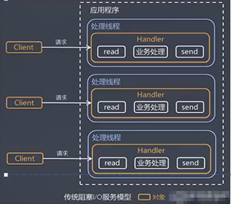
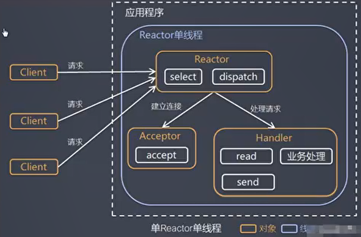
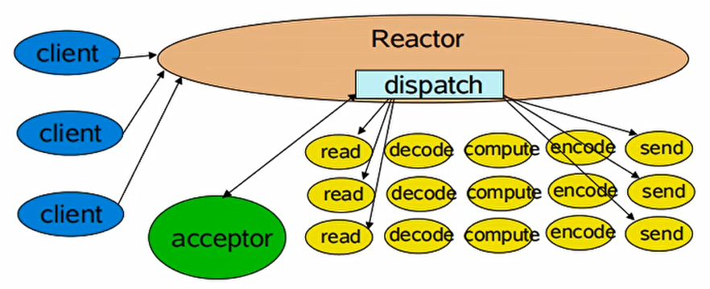
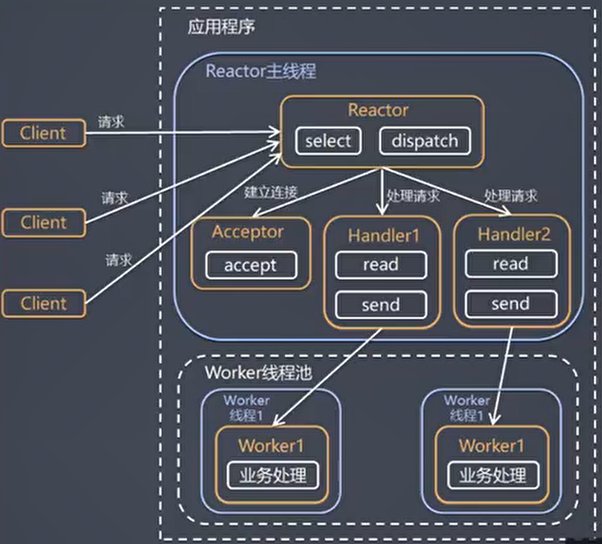
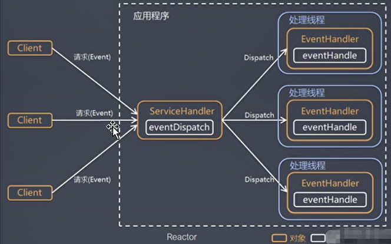
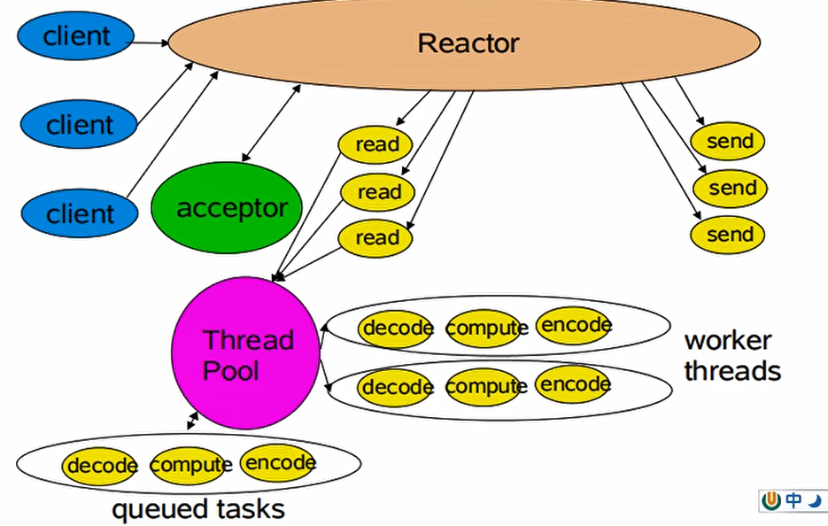
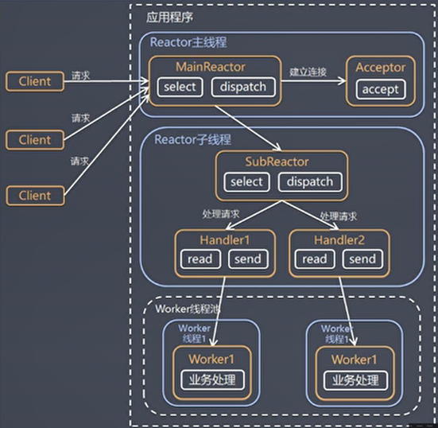
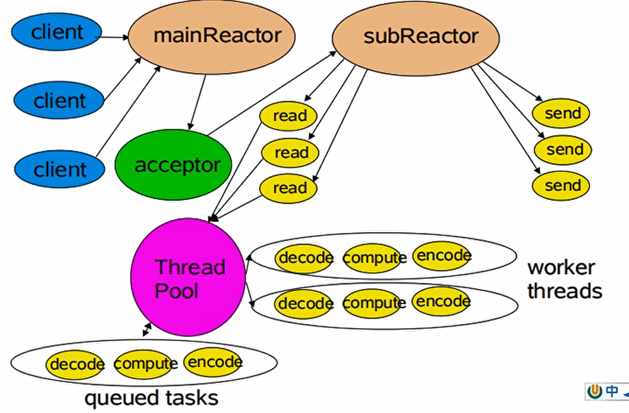
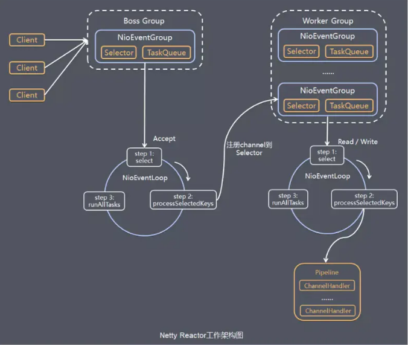
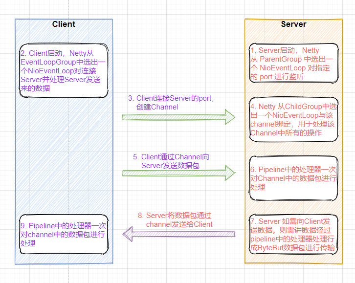

# 特点

Netty是一个**异步的、基于事件驱动**的**网络**应用框架，用以快速开发高性能、高可靠性的网络IО程序。
Netty主要针对在**TCP**协议下，面向**Clients端**的高并发应用，或者Peer-to-Peer场景下的大量数据持续传输的应用。
Netty本质是一个Java NIO**客户端/服务器**框架，适用于服务器通讯相关的多种应用场景
要透彻理解Netty ,需要先学习NIO，这样我们才能阅读Netty 的源码。


Netty线程模式(Netty主要基于主从Reactor多线程模型做了一定的改进，其中主从Reactor多线程模型有多个Reactor)


# IO模型

## 结构

# 问题解决

## 黏包


黏包、半包：OS发送网络时缓存批量发送导致边界问题

解决断线

零拷贝：针对transerTo，整个过程仅只发生了一次用户态与内核态的切换，数据拷贝了2次。所谓的【零拷贝】，并不是真正无拷贝，而是在不会拷贝重复数据到 jvm内存中，零拷贝的优点有
·更少的用户态与内核态的切换
·不利用cpu计算，减少cpu缓存伪共享·零拷贝适合小文件传输

OS支持的零拷贝有 mmap(内存映射)和sendFile。那么，他们在OS里，到底是怎么样的一个的设计?我们分析 mmap 和sendFile 这两个零拷贝

mmap通过内存映射，将文件映射到内核缓冲区，同时，用户空间可以共享内核空间的数据。这样，在进行网络传输时，就可以减少内核空间到用户控件的拷贝次数。

sendFile优化。Linux 2.1版本提供了
sendFile函数，其基本原理如下:数据根本不经过用户态，直接从内核缓冲区进入到SocketBuffer，同时，由于和用户态完全无关，就减少了一次上下文切换Linux在2.4版本中，做了一些修改，避免了从内核缓冲区拷贝到 Socket
buffer的操作，直接拷贝到协议栈，从而再一次减少了数据拷贝。具体如下图和小结:


# Reactor模型

Reactor 的数量和处理资源池线程的数量

Reactor: Reactor在一个单独的线程中运行，负责监听和分发事件，分发给适当的处理程序来对I0事件做出反应。

Handlers:处理程序执行I/O事件要完成的实际事件。Reactor通过调度适当的处理程序来响应/0事件，处理程序执行非阻塞操作。


建立连接accept事件和读写事件分别处理


## 传统阻塞IO

采用阻塞IO模式获取输入的数据
每个连接都需要独立的线程完成数据的输入、业务处理、数据输出




基于线程池复用线程资源:不必再为每个连接创建线程，将**连接完成后**的业务处理任务分配给线程进行处理，一个线程可以处理多个连接的业务。


## 单Reactor单线程

基于I/O复用模型:多个连接共用一个阻塞对象，应用程序只需要在一个阻塞对象等待，无需阻塞等待所有连接。当某个连接有新的数据可以处理时，操作系统通知应用程序，线程从阻塞状态返回，开始进行业务处理



Select是前面I/0复用模型介绍的标准网络编程API，可以实现应用程序通过一个阻塞对象监听多路连接请求
Reactor对象通过Select监控客户端请求事件，收到事件后通过Dispatch进行分发如果是建立连接请求事件，则由 Acceptor通过Accept处理连接请求，然后创建一个Handler对象处理连接完成后的后续业务处理
如果不是建立连接事件，则 Reactor会分发调用连接对应的 Handler来响应Handler会完成 Read→>业务处理→Send的完整业务流程


优点:模型简单，没有多线程、进程通信、竞争的问题，全部都在一个线程中完成缺点:性能问题，只有一个线程，无法完全发挥多核CPU的性能。Handler在处理某个连接上的业务时，整个进程无法处理其他连接事件，很容易导致性能瓶颈
缺点:可靠性问题，线程意外终止，或者进入死循环，会导致整个系统通信模块不可用，不能接收和处理外部消息，造成节点故障
使用场景:客户端的数量有限，业务处理非常快速，比如Redis在业务处理的时间复杂度O(1)的情况

优点:可以充分的利用多核cpu的处理能力
缺点:多线程数据共享和访问比较复杂，reactor处理所有的事件的监听和响应，在单线程运行,在高并发场景容易出现性能瓶颈.





## 单Reactor多线程






Reactor对象通过select监控客户端请求事件,收到事件后，通过dispatch进行分发如果建立连接请求,则右Acceptor通过
accept处理连接请求,然后创建一个Handler对象处理完成连接后的各种事件
如果不是连接请求，则由reactor分发调用连接对应的handler来处理
handler只负责响应事件,不做具体的业务处理,通过read读取数据后，会分发给后面的worker线程池的某个线程处理业务
worker线程池会分配独立线程完成真正的业务,并将结果返回给handler
handler收到响应后，通过send将结果返回给client




## 主从 Reactor多线程





3，第三种模型比起第二种模型，是将Reactor分成两部分，mainReactor负责监听server socket，accept新连接，并将建立的socket分派给subReactor。subReactor负责多路分离已连接的socket，读写网·络数据，对业务处理功能，其扔给worker线程池完成。通常，subReactor个数上可与CPU个数等同。


subReacror可有多个

Reactor主线程MainReactor对象通过select监听连接事件,收到事件后,通过Acceptor处理连接事件
当Acceptor处理连接事件后,MainReactor将连接分配给SubReactor
subreactor将连接加入到连接队列进行监听并创建handler进行各种事件处理
当有新事件发生时，subreactor就会调用对应的handler处理handler通过read 读取数据,分发给后面的worker线程处理worker 线程池分配独立的worker线程进行业务处理,并返回结果
handler收到响应的结果后,再通过send将结果返回给clientReactor主线程可以对应多个Reactor子线程

1)优点:父线程与子线程的数据交互简单职责明确，父线程只需要接收新连接，子线
程完成后续的业务处理。
2)优点:父线程与子线程的数据交互简单，Reactor主线程只需要把新连接传给子线
程，子线程无需返回数据。
3)缺点:编程复杂度较高
结合实例:这种模型在许多项目中广泛使用，包括 Nginx主从Reactor多进程模型，Memcached主从多线程，Netty主从多线程模型的支持

响应快，不必为单个同步时间所阻塞，虽然Reactor本身依然是同步的可以最大程度的避免复杂的多线程及同步问题，并且避免了多线程/进程的切换开销
扩展性好，可以方便的通过增加Reactor实例个数来充分利用CPU资源复用性好，Reactor模型本身与具体事件处理逻辑无关，具有很高的复用性




# Netyy结构

## 交互流程



## netty组件

### Channel

Channel是 Java NIO基本组件，负责netty传输数据，可以被打开或关闭，连接或者断开连接

NioServerSocketChannel负责监听一个tcp端口，有ACCEPT事件则parentGroup创建一个NioSocketChannel将其绑定到childGroup，然后childGroup负责这个NioSocketChannel的读写等io事件。

每个 NioChannel都绑定有一个自己的 ChannelPipeline

### NioEventLoop 与 NioEventLoopGroup

#### NioEventLoop（reactor）

##### 功能

NioEventLoop用来**处理相关Channel的事件**，用于消息的读取->解码->处理->编码->发送

NioEventLoop内部采用**串行化**设计，从，始终由IO线程NioEventLoop负责

NioEventLoop是**一个不断循环的执行处理任务的固定线程。包含一个selector和一个taskQueue**

其**生命周期内只会绑定同一个线程**，该线程处理所有注册到selector上的Channel的IO操作，在这里实现了一个线程维护多条连接的工作。

##### 结构

==NioEventLoop 本身就是一个**单线程**Executor==，EventLoop (1)------ (1)Thread

NioEventLoop 中维护了一个线程和任务队列，支持异步提交执行任务，执行 I/O 任务和非 I/O 任务：

- I/O 任务，即 selectionKey 中 ready 的事件，如 accept、connect、read、write 等，由 processSelectedKeys 方法触发。
- 非 IO 任务，添加到 taskQueue 中的任务，如 register、bind 等任务，由 runAllTasks 方法触发。两种任务的执行时间比由变量 ioRatio 控制，默认为 50，则表示允许非 IO 任务执行的时间与 IO 任务的执行时间相等。

##### NioEventLoop和Channel

-  Netty 为每个 `Channel` **固定分配**了一个 `EventLoop`，用于处理用户的相关事件

-  一个 Channel 一旦与一个 EventLoop 相绑定，**不可绑定其他的EventLoop** 。
- **Channel(n)--------(1)EventLoop(1) --------(1)Thread**
  - 一个 EventLoop 可以与多个 Channel 绑定，但一个 Channel 只能绑定一个 EventLoop

#### NioEventLoopGroup

 EventLoopGroup是EventLoop 池，一个**线程池**。 包含很多的 EventLoop(即EventLoopGroup包含多个线程)

Netty抽象出**两组线程池**parentGroup(BossEventLoopGroup)和childGroup(WorkerEventLoopGroup)

==**parentGroup仅负责连接`accept`，childGroup专门负责网络的`read、write、业务处理`**==

##### parentGroup:仅负责连接`accept`

parentGroup通常是一个**单线程的 EventLoop**，EventLoop 维护着一个注册了ServerSocketChannel 的 Selector 实例。不断轮询 Selector 将连接事件分离出来，通常是 OP_ACCEPT 事件，然后将接收到的 SocketChannel 交给 childGroup。childGroup会由 next 选择其中一个 EventLoopGroup 来将这个 SocketChannel 注册到其维护的 Selector 并对其后续的 IO 事件进行处理。

- 轮询accept事件
- 处理accept事件，与client建立连接。生成`NloScocketChannel`,并将**其注册到某个worker NIOEventLoop 上的 selector**
- 处理任务队列的任务,即runAllTasks

##### childGroup:`read、write、业务处理`，包含pipeline

- 轮询read, write事件
- 处理i/o事件,即read , write事件,在**对应NioScocketChannel处理**任务队列的任务,即runAllTasks
  - 使用pipeline(管道)处理业务，pipeline中包含了channel的handler

```java
 public Future<?> shutdownGracefully()//断开连接，关闭线程
```

#### 联系

NioEventLoopGroup下包含多个NioEventloop，**NioEventLoop(n)-------(1)NioEventLoopGroup**

### ServerBootstrap 与 Bootstrap

ServerBootstrap与 Bootstrap 都是启动配置类(引导类)

#### ServerBootstrap 

ServerBootstrap用于绑定本地端口，有2个EventLoopGroup（parentGroup和childGroup），指定 Channel 的类型、绑定 Channel 处理器等操作。

ServerBootstarp 在调用 `bind()` 方法时会创建**一个 NioServerSocketChannel** 来接受来自客户端的**连接**，并且该 NioServerSocketChannel管理了多个**子 Channel 用于同客户端**之间的通信。

ServerBootstrap在服务器监听一个port，轮询客户端的Bootstrap是否连接服务器。返回的ChannelFuture()


一个ServerBootstrap可以认为有2个channel集合，第一个集合包含一个单例ServerChannel，代表持有一个绑定本地端口的socket；第二个集合包含所有创建的Channel，处理服务器所接收到的客户端进来连接。
与ServerChannel相关的EventLoopGroup分配一个EventLoop是负责创建Channels用于传入的连接请求。一旦请求接收，第二个EventLoopGroup分配一个EventLoop给她的Channel。

```java
//该方法用于服务器端，用来设置两个 EventLoop
public ServerBootstrap group(EventLoopGroup parentGroup, EventLoopGroup childGroup)
//设置一个服务器端的通道实现
ServerBootstrap channel(Class<? extends C> channelClass)
//用来给接收到的通道添加配置
public <T> ServerBootstrap childOption(ChannelOption<T> childOption, T value)
//该方法用来设置业务处理类（自定义的 handler）
public ServerBootstrap childHandler(ChannelHandler childHandler)

public ChannelFuture bind(int inetPort) //于服务器端，用来设置占用的端口号

```

#### Bootstrap

Bootstrap时用于连接远程主机和端口的**客户端启动配置**，有1个EventLoopGroup；

Bootstrap 是客户端的引导类，Bootstrap 在调用 `bind()（连接UDP）`和 `connect()（连接TCP）`方法时，会新创建NioSocketChannel，仅创建**一个单独的、没有父 Channel 的 Channel 来实现所有的网络交换**。

```java
//该方法用于客户端，用来设置一个 EventLoop
public B  group(EventLoopGroup group)
//该方法用来设置一个客户端的通道实现
public B  channel(Class<? extends C> channelClass)，
//用来给 ServerChannel 添加配置
public <T> B option(ChannelOption<T> option, T value)，
//用来设置业务处理类（自定义的 handler）
public B handler(ChannelHandler childHandler)
//用来连接服务器端
public ChannelFuture connect(String inetHost, int inetPort)
```


#### ChannelOption

创建 Channel 实例后,一般都需要设置 ChannelOption 参数。ChannelOption 是Socket 的标准参数，而非 Netty 独创的。常用的参数配置有：

- ChannelOption.`SO_BACKLOG`初始化服务器可连接队列大小。
  - 服务端处理客户端连接请求是顺序处理的，所以同一时间只能处理一个客户端连接。多个客户端来的时候，服务端将不能处理的客户端连接请求放在队列中等待处理
- ChannelOption.`SO_KEEPALIVE` ，一直保持连接活动状态。

### ChannelHandler 与 ChannelPipeline

#### ChannelHandler

处理io事件真正的处理单元，ChannelHandler 可以是系统本身定义好的编解码器，也可以是用户自定义的。这些处理器会被统一添加到一个 ChannelPipeline 的对象中

ChannelHandler分为`inBound`和`outBound`，分别对应io的read和write的执行链。

I/O 线程一定不能阻塞，禁止任何直接阻塞操作在 ChannelHandler

##### 常用Handler

###### ChannelInitializer

用于设置ServerBoostrap的childHandler，可设置pipline

###### 编码解码器

基类名字类似 ByteToMessageDecoder 或 MessageToByteEncoder。所有的编码器/解码器适配器类 都实现自 ChannelInboundHandler 或ChannelOutboundHandler。

- 入站数据：channelRead 方法/事件被覆盖。在每个消息从入站 Channel 读入时调用特定解码器的“解码”方法，并将解码后的消息转发到管道中下个的 ChannelInboundHandler。
- 出站数据：编码器将消息转为字节，转发到下个的 ChannelOutboundHandler。

###### ChannelHandlerAdapter

自定义 Handler 继承`ChannelHandlerAdapter`，通过重写相应方法实现业务逻辑。子类有ChannelInboundHandlerAdapter和ChannelOutboundHandlerAdapter

```java
public void channelActive(ChannelHandlerContext ctx)//通道就绪事件
 public void channelRead(ChannelHandlerContext ctx, Object msg)//通道读取数据事件
 public void channelReadComplete(ChannelHandlerContext ctx)//数据读取完毕事件
 public void exceptionCaught(ChannelHandlerContext ctx, Throwable cause)//通道异常事件
```

###### SimpleChannelInboundHandler()

**接收到解码后的消息**并**应用**一些业务**逻辑**到这些数据。

扩展基类`SimpleChannelInboundHandler<T>` 其中 T 是想要进行处理的类型。

##### ChannelHandlerContext

Pipeline 链中的实际处理节点。每个`ChannelHandlerContext` 包含一个具体的`ChannelHandler` 、对应的 `pipeline` 、 `Channel` 的信息，方便对 ChannelHandler进行调用

ChannelHandler用ChannelHandlerContext包裹着，有prev和next节点，可以获取前后ChannelHandler，read时从ChannelPipeline的head执行到tail，write时从tail执行到head，所以head既是read事件的起点也是write事件的终点，与io交互最紧密。

```java
 ChannelFuture close()//关闭通道
 ChannelOutboundInvoker flush()//刷新
//将 数 据 写 到 ChannelPipeline中当前ChannelHandler 的下一个 ChannelHandler 开始处理（出站）
 ChannelFuture writeAndFlush(Object msg)
```

#### ChannelPipeline

是保存 ChannelHandler 的容器，**按照添加的顺序对 Channel 中的数据进行依次处理。**

ChannelPipeline内部有两个节点，`head`和`tail`，分别对应着ChannelHandler链的头和尾。

每个 NioChannel都绑定有一个自己的 ChannelPipeline

```java
//把一个业务处理类（handler）添加到链中的第一个位置
ChannelPipeline addFirst(ChannelHandler... handlers)
//把一个业务处理类（handler）添加到链中的最后一个位置
ChannelPipeline addLast(ChannelHandler... handlers)
```

#### 联系

ChannelHandler和ChannelPipeline组成责任链，使得一组ChannelHandler像一条链一样执行下去。

#### 数据流

若数据是从APP到远程主机则是“**出站**”；若数据是从远程主机到APP则是“**入站**”。


### ChannelFuture

 Netty 中定义了一个 ChannelFuture 对象作为这个异步操作的“代言人”，表示异步操作本身。Netty 中所有的 I/O 操作都是异步的，I/O 的调用会直接返回，调用者并不能立刻获得结果，但是可以通过 ChannelFuture 来获取 I/O 操作的处理状态

如果想获取到该异步操作的返回值，可以通过该异步操作对象的addListener() 方法为该异步操作添加监 NIO 网络编程框架 Netty 听器，为其注册回调：当结果出来后马上调用执行。

 Netty 的异步编程模型都是建立在 Future 与回调概念之上的。

```java
Channel channel()//返回当前正在进行 IO 操作的通道
ChannelFuture sync()//等待异步操作执行完毕
```


## 常用API以及方法意义


```java
public class NettyServer {
        public static void main(String[] args) throws Exception {
            //1.创建一个线程组：用来处理网络事件（接受客户端连接）
            EventLoopGroup bossGroup = new NioEventLoopGroup();
            //2.创建一个线程组：用来处理网络事件（处理通道 IO 操作）
            EventLoopGroup workerGroup = new NioEventLoopGroup();
            //3.创建服务器端启动助手来配置参数
            ServerBootstrap b = new ServerBootstrap();
            b.group(bossGroup, workerGroup) //4.设置两个线程组 EventLoopGroup
                    .channel(NioServerSocketChannel.class) //5.使用 NioServerSocketChannel 作为服务器端通道实现
                    .option(ChannelOption.SO_BACKLOG, 128) //6.设置线程队列中等待连接的个数
                    .childOption(ChannelOption.SO_KEEPALIVE, true) //7.保持活动连接状态
                    .childHandler(new ChannelInitializer<SocketChannel>() { //8.创建一个通道初始化对象
                        public void initChannel(SocketChannel sc) { //9.往 Pipeline 链中添加自定义的业务
                            处理 handler
                            sc.pipeline().addLast(new NettyServerHandler()); //服务器端业务处理类
                     //NettyServerHandler,继承自ChannelHandlerAdapter，自定义channelRead等方法
                            System.out.println(".......Server is ready.......");
                        }
                    });
            //10.启动服务器端并绑定端口，等待接受客户端连接(非阻塞)
            ChannelFuture cf = b.bind(9999).sync();
            System.out.println("......Server is Starting......");
            //11.关闭通道，关闭线程池
            cf.channel().closeFuture().sync();
            //12.优雅的退出线程组
            bossGroup.shutdownGracefully();
            workerGroup.shutdownGracefully();
        }
    }


public class NettyClient {
        public static void main(String[] args) throws Exception {
            //1.创建一个 EventLoopGroup 线程组
            EventLoopGroup group = new NioEventLoopGroup();
            //2.创建客户端启动助手
            Bootstrap b = new Bootstrap();
            b.group(group) //3.设置 EventLoopGroup 线程组
                    .channel(NioSocketChannel.class) //4.使用 NioSocketChannel 作为客户端通道实现
                    .handler(new ChannelInitializer<SocketChannel>() { //5.创建一个通道初始化对象
                        @Override
                        protected void initChannel(SocketChannel sc) { //6.往 Pipeline 链中添加自定义的业务处理 handler
                            sc.pipeline().addLast(new NettyClientHandler()); //客户端业务处理类
                       //NettyServerHandler,继承自ChannelHandlerAdapter，自定义channelRead等方法
                            System.out.println("......Client is ready.......");
                        }
                    });
            //7.启动客户端,等待连接上服务器端(非阻塞)
            ChannelFuture cf = b.connect("127.0.0.1", 9999).sync();
            //8.等待连接关闭(非阻塞)
            cf.channel().closeFuture().sync();
        }
    }
```


