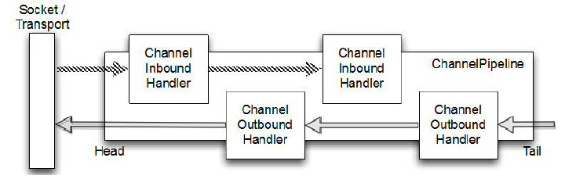

# 特点

Netty是一个**异步的、基于事件驱动**的**网络**应用框架，用以快速开发高性能、高可靠性的网络IО程序。

Netty主要针对在**TCP**协议下，面向**Clients端**的高并发应用、Peer-to-Peer场景下的大量数据持续传输应用。

netty的异步还是基于多路复用的，并没有实现真正意义上的异步IO

# IO模型

Netty基于主从Reactor多线程模型

## 传统阻塞IO

基于线程池复用线程资源:不必再为每个连接创建线程，将**连接完成后**的业务处理任务分配给线程进行处理，一个线程可以处理多个连接的业务。

每个连接都需要独立的线程完成数据的输入、业务处理、数据输出


## Reactor模型

Reactor：在一个单独的线程运行，负责**监听**`accept`和分发事件，分发给适当的Handler来对IO做出反应。

Handlers：真正执行任务

建立连接accept事件和读写事件分别由不同线程处理


## 单Reactor单线程

**单个线程处理`accept、read、write和Worker`**。如典型java selector应用


- 优点：模型简单，没有多线程、进程通信、竞争的问题，全部都在一个线程中完成
- 缺点：
  - 性能问题，只有一个线程，无法完全发挥多核CPU的性能。
  - 无法并行处理其他连接事件，性能瓶颈
  - 单线程故障不可靠
- 使用场景：客户端的数量有限，业务处理非常快速。如Redis在业务处理的时间复杂度O(1)的情况

## 单Reactor多线程

**Reactor处理`accept、handler(read、write)`**

worker由线程池处理将结果返回给handler，handler收到响应后，通过send将结果返回给client


- 优点：可以充分的利用多核cpu的处理能力
- 缺点：多线程数据共享和访问比较复杂，reactor处理所有的事件的监听和响应
  - 在单线程运行,在高并发场景容易出现性能瓶颈.

## 主从 Reactor多线程

`mainReactor`：监听serverSocket，负责`accept`，用于建立新连接，并将建立的socket分派给subReactor

`subReactor`：负责`handler(read、write)`读写网络数据。可有多个

worker：业务处理，由线程池完成


- 优点：
  - 父线程与子线程的数据交互简单职责明确。父线程只需要接收新连接，子线程完成后续的业务处理。
  - 父线程与子线程的数据交互简单。Reactor主线程只需要把新连接传给子线程，子线程无需返回数据。
- 缺点：编程复杂度较高

### Netty模型

- 响应快，不必为单个同步时间所阻塞，避免了多线程/进程的切换开销
- 扩展性好，可以方便的通过增加Reactor实例个数来充分利用CPU资源
- 复用性好，Reactor模型本身与具体事件处理逻辑无关，具有很高的复用性


# Netty交互流程


# netty组件

## Channel

Netty的Channel是Java Nio中Channel的加强

负责netty传输数据，可以被open、close、read、write、connect、bind

- 每个 Channel都分配<u>属于自己</u>的 `ChannelPipeline`、`ChannelConfig`(支持热更新)
- **线程安全**，多线程操作会保证按顺序发送
- Channel的HashCode不能相同

### 常用Channel

| 类型      | 描述                                                         |
| --------- | ------------------------------------------------------------ |
| **Nio**   | 最常用的Channel。NioServerSocketChannel / NioSocketChannel   |
| **Epoll** | 只应用于Linux，性能更强。配合EpollEventLoop/Group。不支持SCTP、UDT(可靠的UDP) |
| Embedded  | 用于debug测试                                                |

### 常用方法

| 方法                | 描述                  | 方法          | 描述                        |
| ------------------- | --------------------- | ------------- | --------------------------- |
| eventLoop()         | 对应的eventLoop       | isActive      | Channel是否活跃，如连接成功 |
| pipeline()          | 对应的pipeline        | localAddress  | 本地Socket信息              |
| read                |                       | remoteAddress | 远程Socket信息              |
| write/writeAndFlush | 写，返回ChannelFuture |               |                             |

## EventLoop 与 EventLoopGroup

### EventLoop（reactor）

#### 功能

NioEventLoop用来**处理相关Channel的事件**，用于轮询派发事件并调用ChannelPipeline处理

NioEventLoop是**一个不断循环的执行处理任务的固定线程。包含一个selector和一个taskQueue**

其**生命周期内只会绑定同一个线程**，该线程处理所有注册到selector上的Channel的IO操作

#### 结构

==NioEventLoop 本身就是一个**单线程**ScheduledThreadPoolExecutor==，**EventLoop (1)------ (1)Thread**

NioEventLoop 中维护了一个线程和任务队列，支持异步提交执行任务，执行 I/O 任务和非 I/O 任务：

- I/O 任务，即 selectionKey 中 ready 的事件，如 accept、connect、read、write 等，由 processSelectedKeys 方法触发。
- 非 IO 任务，添加到 taskQueue 中的任务，如 register、bind 等任务，由 runAllTasks 方法触发。两种任务的执行时间比由变量 ioRatio 控制，默认为 50，则表示允许非 IO 任务执行的时间与 IO 任务的执行时间相等。

#### EventLoop和Channel

-   `EventLoop`处理多个Channel的事件

-  一个 Channel 一旦与一个 EventLoop 相绑定，**不可绑定其他的EventLoop** 。
- **Channel(n)--------(1)EventLoop(1) --------(1)Thread**
  - ==一个 EventLoop 可以与多个 Channel 绑定，但一个 Channel 生命周期内只能注册于一个 EventLoop==

### EventLoopGroup

 EventLoopGroup为Channel分配EventLoop ，包含很多的 EventLoop (默认CPU核数*2)

**任务需要较长的时间处理时，pipeline使用DefaultEventExecutorGroup**，避免EventLoop线程阻塞

shutdownGracefully()：优雅关闭，配合syncUninterruptibly()阻塞完成

#### 联系

NioEventLoopGroup下包含多个NioEventloop，**NioEventLoop(n)-------(1)NioEventLoopGroup**


## 数据处理

### ChannelHandler

相关**事件**被触发的**回调**，**处理数据**

统一添加到Channel持有的`ChannelPipeline` 中，同一个Handler可从属于多个Pipeline

ChannelHandler分为`inBound`和`outBound`，分别对应io的read和write的执行链。

I/O 线程一定不能阻塞，禁止任何直接阻塞操作在 ChannelHandler

常用操作：数据类型转换

- **`@Sharable`**：**同一Handler实例** 可 添加到多个Pipeline，避免对象创建开销
  - 同一实例而非每次new handler，不声明此注解第二个Channel会报错
  - 必须保证线程安全才能使用
  - 常用于统计下当前的连接数，限流，白名单
- ChannelInboundHandlerAdapterChannelInboundHandler一个简单实现，默认情况下不会做任何处理。
  - 只是简单的将操作通过fire*方法传到ChannelPipeline中的下一个ChannelHandler处理

#### 常用方法/回调

| 方法名              | 描述                                  |
| ------------------- | ------------------------------------- |
| channelUnregistered | Channel已创建，但未注册入EventLoop    |
| channelRegistered   | channel已注册入EventLoop              |
| channelActive       | channel处于活动状态，如已连接可读写了 |
| channelInactive     | channel未活动，如未连接远程节点       |
| handlerAdded        | handler添加到pipeline                 |
| handlerRemoved      | handler从pipeline移除                 |
| exceptionCaught     | 处理产生异常时调用                    |

##### ChannelInboundHandler入站处理(read)

| 方法名                    | 意义                                      |
| ------------------------- | ----------------------------------------- |
| channelRead               | 每个传入消息都被调用，可能多次触发        |
| channelReadComplete       | 最后一次调用channelRead执行，所有消息读完 |
| channelWritabilityChanged | 可写状态变化时调用，避免写太快内存溢出    |
| userEventTriggered        | fireUserEventTriggered()调用时触发        |

##### ChannelOutboundHandler出战处理(write)

| 方法名             | 描述                    |
| ------------------ | ----------------------- |
| bind               |                         |
| connect/disConnect |                         |
| read/write/flush   | channel读写时调用       |
| close              | 关闭channel时调用       |
| deregister         | 接触EventLoop绑定时调用 |

### 异常处理

#### 入站异常

异常会从 产生点沿pipeline 传递，直至某Handler的已实现的exectionCaught处理

默认：转发给下一Handler处理

#### 出站异常

- 出站操作返回的`ChannelFuture`会通知状态，设置相关监听器
- 出站操作的`ChannelPromise`参数设置监听

### ChannelPipeline

保存多个`ChannelHandler`的容器，**按照添加的顺序对 Channel 中的数据进行依次处理**

ChannelPipeline内部有两个节点：`head`和`tail`，用于收尾工作，如释放消息

每个 Channel都绑定有一个自己的 ChannelPipeline

通常于`ChannelInitializer.initChannel()`时设置并添加pipeline

**支持动态修改**，用于实现协议切换

最开始输入是 ByteBuf，经过 pipeline 中的各个 handler 加工变成其它类型，最后输出又变成 ByteBuf



处理顺序：**入站read**：Inbound链的**顺序**  **出站write**：Outbound链的**逆序**


```java
//向头/尾添加
ChannelPipeline addFirst/Last(name,handler)
//把一个业务处理类（handler）添加到链中的最后一个位置
ChannelPipeline remove(name)
ChannelPipeline replace(oldname,newname,handler)
ChannelPipeline get()//返回对应handler
ChannelHandlerContext context()//返回对应ChannelHandlerContext
    
    fire***//调用下一个handler的相关回调方法
```

#### ChannelHandlerContext

表示某个ChannelHandler和ChannelPipeline的关联，每个ChannelHandler都有对应的ChannelHandlerContext

ChannelHandler用ChannelHandlerContext包裹着，有prev和next节点，可获取前后ChannelHandler

绑定关系不会变，引用安全的

用于**和同一Pipeline的其他Handler交互**，常用于转发给下个handler处理

- 许多方法和Channel、ChannelPipeline重合
  - ChannelHandlerContext调用从**当前handler**传播，产生更短的事件流
  - Channel、ChannelPipeline调用，沿**整个完整的链**(头尾)传播


#### 联系

ChannelHandler和ChannelPipeline组成责任链，使得一组ChannelHandler像一条链一样执行下去。

**Channel (1)-----(n) ChannelPipeline (n)-----(n) ChannelHandler (1)-----(1) ChannelHandlerContext**

### ChannelFuture

Netty 建立在 Future 与回调概念之上，所有的 **I/O 操作都是异步**调用者并不能立刻获得结果，通过ChannelFuture 来处理状态

通过addListener() 方法**添加监听器才能获取执行结果**(ChannelFutureListener.operationComplete())

出站操作完成时返回ChannelFuture，被通知完成成功/错误

```java
Channel channel()//返回当前正在进行 IO 操作的通道
ChannelFuture sync()//阻塞等待异步操作执行完毕
    closeFuture()：//关闭时等待触发
    isSuccess()//是否操作成功
    cause()//返回错误异常
```

### ChannelPromise

ChannelFuture的子类，常作为出站操作的参数

| 功能/名称    | jdk Future                     | netty Future                                                 | Promise      |
| ------------ | ------------------------------ | ------------------------------------------------------------ | ------------ |
| cancel       | 取消任务                       | -                                                            | -            |
| isCanceled   | 任务是否取消                   | -                                                            | -            |
| isDone       | 任务是否完成，不能区分成功失败 | -                                                            | -            |
| get          | 获取任务结果，阻塞等待         | -                                                            | -            |
| getNow       | -                              | 获取任务结果，非阻塞，还未产生结果时返回 null                | -            |
| await        | -                              | 等待任务结束，如果任务失败，**不会抛异常**，而是通过 isSuccess 判断 | -            |
| sync         | -                              | 等待任务结束，如果任务失败，抛出异常                         | -            |
| isSuccess    | -                              | 判断任务是否成功                                             | -            |
| cause        | -                              | 获取失败信息，非阻塞，如果没有失败，返回null                 | -            |
| addLinstener | -                              | 添加回调，异步接收结果                                       | -            |
| setSuccess   | -                              | -                                                            | 设置成功结果 |
| setFailure   | -                              | -                                                            | 设置失败结果 |

## 引导

配置Netty各组件，使其与业务逻辑无关

服务器：父Channel处理连接，仅响应`accept`事件，子Channel负责通信

客户端：只需要一个Channel用于交互。尽可能重用EventLoop

Channel和EventLoopGroup类型必须匹配，同NIO/Epoll...

bind/connect由NIO线程执行，主线程必须阻塞等待ChannelFuture完成

#### ServerBootstrap

- ServerBootstarp 在调用 `bind()` 方法时会创建**一个 ServerSocketChannel** 来接受来自客户端的**连接**，并且该 ServerSocketChannel管理了多个**子 SocketChannel用于同客户端**之间的通信。返回的ChannelFuture()
- ServerBootstrap在服务器监听一个port，轮询客户端是否连接服务器


**两组线程池**parentGroup(BossEventLoopGroup)和childGroup(WorkerEventLoopGroup)

==**parentGroup仅负责连接`accept`，childGroup专门负责网络的`read、write、业务处理`**==

##### parentGroup:仅负责连接`accept`

parentGroup通常是一个**单线程的 EventLoop**，EventLoop 维护着一个注册了ServerSocketChannel 的 Selector 实例。不断轮询 Selector 将连接事件分离出来，通常是 OP_ACCEPT 事件，然后将接收到的 SocketChannel 交给 childGroup。childGroup会由 next 选择其中一个 EventLoopGroup 来将这个 SocketChannel 注册到其维护的 Selector 并对其后续的 IO 事件进行处理。

- 轮询accept事件
- 处理accept事件，与client建立连接。生成`NloScocketChannel`,并将**其注册到某个worker NIOEventLoop 上的 selector**
- 处理任务队列的任务,即runAllTasks

##### childGroup:`read、write、业务处理`，包含pipeline

- 轮询read, write事件
- 处理i/o事件,即read , write事件,在**对应NioScocketChannel处理**任务队列的任务,即runAllTasks
  - 使用pipeline(管道)处理业务，pipeline中包含了channel的handler

```java
//该方法用于服务器端，用来设置两个 EventLoop
public ServerBootstrap group(EventLoopGroup parentGroup, EventLoopGroup childGroup)
//设置一个服务器端的channel实现
ServerBootstrap channel(Class<? extends C> channelClass)
    //ServerChannel本身设置
    public <T> ServerBootstrap option(ChannelOption<T> childOption, T value)

//子channel添加配置
public <T> ServerBootstrap childOption(ChannelOption<T> childOption, T value)
//该方法用来设置业务处理类（自定义的 handler）
public ServerBootstrap childHandler(ChannelHandler childHandler)

public ChannelFuture bind(int inetPort) //于服务器端，用来设置占用的端口号
localAddress()//设置本地端口，无则随机
```

#### Bootstrap

Bootstrap有1个EventLoopGroup；

Bootstrap 是客户端的引导类，Bootstrap 在调用 `bind()（连接UDP）`和 `connect()（连接TCP）`方法时，会新创建SocketChannel，仅创建**一个单独的、没有父 Channel 的 Channel 来实现所有的网络交换**。

```java
//该方法用于客户端，用来设置一个 EventLoop
public B  group(EventLoopGroup group)
//该方法用来设置一个客户端的通道实现
public B  channel(Class<? extends C> channelClass)，
//用来给 ServerChannel 添加配置
public <T> B option(ChannelOption<T> option, T value)，
//用来设置业务处理类（自定义的 handler）
public B handler(ChannelHandler childHandler)
//用来连接服务器端
public ChannelFuture connect(String inetHost, int inetPort)
```

#### ChannelOption

创建 Channel 实例后,一般都需要设置 ChannelOption 参数。ChannelOption 是Socket 的标准参数，而非 Netty 独创的。常用的参数配置有：

- ChannelOption.`SO_BACKLOG`初始化服务器可连接队列大小。
  - 服务端处理客户端连接请求是顺序处理的，所以同一时间只能处理一个客户端连接。多个客户端来的时候，服务端将不能处理的客户端连接请求放在队列中等待处理
- ChannelOption.`SO_KEEPALIVE` ，一直保持连接活动状态。

#### Channel自定义属性

`AttributeKey<T>`为自定义属性的Key，值为 T 。保存于AttributeMap

attr() / childAttr()设置，

## ByteBuf

### 介绍

作为java NIO原生ByteBuffer的替代，实现**透明零拷贝**、**动态增长**、**池化**、**引用计数**、支持链式调用

### 类型

- 堆缓冲区`heapBuffer`
  - 数据存储于**JVM的堆**中，适用于未池化快速分配释放
  - 由GC 回收内存
- 直接缓冲区`directBuffer`
  - 存储于JVM外，由NIO原生directByteBuffer支持。配合池化使用
  - 直接内存创建和销毁的代价昂贵，注意主动释放内存空间

-  复合缓冲区`CompositeBuffer`
  - 将多个缓冲区提供逻辑聚合，可以是不同类型

`ByteBufAllocator`用于创建ByteBuf，有默认实现DEFAULT(JVM**默认池化**)；UnPooled创建非池化ByteBuf

ByteBufUtil工具类：hexdump：十六进制打印    equals：判断相等

默认大小最大整数，超出大小IndeOutOfBoundsException

```java
ByteBuf buffer = ByteBufAllocator.DEFAULT.buffer(16);//默认directBuffer
ByteBuf buffer = ByteBufAllocator.DEFAULT.heapBuffer(16);
ByteBuf buffer = ByteBufAllocator.DEFAULT.directBuffer(16);
```

#### 池化

重用池中ByteBuf 实例，并且采用了与jemalloc类似的内存分配算法提升分配效率·高并发时，池化功能更节约内存，减少内存溢出的可能访问

更复杂的规则来回收内存

### 访问

维护两个分别读写的索引`readIndex`、`writeIndex`

<u>read/write\*\*会推进索引；get/set\*\*不会改变索引</u>，**会自动扩容**


`slice`：切片         `duplicate`：浅拷贝        `copy`：深拷贝

### 引用计数 ReferenceCounted

用于对象内存释放，计数>0不会被释放。

- 每个 ByteBuf 对象的初始计数为 1
- 调用 `release` 方法计数减 1，如果计数为 0，ByteBuf 内存被回收
- 调用 `retain` 方法计数加 1，表示调用者没用完之前，其它 handler 即使调用了 release 也不会造成回收
- 当计数= 0 时，底层内存会被回收，这时即使 ByteBuf 对象还在，其各个方法均无法正常使用
- ReferenceCountUtil.realese(msg)：调用release，默认-1

#### ChannelPipeline的消息释放

##### 入站

- 首次创建 ByteBuf 放入 pipeline（line 163 pipeline.fireChannelRead(byteBuf)）

- 入站 ByteBuf 处理原则

  - 默认方法：对原始 ByteBuf 不做处理，调用 ctx.fireChannelRead(msg) 向后传递，此时无须 release
  - 将原始 ByteBuf**转换为其它类型的 Java 对象，此时必须 release**
  - **不调用 ctx.fireChannelRead(msg) 向后传递，必须 release**
  - **异常导致ByteBuf没有成功传递到下一个 ChannelHandler，必须 release**
  - 消息**一直向后传**， TailContext 会负责释放未处理消息（只针对原始的 ByteBuf）


##### 出站

- **出站消息最终都会转为 ByteBuf 输出，一直向前传，由 HeadContext flush 后 release**
- **出站**消息释放内存资源(**计数=0**)后，必须**调整其`ChannelPromise`参数状态通知成功/异常**

- 异常处理原则

  - 有时候不清楚 ByteBuf 被引用了多少次，但又必须彻底释放，可以**循环调用 release 直到返回 true**

    ```
    while (!buffer.release()) {}
    refCnt()//查看当前计数
    ```

传递到head、tail的ByteBuf被自动释放。前提是ByteBuf被传递到了head与tail中 且 <u>没有被转换为其他类型</u>


## 常用API以及方法意义


```java
public class NettyServer {
        public static void main(String[] args) throws Exception {
            //1.创建一个线程组：用来处理网络事件（接受客户端连接）
            EventLoopGroup bossGroup = new NioEventLoopGroup();
            //2.创建一个线程组：用来处理网络事件（处理通道 IO 操作）
            EventLoopGroup workerGroup = new NioEventLoopGroup();
            //3.创建服务器端启动助手来配置参数
            ServerBootstrap b = new ServerBootstrap();
            b.group(bossGroup, workerGroup) //4.设置两个线程组 EventLoopGroup
                    .channel(NioServerSocketChannel.class) //5.使用 NioServerSocketChannel 作为服务器端通道实现
                    .option(ChannelOption.SO_BACKLOG, 128) //6.设置线程队列中等待连接的个数
                    .childOption(ChannelOption.SO_KEEPALIVE, true) //7.保持活动连接状态
                    .childHandler(new ChannelInitializer<SocketChannel>() { //8.创建一个通道初始化对象
                        public void initChannel(SocketChannel sc) { //9.往 Pipeline 链中添加自定义的业务
                            处理 handler
                            sc.pipeline().addLast(new NettyServerHandler()); //服务器端业务处理类
                     //NettyServerHandler,继承自ChannelHandlerAdapter，自定义channelRead等方法
                            System.out.println(".......Server is ready.......");
                        }
                    });
            //10.启动服务器端并绑定端口，等待接受客户端连接(非阻塞)
            ChannelFuture cf = b.bind(9999).sync();
            System.out.println("......Server is Starting......");
            //11.关闭通道，关闭线程池
            cf.channel().closeFuture().sync();
            //12.优雅的退出线程组
            bossGroup.shutdownGracefully();
            workerGroup.shutdownGracefully();
        }
    }


public class NettyClient {
        public static void main(String[] args) throws Exception {
            //1.创建一个 EventLoopGroup 线程组
            EventLoopGroup group = new NioEventLoopGroup();
            //2.创建客户端启动助手
            Bootstrap b = new Bootstrap();
            b.group(group) //3.设置 EventLoopGroup 线程组
                    .channel(NioSocketChannel.class) //4.使用 NioSocketChannel 作为客户端通道实现
                    .handler(new ChannelInitializer<SocketChannel>() { //5.创建一个通道初始化对象
                        @Override
                        protected void initChannel(SocketChannel sc) { //6.往 Pipeline 链中添加自定义的业务处理 handler
                            sc.pipeline().addLast(new NettyClientHandler()); //客户端业务处理类
                       //NettyServerHandler,继承自ChannelHandlerAdapter，自定义channelRead等方法
                            System.out.println("......Client is ready.......");
                        }
                    });
            //7.启动客户端,等待连接上服务器端(非阻塞)
            ChannelFuture cf = b.connect("127.0.0.1", 9999).sync();
            //8.等待连接关闭(非阻塞)
            cf.channel().closeFuture().sync();
        }
    }
```

## 常用Handler

### ChannelInitializer

组合多个ChannelHandler为一个Handler

用于设置ServerBoostrap的childHandler，可设置pipline

### 编码解码器

编码、解码后消息自动释放，并传递Message给下个Handler。可retain增加计数

#### 解码器

常用于**入站数据**格式**转换**，会对数据缓冲

- `ByteToMessageDecoder`：字节------->Object
  - ``decode(ctx, ByteBuf in,List<Object> out)`
    - 终止条件：**out没有新元素**被添加    或  in结束
    -  需判断可读字节数符合要求，而DeplayingDecoder不用判断
  - decodeLast：Channel关闭调用一次，默认执行一次decode
  - `TooLongFrameException`：帧超过最大值，如可读字节超出限制抛出此异常。由exceptionCaugth处理
  - 常用：JsonObjectDecoder
- `MessageToMessageDecoder<源类型>`：Object ------->Object
  - ``decode(ctx, 源类型 in,List<Object> out)`

#### 编码器

常用于**出站数据**格式**转换**，write会依次编码

- `MessageToByteEncoder<源类型>`：字节<-------Object
  - `encode(ctx,源类型 msg, Bytebuf out)`
    - LineEncoder：按行编码，给定一个CharSequence(如String)，在其之后添加换行符\n或者\r\n，并封装到ByteBuf进行输出，与LineBasedFrameDecoder相对应。
    -  Base64Encoder：给定一个ByteBuf，得到对其包含的二进制数据进行Base64编码后的新的ByteBuf进行输出，与Base64Decoder相对应。
    -  LengthFieldPrepender：给定一个ByteBuf，为其添加报文头Length字段，得到一个新的ByteBuf进行输出。Length字段表示报文长度，与LengthFieldBasedFrameDecoder相对应。
    -  StringEncoder：给定一个CharSequence(如：StringBuilder、StringBuffer、String等)，将其转换成ByteBuf进行输出，与StringDecoder对应。
- `MessageToMessageEncoder<源类型>`：Object <-------Object
  - ``encode(ctx, 源类型 msg,List<Object> out)`

#### 编码解码器

同时实现编码解码方法

- `ByteToMessageCodec`
- `MessageToMessageCodec<入站IN，出站IN>`
- `CombinedChannelDuplexHandler<Decoder，Encoder>`：聚合两个分开的编解码器，使其成为整体

### SimpleChannelInboundHandler<类型>

**接收到解码后的消息**并**应用**一些业务**逻辑**到这些数据。

扩展基类`SimpleChannelInboundHandler<T>` 其中 T 是想要进行处理的类型。

**ChannelRead0()执行完毕自动释放消息**

### 粘包/拆包

#### 基于分隔符定界

- `DelimiterBasedFrameDecoder`：自定义
- `LineBaseFrameDecoder`：定界符为`\n`或`\r\n`

#### 基于帧长度定界

- `FixedLengthFrameDecoder`：定长帧
- `LengthFieldBasedFrameDecoder(最大帧长，帧长标志起始偏移，标志位本身长度)`：指定header**帧长标志位置**

### 超时检测

- `IdleStateHandler`：自定义空闲时间太长触发`IdleStateEvent`，下个Handler重写`userEventTriggered`()判断事件类型并处理
- `ReadTimeoutHandler`：指定时间间隔没有收到入站数据，抛出`ReadTimeoutException`并关闭channel，可重写execptionCaught
- `WriteTimeoutHandler`：指定时间间隔没有收到出站数据，抛出`WriteTimeoutException`并关闭channel，可重写execptionCaught

### 大型数据

- `FileRegion`：传输文件，数据流不被处理。DefauleFileRegion实现，write输出即可
- `ChunkedInput`：传输处理的大型数据流。
  - File：不支持零拷贝时使用
  - NioFile：使用FileChannel传输
  - Stream：从InputStream传输
  - NioStream：从Channel传输

### Protocol Buffers序列化

- ProtobufDecoder：解码
- ProtobufEncoder：编码
- ProtobufVarint32FrameDecoder：根据帧长度动态分割帧，入站最前
- ProtobufVarint32LengthFileldPrepender：Bytebuf前添加协议的帧长度标志，出站最后

### SSL支持

内置SSL处理器，使用SSLContext和SSLEngine实现

`SslHandler(engine,startTls)`：client的startTls=true server的strartTls=false

通常置于pipeline第一个

### Http处理

#### HttpObject

一个Http请求/响应由多部分组成(一个头+多个中间体+一个末尾体)，各部分都实现了`HttpObject`接口

HttpRequest/HttpResponse：请求/响应头

HttpContent：中间数据

LastHttpContent：末尾数据

`FullHttpRequest/Response`：完整的请求/响应


#### 编码解码支持

HttpResponse/HttpRequest|Encoder/Decoder，分别对应响应/请求的编解码

- 客户端：Http`RequestEncoder`+Http`ResponseDecoder`----->HttpClientCodec
- 服务端：Http`RequestDecoder`+Http`ResponseEncoder`------>HttpServerCodec
- 聚合完整FullHttp：`HttpObjectAggregator(最大长度)`
- 压缩：HttpContentCompressor

### WebSocket

- 帧类型
  - 控制帧：Close/Ping/PongWebSocketFrame，负责建立协议连接
  - 数据帧：Binary/TextWebSocketFrame，Continuation为上个数据帧
- 内置处理器
  - WebSocketServerProtocolHandler：协议连接建立
- 一般为TextWebSocketFrame设置SimpleChannelInboundHandler
