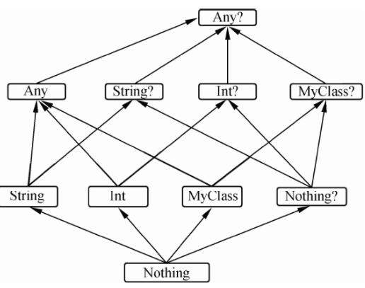
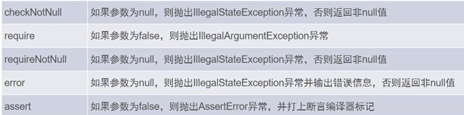
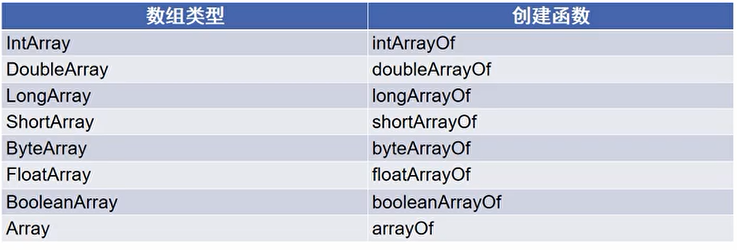

# 特色

Kotlin优势是既有Java的完整生态(Kotlin完全无缝使用各类Java API框架库又有现代语言的高级特性（语法糖）

与所有基于Java的框架完全兼容，支持函数式编程。有功能丰富的集合类Stream API，扩展了简单实用的文件IO、正则匹配、线程等工具类;

Kotlin具备类型推断、多范式支持、可空性表达、扩展函数、模式匹配等诸多下一代编程语言特性。

kotlin编译器十分强大，检查机制十分严格。可将源码译成jvm字节码等各种平台形式

Kotlin的编译器kompiler可以被独立出来并嵌入到 Maven、Ant或Gradle工具链中。这使得在IDE 中开发的代码能够利用已有的机制来构建，可以在新环境中自由使用。

Kotlin可直接扩展类的函数与属性

**静态语言**但支持推断变量类型，==**一切皆引用**==，**严格限制null**

垮平台的通用型语言，可开发各种原生应用，如Android、macOS、Windows、Javascript应用

支持直接编译成可以在Windows、Linux和macOS平台上运行的native原生二进制代码。

kotlin不能和java语法混合，groovy可以


# 基本语法

## 变量

- 变量不仅是值，还可以是匿名函数、代码块。没有java static静态变量的概念

- 变量是==**强类型**==，同一变量不能赋值不同类型  `var 变量名[ ：类型 ] [ ? 允许null]`

- **支持变量类型推断**，但==**无初值必须指定类型**==。建议都赋值默认值

- ==**<u>默认变量使用前不能为null</u>**==。可为 **`null`** 要在**类型/返回值**声明时添加 **`?`**

- kotlin**一切都是类/对象**，包括java的void和函数，对应为**Unit**、**(形参类型...)->返回值类型**

- **`_`**下划线：不适用变量。用于lambda函数声明不使用的参数、解构赋值

- 常量
  - **`val`** 常量：只能赋值一次，可以**先声明后赋值，但只能赋值一次**
    - 同java：`private final static Class v`      +  `public final static getV( )`
    - 尽量使用val常量，线程安全
  - **`const val`编译期常量**：  必须**初始化赋值**(编译时赋值)。同java static final
    - **编译时赋值**
    - 位于顶层或者是 *object* 声明或 companion object的一个成员
    - <u>类型**只能**是常见的**基本数据类型**</u>：数字、String、Boolean
    - 同java： `public final static Class v=XXX` (初始化赋值全部搞定)
  
- 解构赋值：**`var ( narName ... )=支持解构的变量`**

- **`vararg`**：函数可变参数，***内部作为数组处理***而非集合。和具名参数配合<u>出现在任意位置</u>
  
  - **`*`**：可展开**数组**用于vararg，**<u>不支持集合</u>**
  
- Kotlin系统类型**分为可空类型和不可空类型**，两者往往存在继承关系。编译期强制检查

- **`as`**导入包起别名消除歧义。包名和源文件路径无需一致，可任意放置。未指定包名则为无名默认包

- 多线程：@Volatile   @Synchronized用于多线程变量/函数

  

### 特殊操作符

- **`?`**允许null类型声明
- **`!`**：平台类型，用于调用java避免返回null。配合**`?.`**使用
- **可空声明**的变量必须使用**安全调用**，返回**空安全?类型**：
  - **`? .`**安全调用/访问：**源对象为null直接返回**，终止调用/访问
  - **`? : 表达式/语句`**   Elvis  简化的<u>判空</u>表达式。<u>接收者**==null**执行表达式</u>
  - **`?.let ( 单参有返回值函数 )`**：<u>接收者**=nul**</u>不执行，！=null才会执行。`. let`=null报错
  - **`! !`**    :非null断言，接收者=null则抛出异常 `KotlinNullPointerException`，慎重使用
- 判断

  -  **`==`** ：同java **`equals( )`**
  -  `===`：引用相等，同java ==
  -  判空操作和java一样  **! = null / == null**
  -  null===null
-  **`in`**：是否range/array/list元素
  -  **`is   !is`**  ：判断对象是否是指定类实例。同java instanceof。
  -  智能类型转换：变量**无需强转类型转换**即可调用新类型方法，**只能子转父**。不安全需要显式转换
    -  **`as`**：强制类型转换，<u>失败**抛出异常**</u>
    -  **`as ?`**：强制类型转换，<u>失败返回**`null`**</u>。注意变量声明必须允许null (**?**)
    -  ==**父类是禁止转换为子类型的**==
- 按顺序解构赋值：**`var ( narName ... )=支持解构的变量`**。**`__`**下划线跳过某变量
  - `componentN( )`：用于对象解构，常用于数据类，N为 1 - 无穷大

```kotlin
var result = telephone?.length ?: "18800008888"
varresult= telephone! !.length

if (a is String) {
	println("字符串长度:"+a.length)       //无需强转
}

var b : String = a as String			//失败抛异常
var b : String? = a as? String          //失败返回null，注意变量声明?


```


### 变量作用域

顶层：整个APP的全局作用域

- 顶层变量：同java类的 static类型，必须初始化赋值
- 顶层函数(**包级别函数**)：作用域为**包package**。同package直接使用；不同package需要导包。同java类的 static类型。
- 访问修饰符：无指定**默认public**，支持private

成员变量/函数：同java

局部变量/函数：方法内定义新的变量/函数。内部可访问/调用外部

没有package时，每个脚本文件有各自作用域，方法外的顶层非private变量构成共享的全局作用域.

Kotlin中的目录与包的结构无须匹配，建议使package和目录同名。

### 异常处理

kotlin无受检查异常，**所有异常无需强制处理**。支持try-resource-catch

- try、catch是表达式，可以返回一个值
  - 无异常发生：try代码块中的最后一个表达式的结果
  - 有异常发生：catch代码块中的最后一个表达式的结果。**finally代码块中的内容不会影响表达式的结果**

**`throw`**抛出异常

### 自定义异常

继承`Throwable根异常`类或其子类

```kotlin
class UnskilledException () : IllegalArgumentException("操作不当")
```

**`TODO( " reson " )`**：抛出异常 `NotImplementedError`,终止运行，返回**`Nothing`**

Java中有两种异常类型，一种是受检异常（ checked exception)，一种是非受检异常(unchecked exception），在编写Java代码时，由于编译器在编译时会检查受检异常，因此IDEA会提示进行try...catch操作。受检异常显得比较麻烦，一直以来争议比较大，可能会导致Java API变得复杂，在编写代码时，需要进行大量的try...catch操作，而Kotlin中相比于Java没有了受检异常，IDEA也不会提示进行try...catch操作。

#### 先决条件函数

kotlin内置的函数，类似assert，可校验关键逻辑



## 基本数据类型

java有基本数据类型和引用类型；

==kotlin**中一切都是引用数据类型**==，没有默认值

kotlin编译器将：==**不可空基本类型、XXXArray原生数组编译为jvm基本类型；可空基本类型编译为包装类型装箱**==


### 数字Int/Long/Float/Double/Byte/Short

初始化赋值**整数**：根据数字大小自动推断`Int/Long`，显式指定 `Long` 型值，追加 `L` 后缀

初始化赋值**浮点数**：一律默认为`Double`。显式指定为 `Float` 类型，添加 `f` 或 `F` 后缀

Kotlin ==**<u>一切都要显式转换</u>**==。小数字类型**不能**隐式转换为大数字类型， `Char` 不能直接当作数字。toXXX()

- 浮点和--->整数：toInt( )仅整数位   roundToInt( )四舍五入
- 支持下划线分割
- **`/`**  : 整数间的除法总是返回整数
- 支持二进制和十六进制，<u>不支持八进制</u>
- *位运算没有符号表示*，只能简写表示
- 编译器可推断的情况下，可隐式转换
- 位运算只能函数操作`shl(bits)` `shr(bits)` `ushr(bits)` `and(bits)` `or(bits)``xor(bits)` `inv()` 

### Boolean

只有两个值true/false。严格Boolean

### Char

单引号包裹，不支持直接赋值给数字

## String

- `“  ”` ：普通字符串 ； `“”“  ”“”` ：原样非转义字符串。`' '`单引号针对Char
- 模板字符串：

  - **`${表达式/执行函数}`**：支持**表达式运算**，必须返回字符串
  - **`$变量`**：只能引用变量值
- **`==`** ：同 java **`equals( )`**，或kotlin `equals(" " ,false)`  
  - kotlin中`equals(" ",是否忽略大小写)` 默认false不忽略。等价于Java中的 equalsIgnoreCase()
- `===`：引用比较，涉及<u>jvm字符串常量池</u>机制
- String支持`[ ]`访问字符，支持`for-in`迭代
-  `Char` 不能直接当作数字，String[ ]为Char
- **`+`**不能隐式转换String

#### 常用方法

- **`.lenth`**：字符串长度
- first() / last() / get( index ):首 / 末 / 指定字符
- indexOf( Char )：返回index
- String.format (" 模板" , args)：支持`%dsf`模板格式输出字符串
- trim()：去首末空白
- substring(支持 IntRange )：接受range变量，开闭区间由Range确定
- split( )：返回`List<String>`,，可用于解构赋值
- replace(regex,单参函数)
- forEach：字符串遍历

## 数组

**`Array`类表示**

1. 基本数据类型数组：**`xXXArrayOf( )`**，返回`xXXArray`，**编译为jvm基本类型**。<u>不支持string</u>

2. 非基本类型：**`arrayOf( )`**   ，返回`Array<XXX>`。可自动推断，建议使用

3. `vararg`将可变参数转为数组。**`*`**：可展开**数组**用于函数实参，==**<u>不支持集合</u>**==

4. 对于基本数据类的的集合，编译器自动转换元素为基本数据类型

   

#### 特殊方法属性

**`.size`**：数组长度

indices：下标序列

**`.indexOf(X)/indexOfFirst{}  lastIndexOf(X)/indexOfLast{}`**：查找第一个/最后一个匹配元素下标

.reversed() //数组内容反转

.count() //获取数组的容量，等价于Java中的 数组.length

**`arr.withIndex ()`**： 返回 **`( index , element )`** 

**`arr.forEachIndex ()`**： 返**` {index , element -> 代码块 }`** 

```
var int_array: IntArray = intArrayOf(1，2，3)
var int array1 : Array<Int> = arrayOf(1，2，3)
var string_array: Array<String> = arrayOf("Hello"， "World"， "!")

for ((index,i) in arr.withIndex ()){
	println("角标=$index元素=$i")
}
```

## 集合类型

类都存放在kotlin.collections包

支持按顺序解构赋值：**`var ( narName ... )=支持解构的变量`**

**`*`**：可展开**数组**用于函数实参，==**<u>不支持集合</u>**==

**只读**集合、只读Map的**value**是**型变**的；**可读写**集合**不是型变**的


### List/Set

listOf(...):不可变列表     mutableListOf(...)可变列表     setOf(...):不可变Set     mutableSetOf(...)可变Set

默认`ArrayList` / `LinkedHashSet`，保留插入顺序

#### 常用方法

**`.size`**：集合长度

可变列表支持 +=  -=增删元素

get：不存在返回null

getOrElse：lambda表达式设置默认值

getOrNull：不存在返回Null

遍历：`for-in` `forEach` `forEachIndexed`

list----->set：toSet( )

List元素和顺序完全一致则相等；Set元素相同即可

### Map

**`to`**关键字：左右两边转为一对Pair，常用于Map初始化

默认`LinkedHashMap`，保留插入顺序

#### 常用方法

两Map键值对相同即相等，不论顺序

entries：返回所有键值对

支持 +=  -=增删元素

get/ [ ] ：键不存在返回null

getValue：键不存在就抛出异常

getOrElse：匿名函数返回默认值

getOrDefault：返回指定默认值

getOrPut：key存在返回旧值；key不存在新增值，返回新值

遍历：forEach{Entity}    forEach{ ( key,value ) ->}

```kotlin
mapof ( "Jack" to 20，"Jason" to 18,"Jack" to 30)
mapOf(Pair ( "Jimmy " ,20),Pair ( "Jack,20))
```

### Sequence序列

① sequenceOf()    ② generate Sequence()  ③ sequence()+yield()   ④list.asSequence( )

Sequence：每个**元素**逐个通过Stream**整条计算链**，**没有中间集合**。**惰性**计算。同java Stream

Iterator：每个**计算步骤**依次处理**整个集合**，生成中间集合。**积极**计算

大集合复杂计算生成有限数据建议使用Sequence

### 其他常用类型

- Any：kotlin中所有类的父类，没有父类默认Any是父类。提供
  - 默认实现：`equals`：针对引用 ===        `hashCode`：对象地址 `toString`：类名@hashCode
  - 不同平台不同实现，JVM中运行时映射成java Object
- Unit：没有返回值。同java void，由于kotlin一切都是类/对象，为解决泛型专门做的包装
- Nothing?：**返回值只能null**但没有意义(<u>null的包装</u>)。`var nul: Nothing?=null`
- Nothing：表示函数不能正常返回，不能声明变量。配合`TODO( )`抛出异常
- 函数类型：**函数本身作为返回值**，即某函数返回一函数。
  - `methodName(...)：（argTypr...）->返回函数的返回值类型`


### 常用集合处理函数

`XXXTo(mutableXXX)`:结果**添加**到指定可变集合，并返回处理结果

**可读写**集合：改变原集合：**无ed后缀**            **只读**集合：生成新集合，**ed后缀**

`map`：映射  `mapIndexed`：下标映射 {idx,value ->}    。，必须非null

`map/IndexedNotNull`：过滤映射后的null值 

`mapKeys/Values`：针对Map的本身K/V转换，生成新的Map，另一方不变。key相同后者会覆盖

```kotlin
fun main() {
    val numbersMap = mapOf("key1" to 1, "key2" to 2, "key3" to 3, "key11" to 11)
    println(numbersMap.mapKeys { it.key.toUpperCase() })
    println(numbersMap.mapValues { it.value + it.key.length })
}

{KEY1=1, KEY2=2, KEY3=3, KEY11=11}
{key1=5, key2=6, key3=7, key11=16}
```

`filter`()：返回true元素，必须非null

`filterIndexed()`：带索引下标， 必须非null

`filterIsInstance()`：返回指定类型的元素，忽略null

`filterNotNull`()：返回非null结果，忽略null的元素

`sort()`:针对可变集合本身排序，**改变原集合**  `sorted()`：创建排序好的新集合，**不改变原集合**


`zip(` )：返回**两集合的最短  `List<Pair>` **  `zip(){k,v-> }`：对两集合的最短  List\<Pair>做map转换

`unzip`(某map)：返回两个list，分别是listKey，listValue


`associateWith`()：集合转为Map，key为元素本身，value从元素计算；

`associateBy`()：key从元素计算，value为元素本身。keySelector / valueTransform自定义k v

`associate`：返回Pair。影响性能


`flatten`()针对集合的元素 为 集合 时，打散所有元素构成新集合

`flatMap`()：先针对element为collection做 <u>先map( )后flatten( )</u>


`joinToString`()：集合转为字符串：默认无开头结尾，逗号分隔，可指定。`separator` `prefix` `postfix`


`partition( boolean)`：原集合拆分成true/false的**一对Pair**<List,List>。可解构赋值

`groupBy`()：返回`Map\<key,List>`，lambda根据element计算，相同key的element组成List。可指定keykeySelector和valueTransform

`chunked(size,块转换)`：将原集合分为**指定大小的块**，构成二维数组。可**针对块**转换

windowed()：滑动窗口


检验谓词：`any`   `all`   `none`。**空集合**调用 `all()` 都会返回 `true`。

`any()` 和 `none()` 无lambda参数：检查集合是否为空。 集合中有元素，`any()` 返回 `true`。`none()` 相反


 `plus+`  / `minus-`：增加至末尾。第二个操作数是一个**元素**， `minus`移除**首次** ；如果是**集合**，移除 **所有**

removeAll:移除所有    retainAll：保留元素(求交集)

```kotlin
val minusList = numbers - listOf("three")//移除所有元素
val minusList = numbers - "three"      //移除首个元素
```

#### 获取元素

splice(index...)：取元素  take/tekeLast()：头/尾取指定数量元素      drop/dropLast()：头/尾去除元素，返回剩余

takeWhile/takeLastWhile：take+while循环结合      dropWhile/dropLastWhile：drop+while循环结合

`subList`(s,e)：取list子区间，**随原集合变化**

针对list/set：`elementAtOrNull`：不存在返回null         `elementAtOrElse`：不存在返回lambda结果

first/last：第一个/最后满足条件的元素    `random`()随机取**一个**，为null抛异常  `randomOrNull`

#### 排序

简单比较：compareBy(lambda)生成针对lambda结果的比较器          sorted():自然排序 

`sortedWith(比较器)`      `sortedBy(比较量)`  `reversed()`逆序，生成元素副本新集合  shuffled随机乱序

#### 聚合(不能存在null元素)

minOrNull/maxOrNull/sum/average/         XXXByOrNull/WithOrNull：根据比较器计算   OrNull针对empty集合

`fold(iniValue，积累lambda)`：指定初值 `reduce(积累lambda)`  ：无初值      **{积累值，当前元素}->**

## 特殊表达式

kotlin中大多数语句都是表达式，返回值自动推断，无需指定声明。**表达式。匿名函数不能显式`return`**

### if-else表达式

与java不同，它是**表达式，返回最后一行结果**。不支持三元运算符(如python)，if---else-- 代替

```kotlin
fun maxOf(a: Int, b: Int) = if (a > b) a else b
```

### range范围

- **`start. . end step X`** :  [start,end **]** 
- **`start until end step X`** :  [start,end **)** 
- **`start downTo end step X`** :  [end, start **]** 全闭区间
- **`range.step(X)`**：修改步长
- IntRange(start,end)：[start,end ] 全闭区间
- 惰性产生，节省内存

### when表达式 : 是switch的加强

针对表达式的不同值匹配不同分支，**无需显示break**(即自动break)，只匹配第一个满足条件的

匹配条件为Boolean可省略括号

任意表达式都可作为分支判断条件

判断表达式(括号内语句)可**声明为变量**，此变量作用域仅为**`when`体内**

**else必须书写**，除非是<u>枚举类型</u>全部有匹配条件，编译器会自动检测

```kotlin
var r : XXX = when ( 表达式/语句  ) {
	匹配条件  - >  代码块
	else	  - >  	代码块
}
//匹配条件为Boolean省略括号
when {
	a >b一>print ("a大于b")
    a b一>print ("a 小于b")else -> print ("a等于b")
}
```

### for

<u>循环变量无须var声明</u>

任何实现iterator迭代器的对象，通常针对Range、Array、List、Map、Set

break和continue支持配合标签`@label`使用

```
for(循环遍量 in 可循环对象){

}
for ((index,i) in arr.withIndex ()){
	println("角标=$index元素=$i")
}
```

## When表达式

类似于Java中的switch，严格分支执行，无须显式break

支持多条件**逗号合并**

基本使用格式：

```kotlin

var result=when(变量){
    分支A -> 表达式(要有返回值，最终将值赋给result)
    else -> 表达式(要有返回值，最终将值赋给result)
}

when (x) {
    0, 1 -> print("x == 0 or x == 1")
    else -> print("otherwise")
}

fun Request.getBody() =
        when (val response = executeRequest()) {
            is Success -> response.body
            is HttpError -> throw HttpException(response.status)
        }
```

## 标签label

显式：`label Name@`：标签名后跟`@`字符.	隐式：**最接近fun声明的函数**

**无标签：整个父函数结束**

```kotlin
ints.forEach lit@{
    return@lit //结束当前，继续下次continue
}
ints.forEach {
    return //结束整个循环break
}

```

## 返回值

- return@lamdba标签名：lambda函数体返回，针对**forEach为continue**
- return：返回**最接近fun声明的函数**
- return@标签名：结束指定标签对应的整个函数体

```kotlin
fun foo() {
        listOf(1, 2, 3, 4, 5).forEach {
            if (it == 3) return  // 结束foo，隐式foo
            print(it)
        }
        print(" done with anonymous function")
    }
fun foo() {
    listOf(1, 2, 3, 4, 5).forEach(fun(value: Int) {
        if (value == 3) return  // 继续流操作，隐式本函数参数
        print(value)
    })
    print(" done with anonymous function")
}

fun foo() {
    run loop@{
        listOf(1, 2, 3, 4, 5).forEach {
            if (it == 3) return@loop // 结束loop对应的函数体
            print(it)
        }
    }
    print(" done with nested loop")
}
```


# 函数

Kotlin中函数可以有普通的定义方式、可以用表达式函数体、可以把Lambda赋值给变量。函数可以放置在类的外面（顶层函数）、可以放置在方法的内部（嵌套函数）、可以作为参数传递、可以作为函数的返回值。函数的功能非常强大与灵活，并且地大大提升。Kotlin中的函数就是一等公民。

## 声明语法

- `可见性修饰符  fun  methodName（ v1 : Class1 [?]） : 返回值 `
- 无返回值时：①**`Unit`** (void，为解决泛型专门做特殊包装)           ②省略不写，默认Unit类型
  - 必须写`return`，具名函数的返回值不能智能推断
- 函数执行**默认接受非null实参**，函数形参明加<u>**`？`**可接受null实参</u>
- 支持**默认参数**、**具名参数**、**可变参数 `vararg`**
  - 在调用 Java 函数时不能使用具名参数语法，因为 Java 字节码并不总是保留函数参数的名称。
  - 默认参数支持简单表达式
- 具名函数中：**单个表达式作为函数体**，**不用`{ }`**包裹，无须指定返回值(**类型自动推断**)。
- 入口函数可无参数，名字必须是`main`
- **\` \` 反引号**：函数名含**特殊字符**(空格、<u>关键字</u>)，<u>声明</u>、<u>调用</u>时反引号包裹。解决java/kotlin互调关键字冲突
- 支持函数内声明局部函数(闭包)，内部函数可访问外部变量

```kotlin
fun main (){}
fun main(args: Array<String>) {
    println("Hello World!")
}

fun sum(a:Int , b:Int):Int=a+b
```

### 修饰符

- 访问修饰符：无指定**默认public**，支持private

- **`inline`** 内联函数：针对lambda函数，编译器将函数体复制每个调用处
  - `noinline`：不内联的函数，常修饰禁止 参数为函数类型的 形参
- **`tailrec`**尾递归优化：优化该尾递归函数，将尾递归函数转化为while循环，无栈溢出风险
  - 不能用在 try/catch/finally 块

## 匿名/lambda函数

**`var`**：==**匿名函数作为变量，变量类型 ：[接收器类型] . <u>(形参类型 ...) -> 返回值类型</u>**==，由声明时指定。常用于函数式编程和闭包

- 类型定义：

  - 显式指定形参类型放于Funcation类型定义，形参名放于函数定义
    - : **`var varName:(argType...) -> 返回类型 = {varName ... -> 语句块 }`**   
      - **`var 接收者.varName:(argType...) -> 返回类型 = {varName ... -> 语句块 }`**   ：接收者作为this
    - lambda内<u>仅一个参数：可省略参数定义</u>，**`it`**是隐含参数名，同groovy
    - 常用于stream/lambda运算
    - 接收器相当于隐含的形参this  (A, B) -> C等同于A.(B) -> C
  - 自动推断：**`var varname=  {varName :Type ...->语句块}`**
    - 变量可自动推断*函数签名类型*时，可省略类型声明
    - 常用于闭包写法、返回函数类型
  - 函数体中**变量声明没有括号**

- ==<u>语句块**不用 { }再次包裹**，返回值、类型是由最后一条语句决定。不能指定return语句</u>==

- 函数调用支持 `函数名.invoke(参数...)`

- lambda为函数调用时的**参数在末尾**，语句块可写在外面；**只有一个参数，括号可省略**。类似**<u>groovy闭包</u>**

- lambda内部的**`this`**：所在代码块的外部对象，同java

- lambda显式返回值：`return@lambda标签  value`。否则隐式返回最后一行

- lambda**内部可访问外部作用域**，反之不可

  ```kotlin
  var j:(Int,Int) ->Int={x,y -> x+y}		//常用于stream/lambda运算
  var i={x : Int , y : Int ->x+y} 		//常用于闭包写法、返回函数类型
  ```

### `inline`函数内联

**`inline`** 内联：kotlin编译器提供针对lambda对象产生额外内存开销的问题，提供特殊优化机制。类似C的宏替换 。编译器将匿名函数体复制粘贴到每个函数调用处。

函数参数也会随之内联，使用`noline`修饰参数，禁止内联

**lambda递归函数不能内联**，宏替换无限循环，编译会发出警告

```kotlin
inline fun foo(inlined: () -> Unit, noinline notInlined: () -> Unit) {  }
```


### 函数引用

**`：：具名`**(双冒号)： 具名函数----->实参，进行函数式编程。顶层函数无需类名

### infix中缀表示

忽略点号、括号。

必须满足①成员函数、扩展函数    ②  只有一个形参   ③形参不能vararg，不能有默认值

- 必须有调用者对象
- 优先级低于算术操作符、类型转换以及 `rangeTo` 操作符，高于布尔操作符 `&&` 与 `||`、`is-` 与 `in-` 检测

```kotlin
infix fun Int.shl(x: Int): Int { …… }

// 用中缀表示法调用该函数
1 shl 2

// 等同于这样
1.shl(2)

class MyStringCollection {
    infix fun add(s: String) { /*……*/ }
    
    fun build() {
        this add "abc"   // 正确
        add("abc")       // 正确
        //add "abc"        // 错误：必须指定接收者
    }
}
```

## 特殊函数

**`TODO( " reson " )`**：抛出异常 `NotImplementedError`,终止运行，返回`Nothing`+

**`?.let ( 单参有返回值函数 )`**：应用于任何类型。源对象！=null则执行该函数，源对象==null不执行该函数

先决条件函数：kotlin内置的函数，类似assert，可校验关键逻辑  require/requireNotNull/error等

forEach/forEachIndexed：（element） /  ( index , element )

```kotlin
public inline fun TOD0(reason: String): Nothing = throw NotImplementedError

str=str?.let{ 
	if(it.isNotBlank ()){
		it.capitalize()
    }else{
		"butterf1y"
	}
}
```

## 高阶函数

在Standard类中的方法都可以通过`return@方法名`这种格式结束当前方法

**高阶函数lamdba内部this：调用者**。**外部的this：调用者代码所在对象**

调用者(接受者)：调用/接受lambda函数的对象


- run()：执行**无参**lambda函数，返回该**lambda执行结果**。支持this
- **`.apply()`**：执行**无参**lambda函数，返回**调用/接受者本身**。常用于设置对象选项(如配置文件)，支持this
- **`.let()`**：调用者！=null执行**单参**lambda函数，返回**lambda执行结果**。不支持this
- **`.also()`**:调用者！=null执行**单参**lambda函数，返回**调用/接受者本身**。不支持this
- .with(接收者，单参lambda)：传入的接收者调用lambda，返回该**lambda执行结果**，支持this
- takeIf：根据lambda的布尔结果决定返回**接收者对象**还是null。直接在对象实例上调用,避免了临时变量赋值的麻烦
- `use`：自动关闭资源，常用于AutoCloseable的实现类
- 支持执行函数引用    **: :具名函数名**
- `?.let`  和 `.let` 不同。前者null不执行，后者null会报错

```kotlin
val file2 = File ( "E://i have a dream_copy.txt").apply{
	setReadable (true)
	setWitable (true)
	setExecutable (false)
}
//交换变量
a = b.also { b = a }
```


# 类

==**类<u> 内 外</u> 部操作field都会自动调用get/set**==

成员`方法`：无指定**默认public**，支持private

类本身、类的成员函数默认`final`禁止继承/冲刺额，`open`开放继承/重写

**`this`**：实例对象

## 可见性

**默认public**

- package：**顶层声明**
  - 默认为`public`，随处可用/见；private本文件可见；不支持protected
  - internal：同模块可见
- 构造函数：类头中在`constructor之前`声明
- 类内：`field`：**默认private**，不支持public。其他和java一致
- internal：模块可见。(maven、gradle项目)
- 局部变量、函数、类本身不支持可见性修饰

get可见性与属性本身声明一致，set可有独立可见性

## 构造函数 `constructor`

- **一个主**构造函数：
  - 声明方式：
    - 位于**<u>类声明后</u>** `class 类名 [ constructor ] (形参:Type...){}`+**`init{ }/初始化赋值/var声明`**。没有其他修饰符可省略constructor。
    - **`init{ }`**：完全自定义构造函数执行逻辑，支持**`this`**，可访问主构造参数。
    - 构造函数<u>形参变量名</u>可直接初始化赋值给field。一般**`_`**下划线开头的与<u>field同名</u>
    - **`var/val`** 声明构造**形参**，不用在类体专门书写field。val只有get没有set
  - **<u>未显式声明则默认生成 public无参主构造函数</u>**
- **多个次**构造函数
  - 位于**<u>类体内</u>**
  - ==**必须调用主构造函数或其他次构造函数**==：`constructor (形参:Type...):this（参数列表)`
  - 声明的<u>新次构造函数</u>调用<u>已有的构造函数`:this(参数...)`</u>：
    - **没有主**构造函数也会**隐式调用**无参主构造
    - 编译器自动**按参数书写顺序赋值、调用已有构造函数**
    - 参数**顺序**必须**一致**。
    - kotlin次构造函数会**调用涉及到的所有构造函数**，从==**主-->[次..]-->当前调用**==。不同于java 构造函数仅调用一次
- 支持field初始化默认值(于jvm字节码的构造函数针对变量本身赋默认值)，支持具名调用
- 初始化顺序：主构造**类头var/val声明**的field-----类中field默认值、`init`**书写顺序**-------次构造。**重复属性可覆盖赋值**
  - 建议前两个选其一
  - 类中field默认值、init按**书写顺序**执行
  - **书写顺序**：kotlin初始化机制 作为 **jvm构造函数体执行**，**初始化赋值按书写顺序执行**。顺序十分重要

```kotlin
class 类名 constructor(形参：Type...){}+ init{ }
class 类名 (形参：Type...){ } + init{ }//无参数仍保留括号

class Workers constructor (name: String){
	var name: String
	init {
		this. name = name
		println("我叫$ iname} ")
	}
	constructor(name: String，age: Int) : this (name) {
		println("我叫$ iname}，我今年$ {age}岁。")
	}
	//新次构造参数个数 > 调用的参数个数
	constructor (name: String, age:Int，sex: String) : this(name,age)){
		println("我叫${name}，我今年$ {age}岁，我是${sex}")
	}
}
fun main(args: Array<String>){
	var pseron = Workers ("江小白"，18，"男")
}
```

## field属性

- `field`默认为java的`private`，可**设默认值**。
- 编译器默认自动为`var`生成`get/set`，`val`只有`get`可重写ge/tter设置计算属性
- 除非可空或val不可变，否则必须初始化赋值。
- 既可空又可变：引用时必须保证非空。also
- ==**类 内 外 部操作属性都会自动调用get/set**==

```kotlin
var age=10
	get() =field.absoluteValueprivate 
	set (value){
		field = value.absolutevalue
	}
```

### lateinit var延迟初始化

**`lateinit var`**提示编译器，该field会在使用前通过**其他逻辑显式赋非null值**。只能`非空var`

### by lazy{ value}惰性初始化

**`by lazy{ 变量初始化代码块 }`**：写好初始化逻辑，**首次使用该`field`**才调用**写好的相关逻辑**赋值

==只能针对`val`==

懒加载**代码块只有首次初始化才执行**，**之后直接返回最终结果**，不会执行代码块

**默认**线程加**同步锁**synchronized，LazyThreadSafetyMode.PUBLICATION多线程计算。NONE不做任何线程安全

```kotlin
classPlayer5(_name : string)i
	var name=_name
	val config by lazy { loadConfig () }
	private fun loadConfig () : string {
		println ( "1oading. . .耗时操作")
		return "xxx"
	}
}
```

### typealias类型别名

`typealias  新名称=旧名称`。支持**泛型**、函数类型

```kotlin
typealias  HH=Set<String>
typealias Predicate<T>=(T)->Boolean
```

## 继承

- `class 子类名：父类(构造函数) /接口名{ }`
- 被调用的 父类构造函数 可使用 子主构造的参数。
- **类本身**、类的成员**函数**默认`final`禁止继承/重写，`open`开放继承/重写。支持**类单继承，接口多实现**
- `open/override`：子类中重写的==**属性、方法**==需要override修饰符。父方法默认final，需要加`open`修饰符
  - 可在类头声明时覆盖变量
  - `final override`禁止再次覆盖
  - 可以用var覆盖val，反之不可以
  - 覆写方法：子类中**被override的方法不能有默认值**
- `super`：子类中访问父类成员。方法歧义冲突使用：`super<某父类>`
- Any：kotlin中所有类的父类，没有父类默认Any是父类。提供
  - 默认实现：`equals`：针对引用 ===        `hashCode`：对象地址 `toString`：类名@hashCode
  - 不同平台不同实现，JVM中运行时映射成java Object
- `abstract`：支持抽象类、抽象方法。默认`open`
- 实现接口`interface`只写接口名，可实现多个接口(逗号分隔)
- 生命周期：父类初始化---------->子类初始化
  - 父类初始化时子类变量不存在，不能调用相关变量/函数

### 接口

内部元素默认`open`

接口被继承/实现**没有括号**

可以声明`field`，但不建议。建议使用**抽象类**设置`field`

实现类**必须重写override get/set**，可用super调用接口的默认实现

```kotlin
interface Movable {
	var maxSpeed: Intvar wheels: Int
	    get() = ( 1..500) .shuffled() .last()
	fun move (movable: Movable) : string
}

class Car(_name: String,override var wheels: Int = 4) : Movable {
	override var maxSpeed: Int
		get() = super.maxSpeed
    	set(value){ }
	override fun move (movable: Movable) : string {
}
```

#### 密封接口 sealed interface


#### 函数式接口 fun interface

只有一个抽象方法，用于**创建lambda实例**。常用于java转kotlin。kotlin有函数类型，所以函数式接口不常用

```kotlin
fun interface IntPredicate {
   fun accept(i: Int): Boolean
}

val isEven = IntPredicate { it % 2 == 0 }

fun main() {
   println("Is 7 even? - ${isEven.accept(7)}")
}
```

### 类型判断

**`is   !is`**  ：判断对象是否是指定类实例。同java instanceof。

-  智能类型转换：变量**无需强转类型转换**即可调用新类型方法
-  **`as`**：强制类型转换，<u>失败**抛出异常**</u>
-  **`as ?`**：强制类型转换，<u>失败返回**`null`**</u>。注意变量声明必须允许null (**?**)
-  子类不能转为父类

## kotlin嵌套类、接口  /  inner内部类

嵌套类、接口：无修饰符，**不能访问外部类**。同java静态内部类

内部类：`inner`修饰，**可以访问外部类成员**。同java <u>成员内部类</u>

- 命名冲突时，内部类访问外部类：**`this@外部类名 . 外部成员`**
- 内部类访问外部类的<u>父类</u>：**`super@外部类名 . 外部成员`**

## 特殊类

### enum枚举类

主构造函数**`val`声明参数**同java，有成员。枚举类中**每个枚举常量**仅一个实例，**单例**

可实现接口，不能继承类。

每个枚举常量都有`name`、`ordinal(0开始)`，实现 Comparable接口， 其中自然顺序是定义的顺序

```kotlin
枚举类名.valueOf("常量名")  //获取某常量实例
枚举类名.values() //所有枚举常量
enumValues<T>() 	//函数以泛型的方式访问枚举类中的常量 
enumValueOf<T>() 
```

### sealed密封类

限制类继承解构，只能取声明的类。不同于枚举类，密封类子类可**有多个实例**

密封类自身是*abstract*、构造函数非public。密封类的**子类**只能**定义**在密封类的**内部**或者**同一个文件**

密封类的间接继承子类可以声明在其他文件中。

```kotlin
sealed class Expr
data class Const(val number: Double) : Expr()
data class Sum(val e1: Expr, val e2: Expr) : Expr()
object NotANumber : Expr()

fun eval(expr: Expr): Double = when(expr) {
    is Const -> expr.number
    is Sum -> eval(expr.e1) + eval(expr.e2)
    NotANumber -> Double.NaN
    // 不再需要 `else` 子句，因为我们已经覆盖了所有的情况
}
```

### data数据类

- `data class  ([var] 形参:Type...])`
- **主构造函数至少有一个参数，必须用val或var修饰**。可有次构造函数
- 不可用abstract、**`open`**、sealed、inner修饰。不能当父，可以当子
- **可继承类、接口**
- 自动生成：针对数据类 **类头声明的var/val变量**，而**非类体内声明**的成员变量

  - equals()、hashCode()：可自定义
  - toString()：`"类名( 数据类 类头声明时var变量值)"`
  - componentN( )解构声明：针对  数据类头声明时var变量值
  - copy(类头声明时var变量值)：克隆对象。利用**主构造函数**(而非次)，创建新实例。特别注意没有完整赋值时需手动赋值
  - 所有field的set/get
- 用于model、entity，保存数据
- `@JvmRecoder`：java解析为recoder类型

### object 单例模式

#### `object`  单例对象

访问方式：`ClassName.varName`**不需要创建该类的实例对象**，默认创建了该类的单例对象。**延迟初始化**

可用于书写Utils类

```kotlin
object Singleton {
	var name = ”单例模式"
    fun sayHello() {
		println ("Hello !我是一个$name，浑身充满正能量")
	}
}

```

#### 单例对象表达式(同java匿名内部类)

生成**只调用一次**的**子类唯一实例**，可有父类，同java 匿名内部类。常用于注册监听。`this`对象本身`this@外部类名`，**立即初始化实例**

**可修改外部变量**，与java不同

作为函数返回值时，只能是private。public返回的对象表达式为Any类型

```kotlin
open class Player {
	open fun load("loading nothing . ")
}
fun main(){
	val p =object : Player() {
		override fun load() = "anonymous class load. . ."
}
    val n =object {//不必有父类
		override fun load() = "anonymous class load. . ."
}
println(p. load())
```

#### companion object 伴生对象

- `companion object   [可省略的伴生对象名]  {   }`
- Kotlin中没有静态变量，伴生对象来替代Java中的静态变量的作用。<u>同java 静态代码块</u>
- 可实现接口
- ==**一个类有且仅有一个伴生对象，所有实例 共享 该类的伴生对象**==
- 伴生对象创建/初始化时机（延迟初始化）：
  - **类加载 ( 创建实例  )**
  - **主动** 访问/调用 某类**伴生对象成员**
  - **仅初始化一次**
- 调用方式：
  - **`ClassName . 伴生成员`**
  - ClassName . 伴生对象名 . 伴生成员/函数。         默认伴生对象名`Companion`
- **运行时作为对象的实例成员存在**。只是看起来像静态成员，便于java调用提供@JvmStatic/JvmField注解

```kotlin
open class ConfigMap {
	companion object{
		private const val PATH= "XXXX"
		fun load () = File (PATH).readBytes ()
	}
}
fun main(){
ConfigMap.load ()
}
```

#### 内联类  value+@JvmInline

内联类有**唯一成员属性**在**主构造函数**中初始化。在运行时，将使用这个唯一属性来表示内联类的实例

不能有`init`代码块

只能实现接口，不能继承类

## by委托

### 类委托

一个是委托类，一个是被委托类。都实现相同接口

在委托类中并没有真正的功能方法，该类的功能是通过调用被委托类中的方法实现的。把所有方法委托给`by后的被委托对象`

委托对象的成员 只能访问 其实现的接口函数

```kotlin
interface Base {
    val message: String
    fun print()
}

class BaseImpl(val x: Int) : Base {
    override val message = "BaseImpl: x = $x"
    override fun print() { println(message) }
}

class Derived(b: Base) : Base by b {
    // 在 b 的 `print` 实现中不会访问到这个属性
    override val message = "Message of Derived"
}

fun main() {
    val b = BaseImpl(10)
    val derived = Derived(b)
    derived.print()
    println(derived.message)
}
```

### 属性委托

一个类的某个属性值不是在类中直接进行定义，而是将其委托给一个代理类，从而实现对该类的属性进行统一管理。支持引用方法

```kotlin
class Example {
    var p: String by Delegate()
}
class Delegate {
    operator fun getValue(thisRef: Any?, property: KProperty<*>): String {
        return "$thisRef, thank you for delegating '${property.name}' to me!"
    }
 
    operator fun setValue(thisRef: Any?, property: KProperty<*>, value: String) {
        println("$value has been assigned to '${property.name}' in $thisRef.")
    }
}

val e = Example()
println(e.p)

class MyClass(var memberInt: Int, val anotherClassInstance: ClassWithDelegate) {
    var delegatedToMember: Int by this::memberInt
    var delegatedToTopLevel: Int by ::topLevelInt
    
    val delegatedToAnotherClass: Int by anotherClassInstance::anotherClassInt
}
var MyClass.extDelegated: Int by ::topLevelInt
```

### Observable

`Delegates.observable(初始值，handler)`每当给属性赋值时会调用该处理程序（在赋值*后*执行），它有三个参数：被赋值的属性、旧值与新值：

```kotlin

class User {
    var name: String by Delegates.observable("<no name>") {
        prop, old, new ->
        println("$old -> $new")
    }
}

fun main() {
    val user = User()
    user.name = "first"
    user.name = "second"
}
```

### map<varName,value>转换

```kotlin
class User(val map: Map<String, Any?>) {
    val name: String by map
    val age: Int     by map
}
val user = User(mapOf(
    "name" to "John Doe",
    "age"  to 25
))

class MutableUser(val map: MutableMap<String, Any?>) {
    var name: String by map
    var age: Int     by map
}
```


## operator运算符重载

`operator`声明重写类相关方法实现运算符重载


# < >泛型

泛型是一种编译时的安全检测机制，它允许在定义类、接口、方法时使用类型参数，声明的类型参数在使用时用具体的类型来替换。泛型的本质是参数化类型，也就是说所操作的数据类型被指定为一个参数。在本章我们将对泛型进行详细讲解。

## 泛型类/接口

实例化同java语法。

`class/interface  名<T、E...> [ ：父类( ) ] [ ：接口名] { }`

泛型类型**`?`**：允许为null

## 泛型方法

- 定义：`fun < T、E...> 方法名 ( 参数... )：返回类型  { }` 
  - 泛型类内定义泛型方法：不用在方法头重新声明类头的泛型
  - 泛型类型声明于方法名之前
- 调用：泛型方法调用不用指定类型，编译器智能推断

## 泛型约束

声明上界：  `<T: 父类上界>`

上界Any非空

默认泛型**类**的**父子类关系** 与 泛型**元素**的父子关系 **无关**。同Java

`out`：协变，泛型为函数输出(返回值)(生产),**只读不写**，限上界泛型属于哪个类的子类,同java `<? extend XXX>`。子类泛型对象可以赋值给父类泛型对象

`in`：逆变，泛型为函数输入(参数)（消费）。**只写不读**，限下界泛型属于哪个类的父类.同`java <? superXXX>`。父类泛型对象可以赋值给子类泛型对象

```kotlin
class MagicBox<T>(item:T){
	var available = false
	private var subject: T = item
	fun fetch () : T?{
		return subject.takeIf { available }
	}
	fun<R> fetch (subjectModFunction:(T) ->R):R?{
		return subjectModFunction (subject).takeIf { available }
    }
}
```

## reified

类型安全检查在编译时进行，运行时类型信息被**擦除**。**默认禁止`is`**检测

`reified`：编译时不擦除类型信息，**支持`is`**检测类型

# 扩展

扩展类的新功能**无需继承类**(装饰器模式)，扩展属性和扩展函数的本质是以**静态导入**的方式来实现的

- **接收者**：被扩展的对象本身。使用`this`访问
- 没有增加类的成员
- 新建<u>公共顶层源文件</u>，扩展属性、函数都放到<u>包</u>中，作为<u>工具类</u>，使用时`import`
- 重名时：**成员优先**，扩展失效

## 扩展函数

`fun <T/E...> 类名 . 扩展方法名 (... )  ：返回类型 {}`

**支持泛型**扩展函数、支持伴生对象扩展

支持对`Any?`的扩展

```kotlin
fun String. addExt(amount : Int = 1)={
	this +"!". repeat (amount)
}
fun main(){
	println
}
//支持泛型
fun <T> T.easyPrint()={}
//支持伴生对象扩展
fun MyClass.Companion.printCompanion() { println("companion") }

```

## 扩展属性

`val 类名.属性名 ：返回类型 +get/set`

**不能有默认值，只能显式通过get/set定义**

可声明泛型

# 元编程

## 类信息KClass

kotlin不同于java，类元信息是`KClass`

获取KClass<类名>：`ClassName : : class`、`实例: : class`

`KClass.java`------->Class              `Class.kotlin`------>KClass

# kotlin和java互操作

## kotlin调用java

kotlin运行时kotlin基本类型(引用)会映射成java基本数据类型

- Java可能返回null ，kotlin `IDE`提示为**平台类型 ! 可接受null，放弃安全检查**(可看作可null类型)
- 配合`@Nullable/@NotNull`常使用 `?.`安全 调用

无需调用get/set方法

无需捕获受检查异常

java的getClass改为kotlin的  `ClassName : : class.java`或 `object. javaClass`

## java调用kotlin

在kotlin注解，生成便于java理解的字节码

@file：JvmName （文件类名）：将kotlin文件暴露为Java类，**顶层成员为静态**

`@JvmName`：指定编译类名

`@JvmField`：将kotlin的field变为java类成员变量，伴生对象 / 单例对象 中自动转为`static`

`@JvmOverload`：强制  有**默认参数的函数** 重载，便于Java调用

`@JvmStatic`：注解于**伴生对象/ 单例对象**内的**函数**，static变量用`@JvmField`注解

`@Throws(checked exception::class)`：注解于**可能抛出java受检查异常**的**函数**中(java必须处理受检查异常，kotlin不用)

`@JvmRecord`：注解于data class，转换成java recoder类型

匿名函数处理：kotlin编译器转换成FuncationN接口，使用代理/反射调用。（N为参数个数，从0开始)

