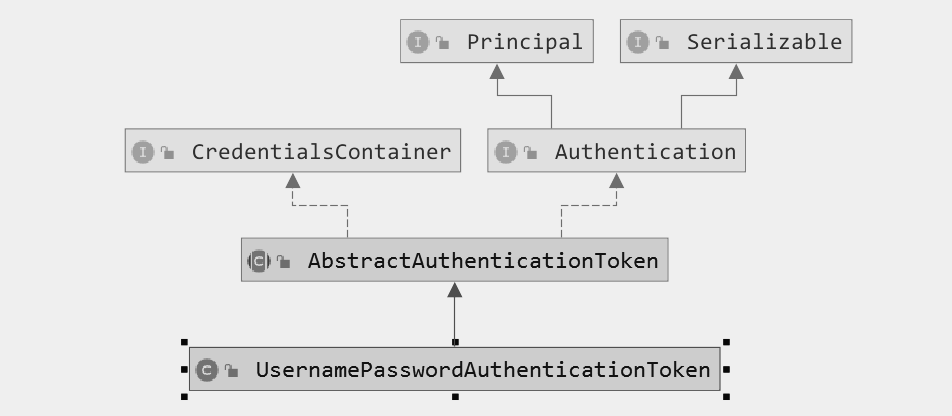
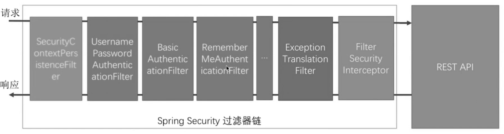
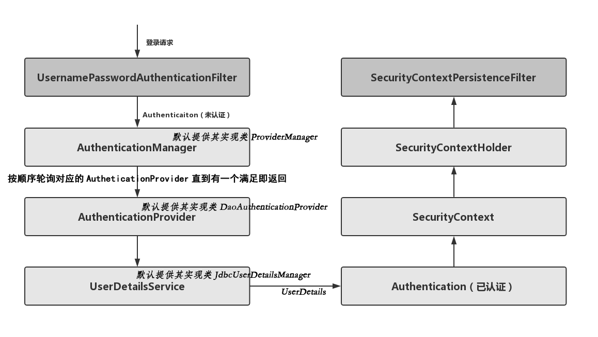
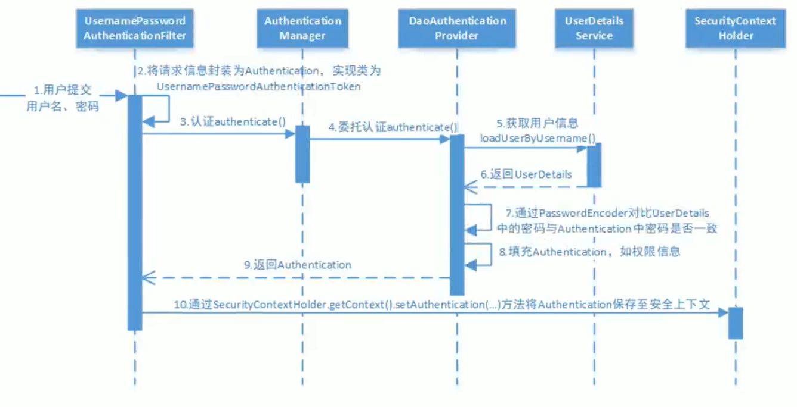
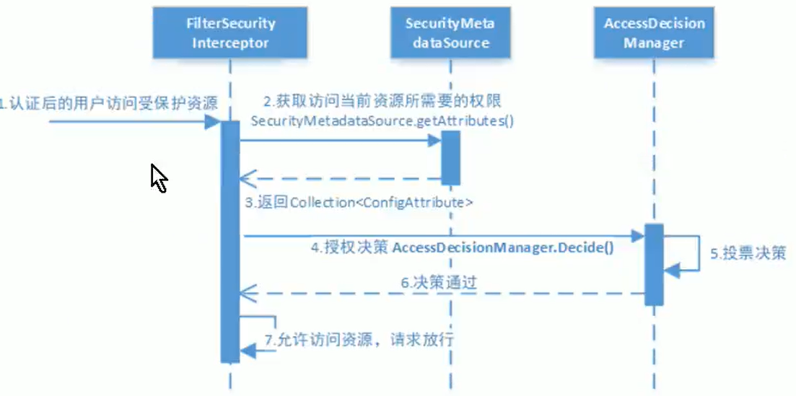
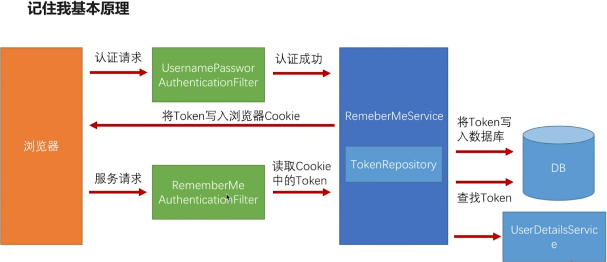
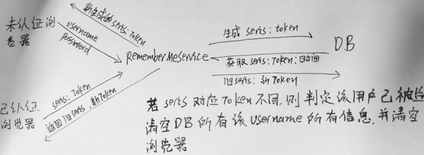
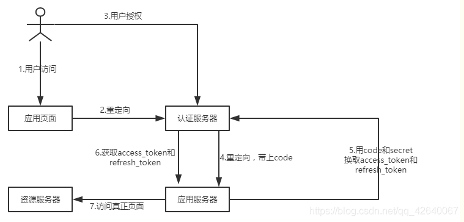

# SpringBoot Security

# 授权数据模型RBAC

主体Subject对资源Resource进行权限操作许可Permission，将功能(函数)看做资源

1. ##基于角色的访问控制

   根据用户角色判断权限许可，间接。不利于扩展

2. ##基于资源的访问控制

   根据用户是否有访问某资源的权限，直接

3. ##Spring Security简介

   ​	认证anthentication和授权authgorization是核心逻辑，继承了OAuth2.0框架，支持广泛的认证技术，是首先被推崇的解决方案。支持==URL对web的请求授权、方法访问授权和对象访问授权==。本质上是在web之前设置一个拦截器Filter，根据权限和认证进行许可。认证类型：基本认证HttpBasic()  、摘要认证，这两种方法不安全，通常使用表单认证formLogin()。新版用链式编程代替了复杂的xml文件

#机制

1. 基本类简介

   

2. 过滤连

   

3. 认证拦截器

   

   

   

4. RemenberMe拦截器

   

5. ##配置WebsecurityConfigurerAdapter

   - @EnableWebSecurity:开启WebSecurity模式， @Enable XXX开启某个功能
   - protected void configure(HttpSecurity http) 默认拦截所有请求并要求认证，可以重写此方法自定义url规则。

   - protected void configure(AuthenticationManagerBuilder auth) 配置自定义认证策略(内存，数据库，自定义userdetailsservice)

   - public void configure(WebSecurity web) 可忽略静态资源

#基本

### 默认规则

1. /login   /logout是登录、注销的路径。默认参数是  username  password remember-me

2. 默认登录失败返回login?error。注销时销毁session，

3. 默认认证成功返回原来页面

4. 默认remember-me14天，每次启动，之前的remember-me cookie失效

5. 默认开启CSRF跨站请求伪造防护功能，仅放行GET HEAD TEACE OPTIONS请求。

6. Jdbc UserDetailsManager它有默认的数据库模型，==内置的sql操作语句可以CRUD用户==
   - 一张users表，一张authorities表
   - roles和authorities共存时，本质上是覆盖List<GrantedAuthority> authorities设置roles时,加ROLE_前缀。==建议使用hasAuthorities精细控制==。多个权限时，每个权限分别一条记录。

7. RememberMe持久化令牌可由JdbcTokenRepository实现，满足大多数需求

8. security自带防火墙StrictHttpFirewall，拦截不合法和危险的URL。默认restrict，拦截冒号和点号，在websecurity放行静态资源文件

9. 在yml中设置会话过期秒数  server.session.tomeout=秒。默认到达最大在线数踢掉旧用户

10. ==Provider可继承DaoAuthenticatedProvider，重写additionalAuthenticationChecks并调用父方法，RequestContextHolder获取request信息==    注入是手动set设置对应的PasswordEncoder和UserDetailsService

  ```java
  HttpServletRequest request = ((ServletRequestAttributes) (RequestContextHolder.getRequestAttributes())).getRequest();
  
  //不能链式注入
  MyDaoProvider myDaoProvider = new MyDaoProvider();
         myDaoProvider.setPasswordEncoder(new BCryptPasswordEncoder());
          myDaoProvider.setUserDetailsService(peopleAuthService);
          auth.authenticationProvider(myDaoProvider);
  ```

11. 用户Authentication保存在SecurityContext(Holder)中，通过拦截器利用session实现不同线程的共享，所以`*获取SecurityContext必须保证请求通过HttpSecurity配置*`

12. `WebSecurity`构建目标是整个`Spring Security`安全过滤器`FilterChainProxy`,Web不走过滤连

   而`HttpSecurity`的构建目标仅仅是`FilterChainProxy`中的一个`SecurityFilterChain`。

   

#表单认证formLogin()

###配置方法：configure(HttpSecurity http)开启

1. loginProcessingUrl()   ：执行认证，==标记作用==，不必存在。默认是与loginPage() 的路径一致。前端表单账密要发送到这个路径POST
2.  loginPage()  ：自定义登录页面。loginProcessingUrl()默认与loginPage() 路径一致。需要permitAll()此路径 GET
3. defaultSuccessUrl ：默认直接登陆成功跳转的首页。间接登录则跳转到登陆前的页面。defaultSuccessUrl(路径, 当为true则必然跳转到指定页面，不建议使用)。不建议使用successForwardUrl 。  必须支持==POST==
4. 可自定义处理器实现更复杂的逻辑successHandler、failureHandler
5. /logout是默认注销页面   .logoutUrl("注销处理器")   .logoutSuccessUrl("注销成功后跳转路径")logoutSuccessHandler更加灵活，可以手动设置删除cookie和session失效。由多个LogoutHandler流式处理
6. deletecookies("remove").invalidateHttpSession(true)

###认证调用服务UserDeatailsService

1. #####自定义认证数据库模型

   1. 自定义的UserDetails及其数据库模型，必须有UserDeatils的username password ahthorities等关键信息。==重写UserDetails的hashCode和equals== (会话管理时更新会话信息表)
   2. List<GrantedAuthority> authorities保存权限列表
   3. AuthorityUtils.commaSeperatedStringToAuthorityList(逗号分割的长列表)可以直接转换为authorities。也可以利用SimpleGrantedAuthority（“权限名”）构造一个GrantedAuthority
   4. 

2. 实现UserDeatailsService接口的loadUserByUsername()，根据username返回真的UserDetails

3. 多个UserDeatailsService生成多个DaoProvider


###密码器PassWordEncoder

1. 前台信息加密后与数据库的密文(UserDeatils)对比。可以作为bean注入，可以在configure(http)配置对应UserDetailsService
2. 密码器建议使用==BcryptPassWordEncoder==  ① 直接作为Bean注入即可②configure(AuthenticationManagerBuilder auth)配置
3. BcryptPassWordEncoder密文格式：  版本信息+盐+真正密文

# 资源授权authorizeRequests()  

###特殊的规则放在前面，==先声明的优先，从头开始匹配成功即返回，不理会以后的==

1.   anyRequest()
2.   antMatchers()
   1. authenticated()  RememberMeAuthenticationToken或UPAT均可
   2. permitAll()
   3. hasRole("...")
   4. hasAuthority("...")
   5. anonymous() 仅匿名访问，如login
   6. fullyAuthenciate()密码认证才能访问（非记住我）  需要UsernamePasswordAuthenticationToken
   7. denyAll(禁止一切访问)
   8. access()最底层，一般不用

```java
http.authorizeRequests().antMatchers("/css/**","/index").permitAll() // 都可以访问
            .antMatchers("/h2-console/**").permitAll() // 都可以访问
            .antMatchers("/users/**").hasRole("USER") // 需要相应的角色才能访问
            .antMatchers("/admins/**").hasRole("ADMIN") // 需要相应的角色才能访问
            .and()
            .formLogin()   //基于 Form 表单登录验证
            .loginPage("/login").failureUrl("/login-error") // 自定义登录界面
            .and().rememberMe().key(KEY).tokenRepository(tokenRepository()) 
            .and().exceptionHandling().accessDeniedPage("/403");  // 处理异常，拒绝访问就重定向到 403 页面
    http.csrf().ignoringAntMatchers("/h2-console/**"); // 禁用 H2 控制台的 CSRF 防护
    http.headers().frameOptions().sameOrigin(); // 允许来自同一来源的H2 控制台的请求
```


# 记住我rememberMe()

##散列加密令牌

1. cookie保存hash散列，服务器根据session信息校验。默认生成UUID的key配合散列加密，这样重启服务器原来的cookie失效，可以指定key固定散列结果，但是不安全。cookie格式：username:expirationTime:hash

2. 必须实现UserDeatailsService并且配置

   ~~~java
   rememberMe().userDetailsService(userDetailsService).key("这是固定记住我的cookie")    //通过@Autowired注入
   ~~~


##持久化令牌   将免密信息保存到数据库

1. seris为主键，作为免密记录的Id ，只有新登录才会添加，免密登录不改变     token是检验值，每次免密登录都要改变。cookie格式：seris : token

2. 默认数据表格式

3. RememberMe持久化令牌可由==JdbcTokenRepository==实现，满足大多数需求

   

# 会话控制sessionManagement()

1. 设置会话策略。invalidSessionUrl("")     invalidSessionStrategy()

2. 单个账户最大并发在线数  maximumSessions( )。默认踢掉旧用户。maxSessionsPreventsLogin( true) 阻止新用户登录

3. Security监听session销毁事件实现会话清理和维护会话注册表(SessionRegistryImpl负责)，需要手动注入内置的HTTPSessionEventPublisher事件源

4. 使用==自定义UserDetailsServer需要重写UserDetails的hashCode和equals==

5. sessionCreationPolicy(SessionCreationPolicy.STATELESS) 完全禁用session。==spring security可能不创建session，但可以手动getSession创建session==     never：不主动创建   if_request：需要时创建(默认)

   ————SecurityContextPersistenceFilter: 每次请求将线程SecurityContext清空，转移至别的地方(session)

   有状态模式：HttpSessionSecurityContextRepository实现，将SecurityContext保存至session中转

   无状态模式：SessionCreationPolicy.STATELESS   NullSecurityContextRepository实现，不主动触碰session。此时，认证成功后无法保存SecurityContext至session，所以下次访问无法直接获取。故而在JWTFilter手动设置SecurityContext，由于每次请求主动清除线程SecurityContext，不必担心内存溢出

6. 引入spring-session实现会话共享后，会话注册表需改为提供的SpringSessionBackedSessionRegistry，注入FindByIndexNameSessionRepository。并在configure配置.sessionRegistry(sessionRegistry();

   ```java
   @Configuration
   public class SecurityConfig extends WebSecurityConfigurerAdapter {
       @Autowired
       FindByIndexNameSessionRepository sessionRepository;
           @Override
       protected void configure(HttpSecurity http) throws Exception {
           http.authorizeRequests().anyRequest()
                   ...
                   .sessionManagement()
                   .maximumSessions(1)
                   .maxSessionsPreventsLogin(true)
                   .sessionRegistry(sessionRegistry());
       }
       @Bean
       SpringSessionBackedSessionRegistry sessionRegistry() {
           return new SpringSessionBackedSessionRegistry(sessionRepository);
       }
   }
   ```

   

# 跨域访问

跨域一般是浏览器的安全措施而非服务器。通常ajax跨域请求被拦截。跨域拦截：套接字不同时，浏览器拦截。通常解决JSONP、Nginx、CORS。一般用CORS

## CORS

1. 浏览器和服务器通过CORS新增的首部字段交流、浏览器发送预检请求，确认服务器是否允许跨域。更加安全，只需要后端作出支持即可

2. ### 三种情景

   1. 简单请求：GET、HEAD、Content-type是application/x-www-form-urlencoded、multipart/form-data、text/plain的post请求
   2. 预检请求：
   3. 带凭证cookie的请求

3. 启用spring Security的CORS支持：①@crossorign+http.cors()  ⑵全局@bean

4. ```java
   http.cors(new Customizer<CorsConfigurer<HttpSecurity>>() {
       @Override
       public void customize(CorsConfigurer<HttpSecurity> httpSecurityCorsConfigurer) {
           CorsConfiguration corsConfiguration = new CorsConfiguration();
           corsConfiguration.addAllowedOrigin("/*");
           corsConfiguration.setAllowCredentials(true);
           corsConfiguration.addAllowedMethod("*");
           corsConfiguration.addAllowedHeader("*");
           UrlBasedCorsConfigurationSource urlBasedCorsConfigurationSource = new UrlBasedCorsConfigurationSource();
   urlBasedCorsConfigurationSource.registerCorsConfiguration("/**",corsConfiguration);
   httpSecurityCorsConfigurer.configurationSource(urlBasedCorsConfigurationSource);
       }
   });
   
       @Bean
       CorsConfigurationSource corsConfigurationSource() {
           UrlBasedCorsConfigurationSource source = new UrlBasedCorsConfigurationSource();
           CorsConfiguration configuration = new CorsConfiguration();
           configuration.setAllowCredentials(true);
           configuration.setAllowedOrigins(Arrays.asList("*"));
           configuration.setAllowedMethods(Arrays.asList("*"));
           configuration.setAllowedHeaders(Arrays.asList("*"));
           configuration.setMaxAge(Duration.ofHours(1));
           source.registerCorsConfiguration("/**",configuration);
           return source;
       }
   ```

## CSRF

###利用对已登录用户的信任进行非法操作，解决方法：①referer请求头不可靠②csrfToken认证(请求带csrfToken值，服务器进行校验)

1. 默认开启CSRF跨站请求伪造防护功能，默认仅放行GET HEAD TEACE OPTIONS请求。

2. Security有两种策略与浏览器交互

   - 默认HttpSessionCsrfTokenRespository：保存在session中，后台渲染_csrf参数给浏览器，浏览器携此token与服务器检验

     或请求头 X-CSRF-TOKEN

     ```html
     <input type="hidden" th:name="${_csrf.parameterName}" th:value="${_csrf.token}">
     ```

   - CookieCsrfTokenRespository：token保存在cookie中，浏览器携带此cookie交互（XSRF-TOKEN),需设置cookie允许读。必须用JS将此cookie的值取出作为参数_csrf或请求头 X-XSRF-TOKEN。cookie本身不校验

3. 在 configure(HttpSecurity http)关闭   http.csrf().disable()  非浏览器建议关闭

# 方法授权

把方法看做资源给予权限   @EnableGlobalMethodSecurity

- ==**`prePostEnabled`：**== 确定 前置注解`[@PreAuthorize,@PostAuthorize,..]` 是否启用

  ```
  @PreAuthorize("hasRole('ADMIN') AND hasRole('DBA')")
  @PreAuthorize("#p0<10")
  @PreAuthorize("authentication.name(#p0)")  //只能是本人的信息，authentication没有#
  @PreAuthorize("#p0.name.equals('abc')")
  ```

- **`securedEnabled`：** 确定安全注解 `[@Secured]` 是否启用

- **`jsr250Enabled`：** 确定 `JSR-250注解 [@RolesAllowed..]`是否启用

# 整合Thymeleaf

1. 引入thymeleaf-extras-springsecurity5 

   ```html
   <html xmlns:th="http://www.thymeleaf.org" xmlns:sec="http://www.thymeleaf.org/thymeleaf-extras-springsecurity4">
   ```

2. 常用标签

   ```html
   <!--如果没认证-->
   <div sec:authorize="!isAuthenticated()">显示没认证的内容</div>
   <!--如果认证了-->
   <div sec:authorize="isAuthenticated()">显示认证的内容</div>
   
   <!--获取用户名-->
   <span sec:authentication="name"></span>
   <!--获取角色-->
   <span sec:authentication="principal.authorities"></span>
   
   <div sec:authorize="hasRole('VIP1')"></div>
   ```


# 前后端分离配置

1. ==登录成功、失败和注销==，使用自定义处理器实现返回Json和根据JWT(Authentication)

2. 前后端分离时，不必区别fullyauthen和authen。禁用csrf

3. 未认证(登录)，配置http.exceptionHandling().authenticationEntryPoint  匿名用户无权限处理      (此时页面登录无效)

4. 未授权，配置http.exceptionHandling().accessDeniedHandler   登录用户无权限处理

5. 设置跨域，禁用session

6. 设置JWT OncePerRequestFilter校验过滤器，，必须设置在UsernamePasswordAuthenticationFilter之前登录后返回JWT令牌，应携带权限信息。

7. 开启sessionCreationPolicy(SessionCreationPolicy.STATELESS) 每次校验都要携带JWT获取信息手动保存至SecurityContext，不会存在session，由GC回收。

    

   ```java
       protected void configure(HttpSecurity http) throws Exception {
           http.exceptionHandling().authenticationEntryPoint((request, response, authException) ->{
               System.out.println("6666666666666666666666");
               response.setContentType("application/json;charset=utf-8");
               response.getWriter().write("{\"status\":\"未认证\"}");
           } ).accessDeniedHandler((request, response, accessDeniedException) -> {response.setContentType("application/json;charset=utf-8");
               response.getWriter().write("{\"status\":\"未授权\"}");});
           http.authorizeRequests()
                   .antMatchers("/root").hasAuthority("root")
                   .antMatchers("/normal").hasAuthority("normal")
                   .anyRequest().permitAll();
           ;
   //        http.csrf().csrfTokenRepository(CookieCsrfTokenRepository.withHttpOnlyFalse());
           http.csrf().disable();
           http.formLogin().loginPage("/ml").successHandler((request, response, authentication) -> {
               response.setContentType("application/json;charset=utf-8");
               //根据authentication返回JWT
               response.getWriter().write(authentication.getName());
           }).permitAll();
           http.cors(new Customizer<CorsConfigurer<HttpSecurity>>() {
               @Override
               public void customize(CorsConfigurer<HttpSecurity> httpSecurityCorsConfigurer) {
                   CorsConfiguration corsConfiguration = new CorsConfiguration();
                   corsConfiguration.addAllowedOrigin("*");
                   corsConfiguration.setAllowCredentials(true);
                   corsConfiguration.addAllowedMethod("*");
                   corsConfiguration.addAllowedHeader("*");
                   UrlBasedCorsConfigurationSource urlBasedCorsConfigurationSource = new UrlBasedCorsConfigurationSource();
                   urlBasedCorsConfigurationSource.registerCorsConfiguration("/**", corsConfiguration);
                   httpSecurityCorsConfigurer.configurationSource(urlBasedCorsConfigurationSource);
               }
           });
           http.addFilterBefore(new OncePerRequestFilter() {
               @Override
               protected void doFilterInternal(HttpServletRequest request, HttpServletResponse response, FilterChain filterChain) throws ServletException, IOException {
                   //根据RequeseContextHolder获取JWT判断
         //必须在UsernamePasswordAuthenticationFilter.class之前手动设置SecurityContext
                   SecurityContextHolder.getContext().setAuthentication(new UsernamePasswordAuthenticationToken("jiji",null,null));
                   filterChain.doFilter(request,response);
               }
           }, UsernamePasswordAuthenticationFilter.class);
           http.rememberMe().userDetailsService(peopleAuthService);
           http.sessionManagement().sessionCreationPolicy(SessionCreationPolicy.STATELESS);
       }
   ```

# OAuth2.0

