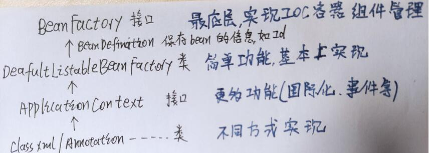
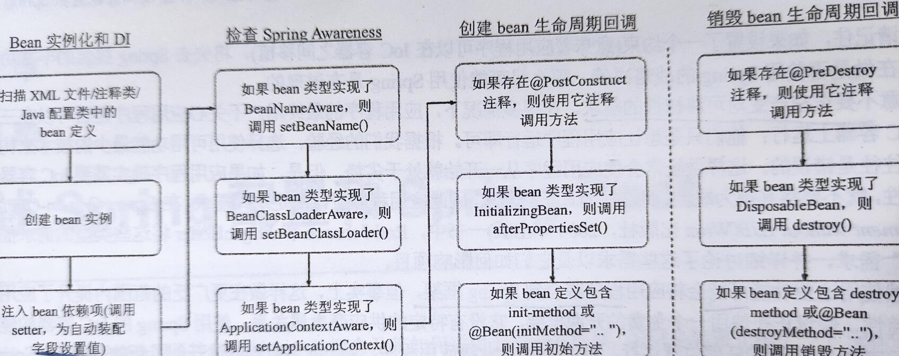

# IOC结构

## 生命周期

## 事件

1. 事件注册：继承ApplicationEvent
2. 事件监听：实现ApplicationListener
3. 事件发布：application.publishEvent()

##要点

1. 关闭Spring安全方式     applicationContext.registerShutdownHook();

2. BeanNameAware.setBeanName(String s)接口：获取本bean名字。不要把bean id赋予业务含义

3. ApplicationContextAware.setApplicationContext(): 本bean与容器交互。可用于新建bean

4. 构造方法——对象实例化——setter注入——@PostConstruct————@PreDestroy

   可用于前置属性检查和资源清理        **`Prototype不执行@PreDestroy`**

5. @Bean(initMethod = ,destroyMethod = )声明内部方法

6. @DependOn可以调整依赖加载顺序

7. 格式转换器PropertyEditor不适合web，不推荐使用

8. 通过`@Autowired`方式依赖注入得到`HttpServletRequest/Response`是线程安全，把Request相关对象设置到`RequestContextHolder`的`ThreadLocal`中(通过代理实现)

9.   

# 依赖注入

## 构造方法注入

1. 被依赖项必须全部实例化，可能存在性能问题
2. final字段智能构造注入
3. 注入后本对象才能实例化
4. ==只能用一个构方法发注入==

## setter注入 

1. 可选择注入一部分，灵活

## 字段注入

1. 利用反射原理，不推荐

## 方法注入

用于Singleton使用Prototype多个不同实例(动态代理)。①声明getXXX，返回null   ②@Lookup(Prototype bean ID)

###要点

1. 没有指定Id，将别名的第一个作为Id
2. 导入集合必须指定Id，即@autowired+@Qualifier
3. Singleton积极加载，Prototype懒加载

# AOP

​	可分为静态代理(aspectj)和动态代理(jdk CGLIB)，spring aop使用动态代理，借鉴可aspectj相关语法。spring将目标对象增强后提供给外部，无需关注细节。但是可以用spring手动实现aop(ProxyFactory)，不过几乎不会使用。

​	有接口则JDK，否则CGLIB。CGLIB生成目标类的子类。当涉及对象转型问题，如果父子类型冲突@EnableAspectjAutoProxy(proxyTargetClas=true指定CGLIB) 

配置aop方式①xml:ProxyFactory ②xml:aop命名空间 ③@aspectj+@Component   **`xml只能配置单例，注解可配置多例`**

1. Before   原方法执行前
2. AfterReturning   原方法无异常才执行，可获得原方法返回值
3. Around 需手动执行原方法，不推荐使用。与前置和后置返回冲突
4. Throw  可自动适配参数，JointPoint / Method args exception   异常类型最精确匹配
5. After   无论原方法成功或失败都会执行

## 语法表达式

1. 符号
   - *单个字段 任意字符
   - ..多个任意字段 任意字符
   - +本类以及子类
   - &&  ||  ！与或非，用于切点用蒜
2. @PointCut表达式
   - ***`execution(修饰符？   return    方法名(参数)  异常？)`*** 匹配方法.表示本包   ..表示本包以及子孙包
   - args(类名)   匹配目标方法形参
   - target(类名) 匹配木目标对象类型
   - bean(Id) 匹配beanId
3. @Aspectj+@Component可配置多例perXXX

# 事务

1. 数据源：spring提供不支持池技术的垃圾数据源，几乎不被使用
2. JDBC编程，设置自动提交，默认每条语句都是事务。
3. springboot针对嵌入式数据库，发现类路径存在嵌入式数据库，默认在resources执行schema.sql和data.sql文件的相关语句。但是可以显示配置，如H2

### 事务支持

1. 提供PlatFormTransactionManager平台事务管理器接口，默认提供多种实现，如JDBC/JPA/Hibernate等
2. TransactionDefination封装事务设置     TransactionStatus封装事务执行状态
3. 分为全局事务(多个库)和本地事务(单个库)，通常使用单个库
4. 传播行为：事务A调用事务B，B如何处理事务。即内事务依赖哪个事务
5. Propagation   REQUIRED有事务存在，则在当前事务运行；否则新创   REQUIRED_NEW无论有无都新创  
6. 默认ERROR和RunTimeException回滚，并且异常不能手动catch。如I/O异常不回滚

## 事务失效

1. 数据库引擎不支持事务   MyISAM 引擎是不支持事务操作的，InnoDB 才是支持事务的引擎

2. 未注入容器或重复扫描                `*同一个类中一个无事务的方法调用另一个有事务的方法，事务是不会起作用的*`

3. ==自身调用问题==    即调用本类成员方法。**事务方法**被**当前类以外的代码**调用时,才会由Spring生成代理对象管理

   ​	——外方法上开启事务，内方法不用事务或默认事务。并且外方法中catch中throw new RuntimeException()

   ​	——外方法上可以不开启事务，内方法上开启事务，并在外方法A中将this调用内方法改成动态代理调用内方法

   ​			并且@EnableAspectJAutoProxy(exposeProxy = true)。即(xxxService)(AopContext.currentProxy())，获取到xxxService的代理类，再调用事务方法，强行经过代理类，激活事务切面

   ​	——==拆分类，将事务方法另外新创一个类，并注入==

4. @Transactional 注解==只能应用到 public 可见度的方法上==，不能static和final

5. 类上注解，而不是接口

6. 数据源没有配置事务管理器

7. 传播行为不支持事务   

   ​	————如Propagation.NOT_SUPPORTED，没有事务的PROPAGATION_SUPPORTS，PROPAGATION_NEVER

8. ==异常被手动catch==

9. ==不是运行时异常==。默认回滚的是：RuntimeException和ERROR

# 属性验证

1. 实现JSR-/303349规范，在WebMVC，绑定过程中验证，无需手动校验。

2. **WEB校验需在参数上标注@Validated/@Valid**。@Validated是@Valid 的一次封装，是Spring提供的校验机制使用。配合@ControllerAdvice

3. @Validated：可以用在类型、方法和方法参数上。但是不能用在成员属性（字段）上

   @Valid：可以用在方法、构造函数、方法参数和成员属性（字段）上    嵌套验证需要在属性上标注@Valid

4. 需提供实现库，通常是Hibernate Validate库。没有库不生效

5. @Valid要在@RequestBody前面

##常用注解

@Null 被注释的元素必须为 null
@NotNull 被注释的元素必须不为 null
@AssertTrue 被注释的元素必须为 true
@AssertFalse 被注释的元素必须为 false
@Min(value) 被注释的元素必须是一个数字，其值必须大于等于指定的最小值
@Max(value) 被注释的元素必须是一个数字，其值必须小于等于指定的最大值
@DecimalMin(value) 被注释的元素必须是一个数字，其值必须大于等于指定的最小值
@DecimalMax(value) 被注释的元素必须是一个数字，其值必须小于等于指定的最大值
@Size(max=, min=) 被注释的元素的大小必须在指定的范围内
@Digits (integer, fraction) 被注释的元素必须是一个数字，其值必须在可接受的范围内
@Past 被注释的元素必须是一个过去的日期
@Future 被注释的元素必须是一个将来的日期
@Pattern(regex=,flag=) 被注释的元素必须符合指定的正则表达式

@NotBlank(message =) 验证字符串非null，且长度必须大于0
@Email 被注释的元素必须是电子邮箱地址

# SpringMVC

## 层次结构

- 由web.xml的监听器启动  根WebApplicationContext容器，一般==根容器保存DAO、Service和安全(如security)层==，子容器是Servlet级别，主要是DispatchServlet实例，包含Controller层、国际化、验证等。

- Security拦截链在所有Filter之前执行

- @RequestBody：applicatin/json，接收requestBody请求体的数据，不受参数数据长度的限制，如post json

  @RequestParam：form-data、x-www-form-urlencoded。如post表单的参数

  @responseBody支持返回Optional

- ==形参不支持list==（需要外包装VO），因为构造早函数不支持，但==支持数组==

- Mapping方法支持同步synchronized修饰符

# WebSocket开发

1. 注入ServerEndpointExporter bean
2. ① 通过注解@ServerEndpoint来声明实例化WebSocket服务端。
   ② 通过注解@OnOpen、@OnMessage、@OnClose、@OnError 来声明回调函数

# 任务调度

支持Quartz框架，简单任务使用spring自己提供的

@EnableScheduling开启+@Scheduled     fixedDelay固定延时   fixedRate固定速率，可能时间冲突   cron