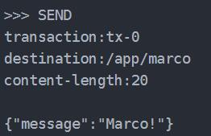
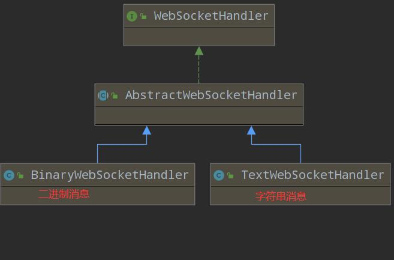
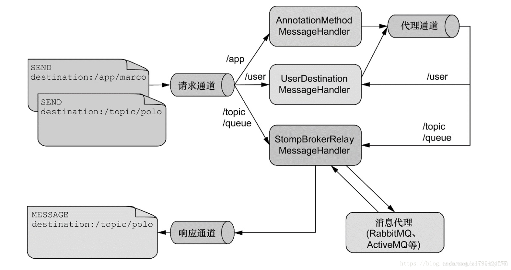

Websocket&Stomp

## WebSocket&SockJs简介

1. WebSocket是两个应用之间全双工的通信通道，
2. WebSocket 是底层协议，SockJS 是WebSocket 的模拟兼容方案，也是底层协议；而 STOMP 是基于 WebSocket（SockJS） 的上层通讯协议
3. SockJS 会优先选择 WebSocket 协议，通常引入sockJs包。
4. 

## Stomp

1. STOMP在WebSocket之上提供了一个基于帧的线路格式（frame-based wire format）层，用来定义消息的语义。可以能路由信息到指定消息地点、直接使用成熟的STOMP代理进行广播 如:RabbitMQ, ActiveMQ。
2. STOMP帧由命令、一个或多个头信息以及负载所组成：



# springboot-WebSocket

## Spring抽象

1. WebSocketHandler接口是消息处理器（**单例**Singleton）
2. **WebSocketSession是底层Session的高层抽象**。每个WebSocket会话以`WebSocketSession`表示，且已分配唯一ID。和WebSocket相关的数据，例如用户名称等，均可放入关联的`getAttributes()`中。
3. WebSocketHandler是**单例Singleton **
4. 


## 部署方式

1. 激活`@EnableWebSocket`

2. @Configuration实现`WebSocketConfigurer`接口`registerWebSocketHandlers`方法注册WebSocketHandler处理器，一般是`TextWebSocketHandler`。

3. 握手`HandshakeHandler`配置：用于连接前鉴权、配置其他信息

   - 默认由`DefaultHandshakeHandler`实现，鉴权时要重写`determineUser`方法获取`Principal`用户信息放入`WebSocketSession的attributes`中

4. 握手拦截器：验证权限、填充Session

   - beforeHandshake：握手前；afterHandshake：握手后

   - `HttpSessionHandshakeInterceptor`：转换容器的`HttpSession`中的内容到`WebSocketSession的attributes`。APP涉及Session需要配置

   

   ```java
   public class MySocketHandler extends TextWebSocketHandler {
       private String x= UUID.randomUUID().toString();	//单例，每个此x都一样
       @Override  //连接建立后
       public void afterConnectionEstablished(WebSocketSession session) throws Exception {
           System.out.println(session.getId());
       }
       @Override	//收到消息处理
       protected void handleTextMessage(WebSocketSession session, TextMessage message) throws Exception {
           session.sendMessage(new TextMessage("kkkkkk"+UUID.randomUUID().toString()));
       }
   
       @Override   	//连接错误
       public void handleTransportError(WebSocketSession session, Throwable exception) throws Exception {
           System.out.println("onerror");
       }
   
       @Override
       public void afterConnectionClosed(WebSocketSession session, CloseStatus closeStatus) throws Exception {
           System.out.println("onclose");
       }
       @Override	//是否支持消息分隔
       public boolean supportsPartialMessages() {
           return false;
       }
   }
   ```

5. ```java
   @Configuration
   @EnableWebSocket
   public class WebSocketConfig implements WebSocketConfigurer {
       @Override
       public void registerWebSocketHandlers(WebSocketHandlerRegistry registry) {
           registry.addHandler(new MySocketHandler(), "/c/{id}").setAllowedOrigins("*").addInterceptors(new HttpSessionHandshakeInterceptor(){
               @Override
               public boolean beforeHandshake(ServerHttpRequest request, ServerHttpResponse response, WebSocketHandler wsHandler, Map<String, Object> attributes) throws Exception {
                   return super.beforeHandshake(request, response, wsHandler, attributes);
               }
   
               @Override
               public void afterHandshake(ServerHttpRequest request, ServerHttpResponse response, WebSocketHandler wsHandler, Exception ex) {
                   super.afterHandshake(request, response, wsHandler, ex);
               }
           }).setHandshakeHandler(new DefaultHandshakeHandler(){
               @Override
               protected Principal determineUser(ServerHttpRequest request, WebSocketHandler wsHandler, Map<String, Object> attributes) {
                   //无Security需重写它获取Principal
                   return super.determineUser(request, wsHandler, attributes);
               }
           });
       }
   ```

## 兼容tomcat方案JSR356标准

1. 引入ServerEndpoint扫描，激活@EnableWebSocket，将@ServerEndpoint作为@Component注册

   ```java
   @Bean
   public ServerEndpointExporter serverEndpointExporter() {
       return new ServerEndpointExporter();  //扫描@ServerEndpoint注解的组件
   }
   ```

2. 注解

   - @ServerEndpoint设路径：
   - @OnOpen连接建立：Session、Endpoint-Config、@PathParam
   - @OnClose连接关闭：Session、CloseReason、@PathPara的String
   - @OnError连接错误：Session、Throwable、@PathParam
   - @OnMessage收到信息：文本，二进制和pong。一般是String
   - @PathParam路径变量：支持String、Integer

3. ==@ServerEndpoint是**Prototype多例**==，**每建立新连接自动创建对应的新ServerEndpoint注解对象**。@Autowire时需要设置static，间接注入其他位置，获取引用为其赋值。或getBean()

4. 发送消息

   - 同步session.getBasicRemote().sendText(message，isLast)
     - isLast是否最后一块，分块发送需要设置。消息过大需要分块发送
   - 异步session.getAsyncRemote()

5. spring代码

   ```java
   @Component
   @ServerEndpoint("/w/{id}")
   public class WEndPoint {
    private static ConcurrentHashMap<String,Session> webSocketMap = new ConcurrentHashMap<>();//存储所有session   
       @OnOpen
       public void onOpen(Session session,EndpointConfig endpointConfig) {
       }
   
       @OnClose
       public void onClose(Session session,CloseReason closeReason) {;
       }
   
       @OnMessage
       public void onMessage(String message, Session session, @PathParam("id") String id) {
               session.getBasicRemote().sendText(message);
       }
   
       @OnError
       public void onError(Session session, Throwable error) {
       }
   
   }
   ```

## JS代码

```js
<script>
    //ws开头
    socket = new WebSocket("ws://localhost:8080/c/ljh");
    socket.onopen = function (event) {
        console.log("websocket已打开");
    };
    //获得消息事件
    socket.onmessage = function (msgEvevt) {
        s.textContent = msgEvevt.data
    };
    //关闭事件
    socket.onclose = function () {
        console.log("websocket已关闭");
    };
    //发生了错误事件
    socket.onerror = function () {
        console.log("websocket发生了错误");
    }
//发消息
    function f() {
        socket.send(Math.random().toString())
    }
</script>
```


# springboot-stomp

## 配置

1. @EnableWebSocketMessageBroker
2. @Configuration实现WebSocketMessageBrokerConfigurer接口registerStompEndpoints注册连接点
3. configureMessageBroker设置**订阅路径和消息代理器**
   1. ApplicationDestinationPrefixes：client主动发往`@MessageMapping的前缀`，一般`/app`；
   2. UserDestinationPrefix：标识一对一发送前缀，默认/user；
   3. Broker：消息代理队，SimpleBroker基于内存的简单代理，可利用rabbilmq。默认/topic

### 注解

- `@MessageMapping`：`client主动发给Server`，**返回值会被发送到消息代理，再被订阅**无需/app前缀(自动加 )
  - Principal参数自动填充为当前用户  Message完整消息   StompHeaderAccessor消息头处理包装
  - @Payload消息负载，默认匹配它，一般无需设置
  - @Header某个消息头     @Headers整体消息头  Map类型     @DestinationVariable路径变量 
- `@SubscribeMapping`：直接返回给client，**不经过消息代理**。类似**一次性**http请求
- `@SendTo`：**重写**`@MessageMapping`返回值的**目的地**
- `@SendToUser`：**单播**至订阅路径，无需/user前缀
- `@MessageExceptionHandler` 异常处理方法

## 结构体系



### 路径设置

#### client发送消息

- 发送路径以**`/app`**开头
- spring去掉/app前缀后，找到**对应@MessageMapping**   
- 方法返**回值发送至@SendTo/@SendToUser声明的消息路径**
  - @SendTo：直接发送至对应路径
  - @SendToUser：转换成    `/user/声明路径-user后跟sessionId`

#### subscribe

##### 广播

**client订阅@SendTo的路径**，不用额外前缀

##### 单播

- client订阅**@SendToUser路径加上`/user前缀`**         或/user/用户名/@SendToUser路径
- Spring将/user的单播路径转换为 `/user/声明路径-user后跟sessionId`，和消息代理的匹配
- 默认推送到同一个帐号不同的session，broadcast = false仅一个Session

### SimpMessagingTemplate

**SimpMessagingTemplate**在程序任何位置发送任意类型信息

1. 广播：SimpMessagingTemplate.convertAndSend("目的地",payload)
2. 单播：SimpMessagingTemplate.convertAndSendToUser("发哪个用户名","目的地无/user前缀",payload)

## 身份认证

JS自定义消息头

配置configureClientInboundChannel获取消息头的令牌认证

```java
//获取stomp消息头
StompHeaderAccessor accessor =  MessageHeaderAccessor.getAccessor(message, StompHeaderAccessor.class);
```

2. ```java
   @Configuration
   @EnableWebSocketMessageBroker
   public class WebSocketBrokerConfig implements WebSocketMessageBrokerConfigurer {
       @Override
       public void registerStompEndpoints(StompEndpointRegistry registry) {
     registry.addEndpoint("/portfolio").setAllowedOrigins("*");
       }
       //校验JS的connect的header携带token
       @Override
       public void configureClientInboundChannel(ChannelRegistration registration) {
           registration.interceptors(new ChannelInterceptor() {
               @Override
               public Message<?> preSend(Message<?> message, MessageChannel channel) {
                   StompHeaderAccessor accessor =
                           MessageHeaderAccessor.getAccessor(message, StompHeaderAccessor.class);
                   //首次连接才判断
                   if (StompCommand.CONNECT.equals(accessor.getCommand())) {
                       Authentication user = ... ; // access authentication header(s)
                       accessor.setUser(user);
                   }
                   return message;
               }
           });
           
       @Override
       public void configureMessageBroker(MessageBrokerRegistry config) {
           config.enableSimpleBroker("/topic");
           config.setUserDestinationPrefix("/user");
           config.setApplicationDestinationPrefixes("/app");
       }
   }
   ```

## JS代码

```javascript
socket = new WebSocket("ws://localhost:8080/portfolio");
var stompClient = Stomp.over(socket);
//client.connect(headers对象, connectCallback, errorCallback);
stompClient.connect({jwt:"jjjjjj"}, function (frame) {
    //单播            //header可携带token
    stompClient.subscribe('/user/topic/greetings', function (greeting) {
        s.innerHTML = JSON.parse(greeting.body).content
    });
//广播
    stompClient.subscribe('/topic/gr', function (greeting) {
        s.innerHTML = JSON.parse(greeting.body).content
    });
});

function f() {
    //发送消息
    stompClient.send("/app/pe", {}, JSON.stringify({'name': Math.random().toString()}));
}

```
